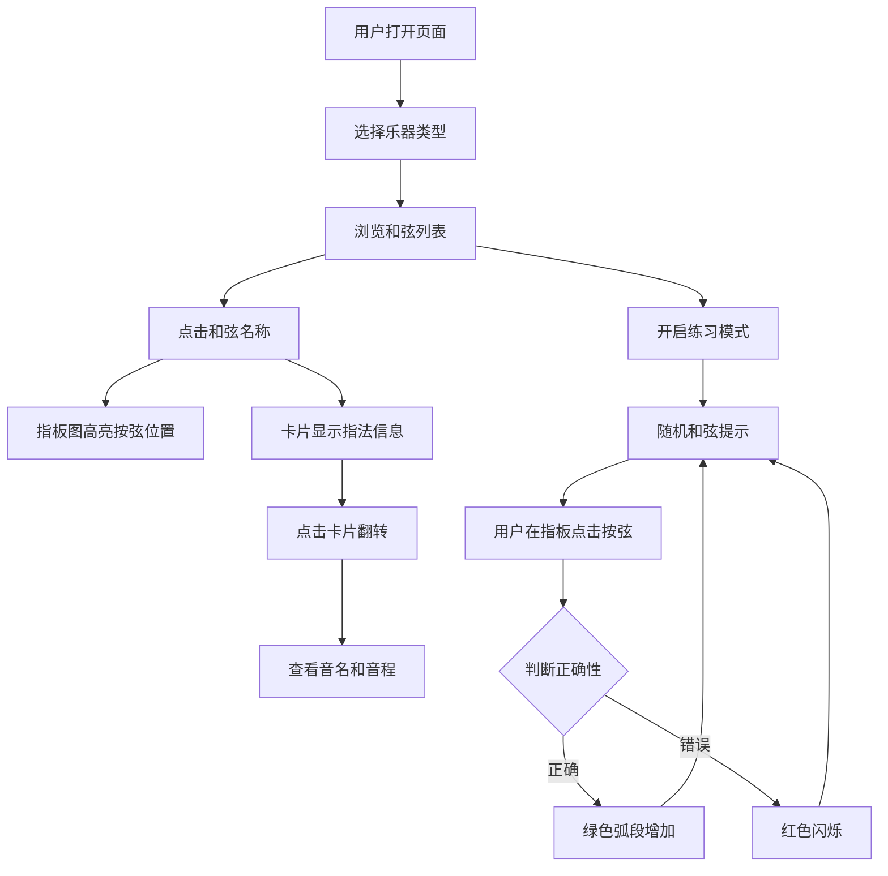

## 1. 产品概述

乐器指法练习卡片是一款面向吉他与尤克里里初学者的交互式指法记忆工具。用户通过点击和弦名称，指板图即时高亮对应按弦位置，配合可翻转的虚拟卡片展示指法详情，并可在练习模式下进行随机和弦测验，以游戏化方式高效记忆和弦与音阶指法。

## 2. 核心功能

### 2.1 用户角色
| 角色 | 注册方式 | 核心权限 |
|------|----------|----------|
| 普通用户 | 无需注册 | 浏览和弦、切换乐器、练习模式 |

### 2.2 功能模块
1. **主页面**：交互式指板图、和弦卡片、和弦列表、练习模式、得分追踪

### 2.3 页面详情
| 页面名称 | 模块名称 | 功能描述 |
|----------|----------|----------|
| 主页面 | 指板图 | Canvas绘制吉他(6弦)/尤克里里(4弦)指板，点击和弦后高亮按弦位置，带手指编号圆圈，脉冲呼吸动画，未按弦显示空心圆 |
| 主页面 | 和弦卡片 | CSS 3D翻转卡片，正面彩色指法图（大三和弦暖色系，小三和弦冷色系），背面白色背景显示构成音名和音程关系 |
| 主页面 | 和弦列表 | 网格布局圆形按钮，当前选中项白色发光边框，点击切换和弦 |
| 主页面 | 乐器切换 | 吉他/尤克里里切换，指板弦数和指法数据联动 |
| 主页面 | 练习模式 | 开关启用后随机播放和弦名称（文字提示+语音合成），每5秒切换，用户需在指板上点击正确按弦位置 |
| 主页面 | 得分追踪 | 右上角深色圆环进度条，答对绿色弧段增加，答错红色闪烁圆环 |

## 3. 核心流程

用户打开页面 → 选择乐器类型（吉他/尤克里里）→ 点击和弦列表中的和弦名称 → 指板图高亮对应按弦位置 + 右侧卡片显示指法信息 → 点击卡片翻转查看构成音名和音程 → 开启练习模式进行测验 → 随机和弦出现 → 用户在指板上点击按弦位置 → 系统判断对错并更新得分

## 4. 用户界面设计

### 4.1 设计风格
- 主色调：深色主题 #1e1e2e，搭配霓虹蓝紫渐变（#6c63ff → #a855f7）
- 按钮样式：圆形按钮，悬浮上移+发光效果，过渡0.2s
- 字体：显示字体选用 Outfit（现代几何感），正文字体 Source Sans 3
- 布局风格：左右两栏，左侧指板60%宽度，右侧卡片30%+和弦列表
- 图标风格：简洁线条图标

### 4.2 页面设计概述
| 页面名称 | 模块名称 | UI元素 |
|----------|----------|--------|
| 主页面 | 指板图 | Canvas画布，纵向排列琴头到琴颈，浅灰色横线琴格，银灰色弦线，实心圆按弦位+手指编号，脉冲动画1.5s，空心圆未按弦 |
| 主页面 | 和弦卡片 | 3D翻转卡片，Y轴旋转0.5s cubic-bezier，正面彩色背景（大三和弦暖色/小三和弦冷色），背面白色+深色文字 |
| 主页面 | 和弦列表 | 网格圆形按钮，当前选中白色发光边框，悬浮上移+发光 |
| 主页面 | 乐器切换 | 顶部切换按钮，吉他/尤克里里图标 |
| 主页面 | 练习模式 | 开关按钮，随机和弦文字提示+语音合成 |
| 主页面 | 得分追踪 | 右上角深色圆环SVG进度条，绿色弧段+红色闪烁 |

### 4.3 响应式设计
- 桌面优先设计，768px以下右侧卡片区域折到下方
- 指板图宽度自适应容器
- 触摸优化：按钮最小44px触控区域

### 4.4 性能目标
- 和弦切换时指板重绘和卡片翻转动画保持60fps
- Canvas绘制使用requestAnimationFrame
- 避免不必要的重绘，使用差异更新策略
