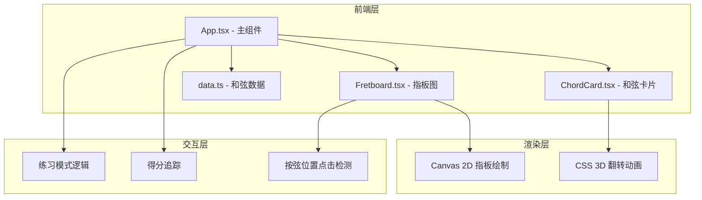

## 1. 架构设计



## 2. 技术说明
- 前端：React 18 + TypeScript + Vite
- 初始化工具：vite-init (react-ts 模板)
- 状态管理：React useState/useReducer（项目规模较小，无需引入zustand）
- 样式方案：CSS（全局样式 + CSS变量主题）
- 后端：无
- 数据库：无，使用内置静态和弦数据

## 3. 路由定义
| 路由 | 用途 |
|------|------|
| / | 单页面应用，包含所有功能模块 |

## 4. 数据模型

### 4.1 数据定义

```typescript
interface FingerPosition {
  string: number;
  fret: number;
  finger: number;
}

interface ChordData {
  name: string;
  type: 'major' | 'minor' | 'dominant' | 'diminished' | 'augmented' | 'major7' | 'minor7';
  positions: FingerPosition[];
  notes: string[];
  intervals: string[];
  openStrings: number[];
  mutedStrings: number[];
}

interface InstrumentType {
  id: 'guitar' | 'ukulele';
  name: string;
  stringCount: number;
  fretCount: number;
  tuning: string[];
  chords: ChordData[];
}
```

### 4.2 文件结构
| 文件 | 职责 |
|------|------|
| src/data.ts | 吉他和尤克里里的和弦指法数据、音名、音程定义 |
| src/Fretboard.tsx | Canvas指板绘制组件，包含动画循环、点击检测、高亮逻辑 |
| src/ChordCard.tsx | 3D翻转卡片组件，正面指法图+背面音名音程 |
| src/App.tsx | 主组件，管理和弦状态、乐器切换、练习模式、得分 |
| src/styles.css | 全局样式、CSS变量、深色主题、动画关键帧、响应式 |

## 5. 关键实现策略

### 5.1 Canvas指板绘制
- 使用 `requestAnimationFrame` 驱动动画循环
- 脉冲呼吸动画：正弦波控制按弦圆圈半径和透明度，周期1.5s
- 点击检测：将鼠标/触摸坐标映射到弦-品网格
- 差异更新：仅在和弦切换时重绘静态元素，动画帧只更新脉冲效果

### 5.2 CSS 3D翻转卡片
- `perspective` + `transform: rotateY(180deg)` 实现翻转
- `backface-visibility: hidden` 控制正背面可见性
- `transition: transform 0.5s cubic-bezier(0.4, 0, 0.2, 1)` 翻转动画

### 5.3 练习模式
- `SpeechSynthesis API` 语音播报和弦名称（降级为文字提示）
- `setInterval` 5秒切换和弦
- 得分用SVG圆环实现，`stroke-dasharray` 控制弧段长度

### 5.4 性能优化
- Canvas使用双缓冲策略
- 组件使用 `React.memo` 避免不必要渲染
- 动画使用 `will-change: transform` 提示GPU加速
