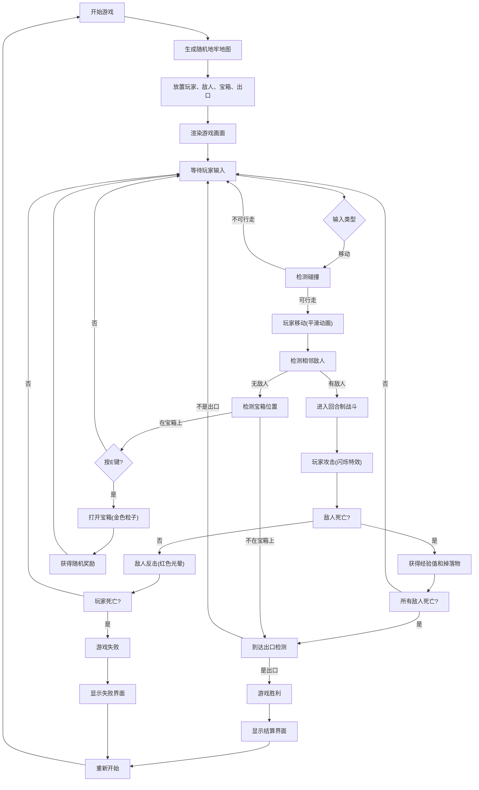

## 1. 产品概述

轻量级Roguelike地下城探险网页游戏，玩家控制角色在随机生成的网格地图中探索、战斗并收集战利品。游戏采用回合制战斗系统，具有程序化生成的地牢、敌人AI、宝箱系统和粒子特效。

- 主要用途：提供休闲娱乐的网页游戏体验，玩家通过策略性移动和战斗完成探索目标
- 目标用户：喜欢Roguelike类型游戏的网页用户，无需下载安装即可游玩
- 产品价值：轻量化、易上手、每次游玩体验不同的随机地牢探险游戏

## 2. 核心功能

### 2.1 功能模块
1. **地牢生成模块**：递归分割算法生成随机地牢地图，包含房间、走廊和墙壁
2. **玩家控制模块**：WASD键盘控制移动，平滑动画过渡，生命值和攻击力管理
3. **战斗系统模块**：回合制近战战斗，敌人AI，伤害计算，经验值和掉落系统
4. **宝箱交互模块**：E键打开宝箱，随机获得金币、武器或药剂，金色粒子特效
5. **渲染模块**：Canvas 2D渲染地图、角色、UI和粒子特效
6. **游戏状态模块**：胜利/失败条件判定，结算界面，统计信息显示

### 2.2 功能详情
| 模块名称 | 功能描述 |
|-----------|-------------|
| 地牢生成 | 10x10至20x20网格地图，递归分割算法，至少3个连通房间，狭窄走廊连接，随机放置3-5个敌人和1-2个宝箱 |
| 玩家控制 | WASD方向键移动，每200ms操作一次，不能穿越墙壁，平滑滑动过渡(100ms ease-out) |
| 回合制战斗 | 与敌人相邻时触发，玩家攻击10点伤害，敌人反击5点伤害，击败获得20经验值，10%概率掉落血瓶(+30HP) |
| 宝箱交互 | 走到宝箱上按E键打开，随机获得金币(10-30)、武器(攻+5)或药剂(回血50)，金色粒子特效(20个粒子，800ms) |
| 游戏状态 | 击败所有敌人并到达右下角出口胜利，生命值为0失败，显示击杀数、金币数、耗时统计 |
| UI界面 | 顶部HUD显示状态栏，战斗时屏幕边缘红色光晕，伤害数字弹出，像素风格平铺渲染 |

## 3. 核心流程

## 4. 用户界面设计

### 4.1 设计风格
- **主色调**：深灰背景(#222)，暖灰地面(#888)，深灰墙壁(#444)
- **强调色**：亮黄色玩家(#FFD700)，红色敌人(#C0392B)，橙色宝箱(#E67E22)，白色文字(#FFF)
- **视觉风格**：暗黑奇幻像素风，所有元素使用平铺像素，无渐变或阴影，简洁清晰
- **字体**：无衬线体，白色14px小字体
- **动效**：平滑滑动过渡(100ms ease-out)，攻击闪烁，伤害数字弹出，粒子特效

### 4.2 界面布局
| 区域 | 位置 | UI元素 |
|-----------|-------------|-------------|
| 游戏画布 | 居中 | Canvas地图、玩家、敌人、宝箱、出口、粒子特效 |
| 状态栏HUD | 顶部居中 | 黑色半透明底，圆角8px，显示生命值、攻击力、金币、经验、击杀数、耗时 |
| 结算界面 | 屏幕中央 | 胜利/失败标题，统计信息，重新开始按钮 |
| 移动端触控 | 屏幕底部 | 方向按钮(上下左右)和交互键(E) |

### 4.3 响应式设计
- **桌面优先**：键盘WASD控制，E键交互
- **移动端适配**：自动检测屏幕尺寸，显示虚拟方向按钮和交互键
- **Canvas自适应**：保持16:9比例，左右留10px内边距，居中显示
- **性能优化**：60FPS稳定帧率，粒子系统20个以下无卡顿，地图生成耗时<50ms
