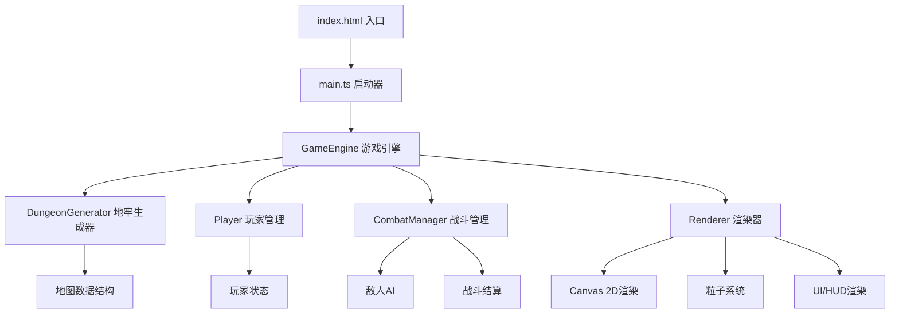

## 1. 架构设计



## 2. 技术描述

- **前端技术栈**: TypeScript + Vite + HTML5 Canvas API
- **构建工具**: Vite 5.x
- **语言**: TypeScript 5.x (严格模式, target ES2020)
- **渲染引擎**: Canvas 2D Context (无第三方游戏引擎)
- **无外部依赖**: 仅使用TypeScript和Vite，无其他运行时依赖

## 3. 模块架构

| 模块文件 | 职责 | 核心数据结构 |
|-----------|-------------|-------------|
| `src/DungeonGenerator.ts` | 递归分割算法生成地牢地图，放置敌人和宝箱 | `TileType`, `Room`, `DungeonMap` |
| `src/Player.ts` | 玩家位置、状态、生命值、攻击力、移动逻辑 | `PlayerState`, `Position` |
| `src/GameEngine.ts` | 核心游戏循环，协调各模块，输入处理，碰撞检测 | `GameState`, `GameStats` |
| `src/Renderer.ts` | Canvas 2D渲染，地图、角色、UI、粒子特效 | `Particle`, `RenderContext` |
| `src/CombatManager.ts` | 近战攻击逻辑，敌人AI，回合制战斗结算 | `Enemy`, `CombatResult` |
| `src/main.ts` | 游戏启动入口，初始化各模块 | - |

## 4. 数据模型定义

### 4.1 核心类型定义

```typescript
// 位置坐标
interface Position {
  x: number;
  y: number;
}

// 地图格子类型
enum TileType {
  WALL = 0,
  FLOOR = 1,
  EXIT = 2,
}

// 房间结构
interface Room {
  x: number;
  y: number;
  width: number;
  height: number;
  centerX: number;
  centerY: number;
}

// 地牢地图
interface DungeonMap {
  width: number;
  height: number;
  tiles: TileType[][];
  rooms: Room[];
}

// 玩家状态
interface PlayerState {
  position: Position;
  targetPosition: Position;
  health: number;
  maxHealth: number;
  attack: number;
  baseAttack: number;
  coins: number;
  experience: number;
  kills: number;
  isMoving: boolean;
  moveStartTime: number;
}

// 敌人状态
interface Enemy {
  id: number;
  position: Position;
  targetPosition: Position;
  health: number;
  maxHealth: number;
  attack: number;
  isAlive: boolean;
  isMoving: boolean;
  moveStartTime: number;
}

// 宝箱状态
interface Chest {
  id: number;
  position: Position;
  isOpened: boolean;
}

// 粒子效果
interface Particle {
  x: number;
  y: number;
  vx: number;
  vy: number;
  color: string;
  size: number;
  life: number;
  maxLife: number;
}

// 伤害数字弹出
interface DamageNumber {
  x: number;
  y: number;
  value: number;
  color: string;
  life: number;
  maxLife: number;
}

// 游戏统计
interface GameStats {
  kills: number;
  coins: number;
  startTime: number;
  totalTime: number;
}

// 游戏状态枚举
enum GamePhase {
  PLAYING = 'playing',
  COMBAT = 'combat',
  VICTORY = 'victory',
  DEFEAT = 'defeat',
}

// 游戏全局状态
interface GameState {
  phase: GamePhase;
  dungeon: DungeonMap;
  player: PlayerState;
  enemies: Enemy[];
  chests: Chest[];
  particles: Particle[];
  damageNumbers: DamageNumber[];
  stats: GameStats;
  exitPosition: Position;
  combatFlash: number;
  lastInputTime: number;
  currentEnemyInCombat: Enemy | null;
}
```

### 4.2 常量配置

```typescript
// 游戏配置常量
const CONFIG = {
  MAP_MIN_SIZE: 10,
  MAP_MAX_SIZE: 20,
  MIN_ROOMS: 3,
  ENEMY_MIN_COUNT: 3,
  ENEMY_MAX_COUNT: 5,
  CHEST_MIN_COUNT: 1,
  CHEST_MAX_COUNT: 2,
  PLAYER_MAX_HEALTH: 100,
  PLAYER_BASE_ATTACK: 10,
  ENEMY_HEALTH: 20,
  ENEMY_ATTACK: 5,
  PLAYER_MOVE_COOLDOWN: 200,
  MOVE_ANIMATION_DURATION: 100,
  PARTICLE_COUNT: 20,
  PARTICLE_DURATION: 800,
  COMBAT_FLASH_DURATION: 200,
  DAMAGE_NUMBER_DURATION: 800,
  HEALTH_POTION_RESTORE: 30,
  CHEST_POTION_RESTORE: 50,
  WEAPON_ATTACK_BONUS: 5,
  COIN_MIN: 10,
  COIN_MAX: 30,
  EXP_PER_KILL: 20,
  HEALTH_POTION_DROP_CHANCE: 0.1,
  TILE_SIZE: 32,
  ASPECT_RATIO: 16 / 9,
  CANVAS_PADDING: 10,
} as const;

// 颜色主题
const COLORS = {
  BACKGROUND: '#222222',
  WALL: '#444444',
  FLOOR: '#888888',
  PLAYER: '#FFD700',
  ENEMY: '#C0392B',
  CHEST: '#E67E22',
  EXIT: '#2ECC71',
  TEXT: '#FFFFFF',
  HUD_BG: 'rgba(0, 0, 0, 0.7)',
  COMBAT_FLASH: 'rgba(192, 57, 43, 0.3)',
  PARTICLE_GOLD: '#FFD700',
  PARTICLE_RED: '#C0392B',
} as const;
```

## 5. 核心算法

### 5.1 递归分割地牢生成算法
```
1. 生成MAP_MIN_SIZE到MAP_MAX_SIZE之间的随机地图尺寸
2. 初始化所有格子为墙壁
3. 调用递归分割函数对整个地图进行分割：
   - 如果当前区域太小或达到最小分割次数，创建房间
   - 否则随机选择水平或垂直方向分割
   - 在分割线上留一个通道口
   - 递归处理两个子区域
4. 确保至少生成MIN_ROOMS个房间
5. 连接所有房间中心（Bresenham直线算法绘制走廊）
6. 在房间内随机放置敌人、宝箱
7. 将右下角房间中心设为出口
8. 玩家出生在左上角房间中心
```

### 5.2 游戏主循环
```
requestAnimationFrame驱动:
1. 计算deltaTime
2. 更新粒子系统
3. 更新玩家移动动画
4. 更新敌人移动动画
5. 更新伤害数字动画
6. 衰减战斗闪光效果
7. 检测游戏结束条件
8. 渲染所有元素
```

### 5.3 回合制战斗流程
```
玩家与敌人相邻时触发:
1. 进入战斗状态，显示战斗闪光
2. 玩家攻击敌人：造成PLAYER_BASE_ATTACK点伤害
3. 显示伤害数字弹出
4. 如果敌人死亡:
   - 增加击杀数和经验值
   - 10%概率掉落血瓶
   - 生成红色死亡粒子
   - 移除敌人
5. 如果敌人存活:
   - 敌人反击玩家，造成ENEMY_ATTACK点伤害
   - 显示伤害数字
   - 检测玩家是否死亡
```

## 6. 性能优化

- **单线程执行**: 所有逻辑在主线程完成，避免Web Worker开销
- **渲染优化**: 仅在必要时重绘，使用Canvas离屏渲染静态地图
- **粒子限制**: 同时存在的粒子不超过20个，自动回收过期粒子
- **输入节流**: 玩家移动每200ms只能操作一次，防止过快输入
- **地图缓存**: 生成的地图数据缓存，不重复计算
- **对象池**: 粒子和伤害数字使用对象池模式复用
