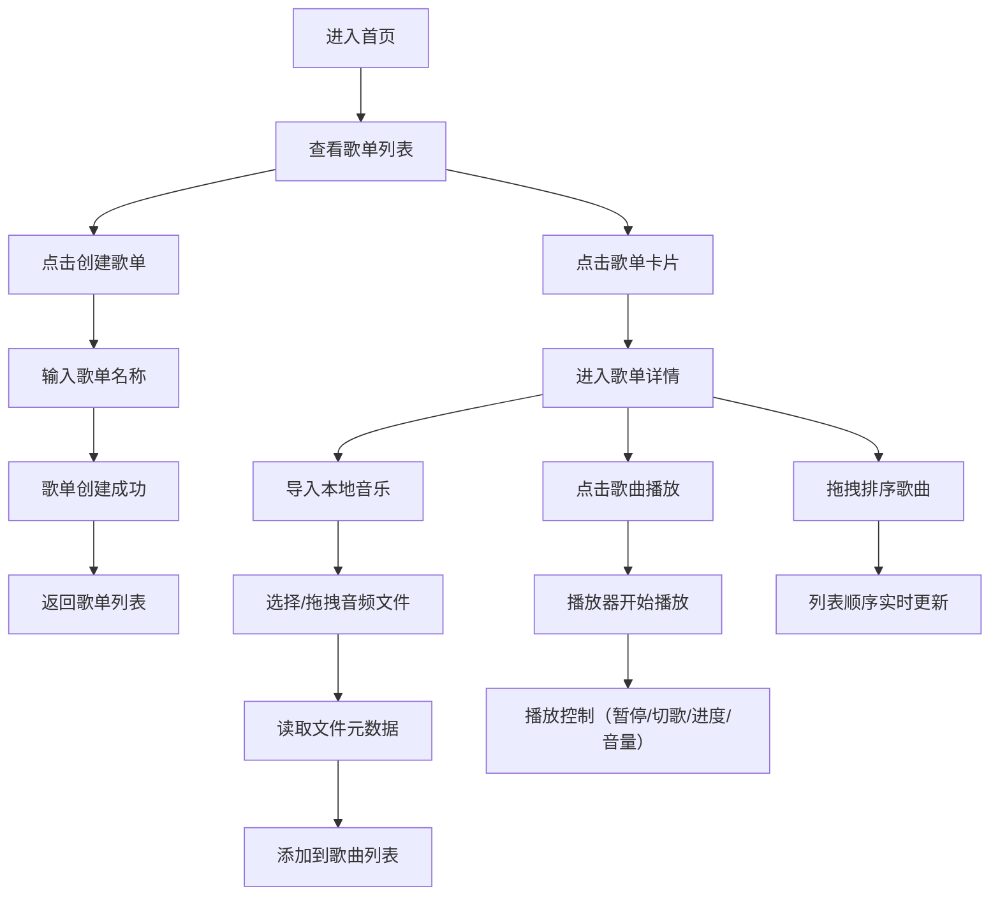

## 1. 产品概述

在线音乐播放歌单管理器，让用户可以创建个性化播放歌单，从本地选择音频文件添加到歌单进行播放，支持完整的播放控制和拖拽排序管理。

- 核心功能：歌单创建管理、本地音频导入、音乐播放控制、拖拽排序
- 目标用户：希望在本地管理和播放个人音乐收藏的用户

## 2. 核心功能

### 2.1 用户角色

| 角色 | 注册方式 | 核心权限 |
|------|----------|----------|
| 普通用户 | 无需注册，本地使用 | 创建/删除歌单、导入本地音乐、播放控制、拖拽排序 |

### 2.2 功能模块

1. **首页（歌单列表页）**：歌单卡片展示、创建歌单、删除歌单、点击进入详情
2. **歌单详情页**：歌曲列表、拖拽排序、删除歌曲、批量导入、音乐播放器
3. **播放器组件**：播放/暂停、上一首/下一首、进度条拖动、音量控制
4. **文件导入组件**：本地文件选择、拖拽文件区域、元数据读取

### 2.3 页面详情

| 页面名称 | 模块名称 | 功能描述 |
|----------|----------|----------|
| 首页 | 歌单卡片网格 | 展示所有歌单，渐变封面、名称、歌曲数量，悬停放大效果 |
| 首页 | 创建歌单按钮 | 弹出输入框，输入歌单名称创建新歌单 |
| 歌单详情页 | 歌曲列表 | 序号、歌曲名、时长、删除按钮，悬停背景淡入动画 |
| 歌单详情页 | 拖拽排序 | 拖拽歌曲行调整顺序，列表实时更新 |
| 歌单详情页 | 文件导入区 | 多文件选择（mp3/wav）、拖拽区域高亮动画反馈 |
| 歌单详情页 | 播放器 | 封面视觉条、进度条（可拖动）、音量滑块、播放控制按钮 |

## 3. 核心流程

## 4. 用户界面设计

### 4.1 设计风格

- **主色调**：#1E1E2E（深色背景）
- **辅助色**：#2D2D44（卡片/面板背景）
- **高亮色**：#7C3AED（紫色渐变，用于进度条、按钮、焦点状态）
- **按钮样式**：圆角按钮，悬停时轻微上浮和阴影加深
- **字体**：现代无衬线字体，清晰易读
- **布局风格**：卡片式布局，桌面端左右分栏（60%列表 + 40%播放器），移动端上下堆叠
- **动画效果**：卡片悬停放大、列表行悬停背景淡入、拖拽区域高亮脉冲

### 4.2 页面设计概览

| 页面名称 | 模块名称 | UI元素 |
|----------|----------|--------|
| 首页 | 顶部标题区 | 应用名称、创建歌单按钮 |
| 首页 | 歌单卡片网格 | 渐变封面、歌单名称、歌曲数量标签、悬停放大动画 |
| 歌单详情页 | 顶部导航 | 返回按钮、歌单名称、删除歌单按钮 |
| 歌单详情页 | 左侧列表区 | 导入按钮、拖拽区域、歌曲列表（序号/名称/时长/删除） |
| 歌单详情页 | 右侧播放器区 | 视觉封面条、歌曲信息、进度条（渐变紫色）、控制按钮、音量滑块 |

### 4.3 响应式设计

- 桌面端（≥1024px）：左右分栏布局，列表区60%，播放器区40%
- 平板端（768-1023px）：左右分栏调整为50%/50%
- 移动端（<768px）：上下堆叠布局，播放器在底部固定
- 触摸优化：增大按钮点击区域，支持触摸滑动进度条
