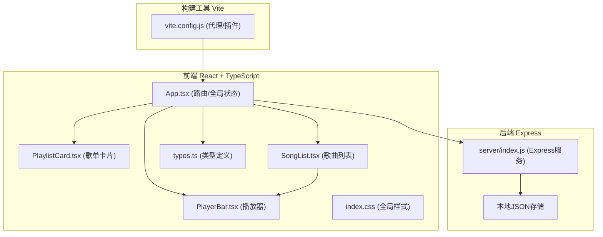
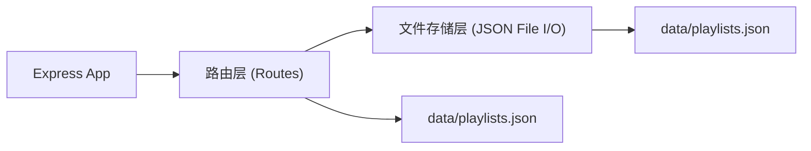
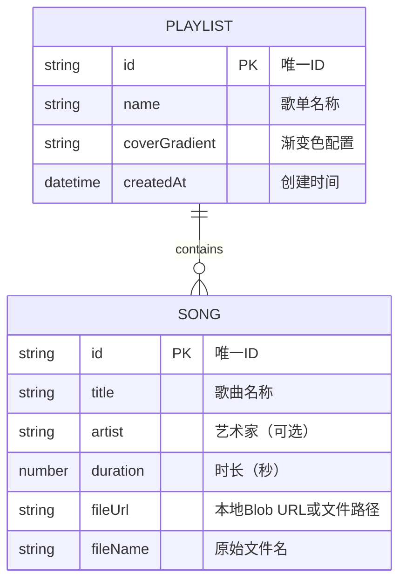

## 1. 架构设计



## 2. 技术选型说明

- **前端框架**：React 18 + TypeScript
- **构建工具**：Vite（快速热更新、开箱即用）
- **后端服务**：Express 4（轻量级HTTP服务）
- **数据存储**：本地JSON文件（无需数据库，简单易用）
- **状态管理**：React useState/useEffect（项目规模适中，无需额外状态管理库）
- **路由**：简单的hash路由或条件渲染（仅2个页面，无需react-router）
- **唯一ID**：uuid库

## 3. 路由定义

| 路由 | 用途 |
|------|------|
| / | 首页，展示所有歌单卡片列表 |
| /playlist/:id | 歌单详情页，展示歌曲列表和播放器 |

## 4. API 定义

### 4.1 获取所有歌单
```typescript
// GET /api/playlists
// Response:
interface PlaylistListResponse {
  playlists: Playlist[];
}
```

### 4.2 创建歌单
```typescript
// POST /api/playlists
// Request Body:
interface CreatePlaylistRequest {
  name: string;
}
// Response:
interface PlaylistResponse {
  playlist: Playlist;
}
```

### 4.3 获取单个歌单
```typescript
// GET /api/playlists/:id
// Response:
interface PlaylistResponse {
  playlist: Playlist;
}
```

### 4.4 更新歌单（添加/排序/删除歌曲）
```typescript
// PUT /api/playlists/:id
// Request Body:
interface UpdatePlaylistRequest {
  name?: string;
  songs?: Song[];
}
// Response:
interface PlaylistResponse {
  playlist: Playlist;
}
```

### 4.5 删除歌单
```typescript
// DELETE /api/playlists/:id
// Response:
interface DeleteResponse {
  success: boolean;
}
```

## 5. 服务器架构



## 6. 数据模型

### 6.1 数据模型定义



### 6.2 TypeScript 类型定义

```typescript
// src/types.ts
interface Song {
  id: string;
  title: string;
  artist?: string;
  duration: number;
  fileUrl: string;
  fileName: string;
}

interface Playlist {
  id: string;
  name: string;
  coverGradient: string;
  songs: Song[];
  createdAt: string;
}
```

## 7. 项目文件结构

```
auto20/
├── package.json
├── vite.config.js
├── tsconfig.json
├── index.html
├── server/
│   └── index.js          # Express后端服务
├── data/
│   └── playlists.json    # 数据存储文件（运行时创建）
└── src/
    ├── types.ts          # 类型定义
    ├── App.tsx           # 主应用组件
    ├── index.css         # 全局样式
    └── components/
        ├── PlaylistCard.tsx  # 歌单卡片
        ├── PlayerBar.tsx     # 播放器控制条
        └── SongList.tsx      # 歌曲列表
```
