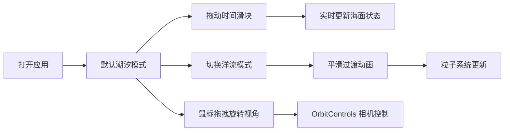

## 1. 产品概述

海洋潮汐模拟器是一个基于 Web 的交互式三维可视化应用，让用户在浏览器中直观观察不同时间尺度下海水表面的流向、流速变化以及潮汐涨落现象。面向海洋爱好者、学生和教育工作者，提供沉浸式的海洋动力学学习体验。

## 2. 核心功能

### 2.1 功能模块

1. **三维海洋场景**：200x200 网格海洋平面，潮汐涨落动画，波纹细节效果
2. **洋流模式切换**：三种洋流模式（无/仅潮汐、环流、急流），平滑过渡动画
3. **流线粒子系统**：1000 个半透明粒子，颜色从青到白渐变，大小随流速变化
4. **时间控制**：底部滑块控制模拟时间（0-24小时），实时响应
5. **信息面板**：右侧悬浮显示模拟时间、潮汐高度、洋流模式、平均流速

### 2.3 页面详情

| 页面名称 | 模块名称 | 功能描述 |
|-----------|-------------|---------------------|
| 主页面 | 三维海洋场景 | 全屏 Three.js 渲染，潮汐动态效果，洋流粒子动画 |
| 主页面 | 时间控制滑块 | 底部居中水平滑块，0-24小时范围，实时拖动响应 |
| 主页面 | 洋流模式选择器 | 下拉菜单切换三种模式，1秒平滑过渡 |
| 主页面 | 信息面板 | 右侧悬浮毛玻璃面板，每秒刷新数据 |
| 主页面 | 背景装饰 | 深空渐变背景，底部水面反射光晕 |

## 3. 核心流程

用户打开应用 → 看到默认潮汐模式的海洋场景 → 通过底部滑块调整时间观察潮汐变化 → 通过下拉菜单切换洋流模式 → 观察粒子流动效果 → 查看右侧信息面板数据 → 可通过鼠标拖拽旋转视角

## 4. 用户界面设计

### 4.1 设计风格

- **主色调**：深蓝色 #0a2b5c 到蓝绿色 #1f7a8c 渐变
- **背景色**：深空渐变 #060a12 到 #0b1420
- **强调色**：青色 #00bcd4 到白色 #ffffff（粒子）
- **UI 风格**：毛玻璃效果、圆角 8px、简洁线条图标
- **字体**：白色无衬线字体，微弱内阴影
- **动画**：悬停亮度提升 + 上浮 2px（0.2秒过渡）

### 4.2 页面设计概览

| 页面名称 | 模块名称 | UI 元素 |
|-----------|-------------|-------------|
| 主页面 | 三维场景 | 全屏海洋平面，动态光照，波纹动画 |
| 主页面 | 时间滑块 | 底部居中，渐变轨道，白色圆形手柄，发光悬停效果 |
| 主页面 | 模式选择 | 下拉菜单，圆角，悬停上浮动画 |
| 主页面 | 信息面板 | 右侧悬浮，backdrop-filter 毛玻璃，半透明深蓝背景 |
| 主页面 | 背景 | 深空径向渐变，底部水面光晕 |

### 4.3 响应式

- 桌面端优先设计
- 窗口尺寸变化时 Three.js 场景自动适配
- UI 控件相对定位，保持在屏幕边缘位置

### 4.4 3D 场景指引

- **环境**：深空背景，雾气效果增强深度感
- **光照**：环境光 + 方向光模拟天光
- **相机**：PerspectiveCamera，OrbitControls 交互
- **材质**：ShaderMaterial 自定义海面着色，顶点动画
- **粒子**：Points 系统，AdditiveBlending 半透明效果
- **性能**：30+ FPS，BufferGeometry 优化顶点数据
