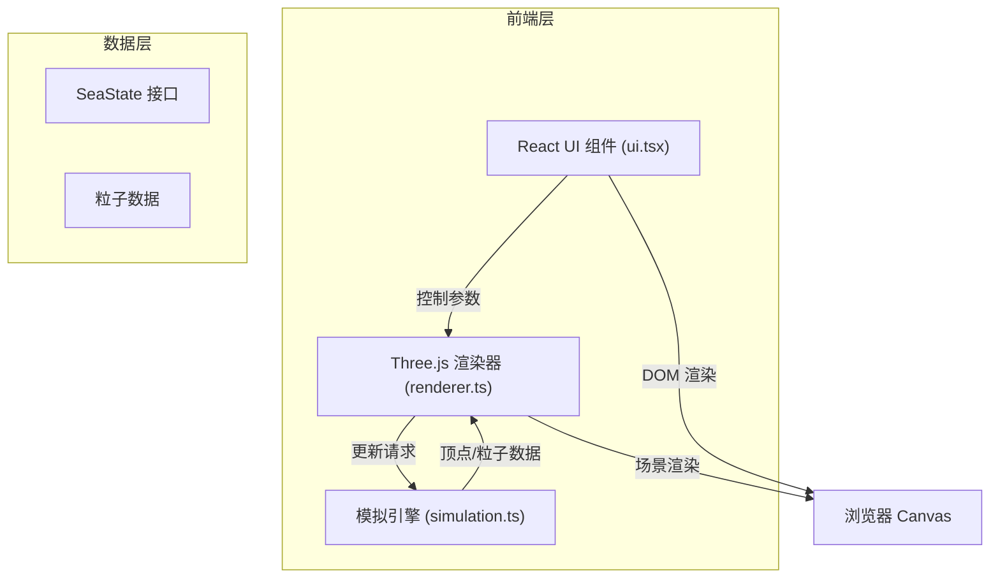

## 1. 架构设计



## 2. 技术说明

- **前端框架**：React@18 + TypeScript
- **构建工具**：Vite@5 + @vitejs/plugin-react
- **3D 渲染**：Three.js + @types/three
- **状态管理**：React useState/useRef（轻量场景，无需 zustand）
- **样式方案**：原生 CSS（内联样式 + style 标签）
- **初始化方式**：手动创建项目结构（用户指定文件结构）

## 3. 模块结构

| 文件 | 职责 |
|------|------|
| package.json | 项目依赖与脚本配置 |
| vite.config.js | Vite 构建配置，base: './' |
| tsconfig.json | TypeScript 严格模式配置 |
| index.html | 入口页面，标题"海洋潮汐模拟器" |
| src/simulation.ts | 核心模拟引擎，SeaState 接口，updateSea 函数 |
| src/renderer.ts | Three.js 场景渲染，海洋网格、粒子、光照、相机控制 |
| src/ui.tsx | React UI 组件，时间滑块、模式选择、信息面板 |
| src/main.tsx | React 入口，挂载 UI 与 3D 场景 |

## 4. 核心数据结构

### SeaState 接口

```typescript
interface SeaState {
  time: number;           // 模拟时间（小时，0-24）
  tideHeight: number;     // 潮汐高度百分比（0-100）
  currentMode: 'none' | 'circulation' | 'jet';
  averageSpeed: number;   // 平均流速
}
```

### 顶点数据

- 200x200 网格 = 40,000 顶点
- 每个顶点包含位置、高度、流动向量
- 使用 BufferGeometry 优化性能

### 粒子系统

- 1000 个流线粒子
- 位置、速度、颜色属性
- Points + ShaderMaterial 渲染

## 5. 核心算法

### 潮汐算法

- 多频率正弦波叠加（基础潮汐 + 高频波纹）
- 周期约 10 秒完成一次完整涨落
- 使用噪声函数生成自然波纹效果

### 洋流算法

- **无模式**：仅潮汐垂直运动，无水平流动
- **环流模式**：围绕中心点的旋转流场，速度随半径变化
- **急流模式**：沿贝塞尔曲线的带状高速流动

### 平滑过渡

- 模式切换时 1 秒插值过渡
- 使用 lerp 函数混合粒子位置和速度
