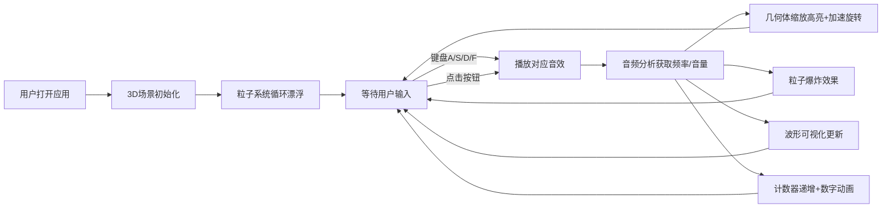

## 1. 产品概述

节奏感应音乐光效表演应用，让用户通过键盘或屏幕按钮触发音效，在3D场景中生成与音乐节奏同步的粒子特效和几何体变换。

- 主要目的：提供沉浸式的音乐可视化互动体验，让用户在创造音乐的同时享受视觉盛宴
- 目标用户：音乐爱好者、视觉艺术爱好者、普通娱乐用户
- 产品价值：将音乐创作与视觉艺术结合，提供即时反馈的互动体验

## 2. 核心功能

### 2.2 功能模块

1. **主应用页面**：3D场景渲染、音效控制面板、波形可视化、节拍计数器
2. **音频引擎模块**：音效加载播放、音频分析（音量/频率）
3. **3D场景模块**：粒子系统、几何体变换、灯光效果
4. **交互控制模块**：键盘事件、按钮点击、动画反馈

### 2.3 页面详情

| 页面名称 | 模块名称 | 功能描述 |
|---------|----------|---------|
| 主应用页面 | 3D场景渲染 | Three.js渲染500个粒子系统和4个霓虹立方体，随音乐节奏变化 |
| 主应用页面 | 音效控制面板 | 4个大圆形按钮（鼓、贝斯、和弦、FX），支持键盘A/S/D/F触发 |
| 主应用页面 | 波形可视化 | Canvas 2D实时绘制音频时域波形，颜色随粒子颜色变化 |
| 主应用页面 | 节拍计数器 | 统计触发总次数，数字动画显示增长 |
| 主应用页面 | 交互反馈 | 按钮按压动画、几何体缩放动画、粒子爆炸效果 |

## 3. 核心流程

用户打开应用 → 3D场景初始化并开始渲染 → 粒子系统循环漂浮 → 用户按下键盘或点击按钮 → 播放对应音效 → 几何体缩放高亮并加速旋转 → 触发粒子爆炸效果 → 波形可视化实时更新 → 计数器递增显示动画

## 4. 用户界面设计

### 4.1 设计风格

- **主色调**：深色背景 #0d0d0d，霓虹色系（紫 #9d4edd、青 #00f5d4、橙 #ff6b35、粉 #ff006e）
- **按钮风格**：圆形、直径80px、霓虹光晕（box-shadow: 0 0 15px 颜色值）、按压时缩放至0.9回弹
- **字体**：现代无衬线字体，数字使用等宽字体
- **布局风格**：全屏沉浸式，场景占据上方大部分区域，按钮底部居中，波形器右下角固定
- **动画风格**：所有交互反馈0.2-0.5秒，流畅有弹性

### 4.2 页面设计概述

| 页面名称 | 模块名称 | UI元素 |
|---------|----------|--------|
| 主应用页面 | 3D场景 | 全屏Canvas、粒子系统（500个，颜色随频率渐变）、4个霓虹立方体（缓慢旋转） |
| 主应用页面 | 顶部计数器 | 大号数字、缩放动画（1.2→1，0.3s）、标签文字 |
| 主应用页面 | 底部按钮区 | 4个圆形按钮水平排列、霓虹光晕、键盘快捷键提示 |
| 主应用页面 | 右下角波形器 | 200x80px Canvas、圆角8px、透明背景、实时波形 |

### 4.3 响应性

- 桌面端优先设计，全屏沉浸式体验
- 按钮区域固定在底部居中，适应不同屏幕宽度
- 3D场景自适应窗口大小变化
- 触摸设备支持按钮点击交互

### 4.4 3D场景指导

- **环境**：深色空间背景，无HDRI，营造沉浸式暗夜氛围
- **灯光**：环境光（低强度）+ 4个点光源（对应4个立方体，触发时增强）
- **相机**：PerspectiveCamera，位置(0, 0, 5)，看向原点，轻微跟随音乐节奏抖动
- **构图**：4个立方体围绕中心分布，粒子系统充满整个场景
- **交互动画**：立方体触发时缩放1.5倍回弹（0.2s），旋转速度0.5→3→0.5rad/s（0.5s），材质半透明→高亮发光
- **后处理**：轻微辉光效果增强霓虹感
- **性能**：粒子500个以内，几何体不超过10个，帧率55FPS以上
