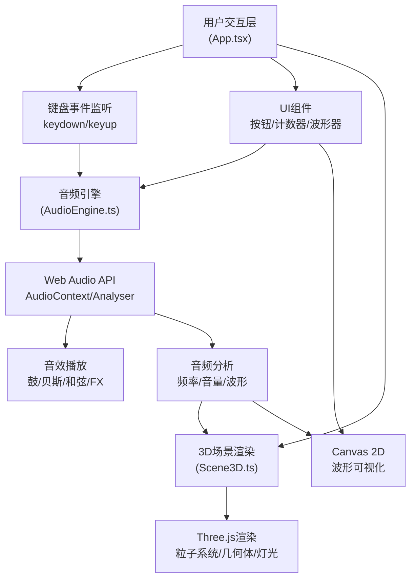

## 1. 架构设计



## 2. 技术描述

- **前端框架**：React 18 + TypeScript 5 + Vite 5
- **3D渲染**：Three.js 0.160 + @types/three
- **音频处理**：Web Audio API（原生）
- **构建工具**：Vite 5 + @vitejs/plugin-react 4
- **状态管理**：React useState/useRef（轻量级，无需额外状态库）
- **样式方案**：原生CSS + CSS变量（无Tailwind，符合项目特定需求）

## 3. 核心模块

### 3.1 AudioEngine 音频引擎

```typescript
interface AudioAnalysis {
  volume: number;           // 瞬时音量 0-1
  averageFrequency: number; // 平均频率 Hz
  frequencyData: Uint8Array; // 频率分布数据
  timeDomainData: Float32Array; // 时域波形数据
}

class AudioEngine {
  playNote(noteName: 'drum' | 'bass' | 'chord' | 'fx'): void;
  getAnalysis(): AudioAnalysis;
  dispose(): void;
}
```

### 3.2 Scene3D 3D场景

```typescript
interface SceneTrigger {
  noteName: string;
  intensity: number;
}

class Scene3D {
  constructor(canvas: HTMLCanvasElement);
  update(analysis: AudioAnalysis, triggers: SceneTrigger[]): void;
  resize(width: number, height: number): void;
  dispose(): void;
}
```

## 4. 文件结构

```
auto203/
├── package.json
├── vite.config.js
├── tsconfig.json
├── index.html
└── src/
    ├── main.tsx          # React根组件，挂载App
    ├── App.tsx           # 主应用组件，布局/状态/事件
    ├── AudioEngine.ts    # 音频引擎类
    └── Scene3D.ts        # Three.js场景类
```

## 5. 性能优化策略

### 5.1 渲染性能
- 使用 `requestAnimationFrame` 驱动渲染循环，目标60FPS
- 粒子系统使用 `BufferGeometry` 批量渲染，减少Draw Call
- 几何体材质复用，避免频繁创建销毁对象
- 音频分析每帧执行一次，数据复用避免重复计算

### 5.2 内存管理
- 组件卸载时调用 `dispose()` 方法清理Three.js资源
- 音频缓冲区复用，音效使用程序生成而非外部文件（控制在2MB以内）
- 使用 `useRef` 存储高频更新对象，避免React重渲染

### 5.3 动画优化
- 所有动画使用时间差（deltaTime）计算，保证不同帧率下一致性
- 几何体动画使用线性插值（lerp）实现平滑过渡
- 粒子位置更新在GPU友好的循环中批量处理

## 6. 音频生成方案

由于要求音频总大小不超过2MB，使用 Web Audio API 程序生成音效：

| 音效类型 | 生成方式 | 特征参数 |
|---------|----------|---------|
| 鼓点 | Oscillator + GainEnvelope | 低频正弦波，快速衰减 |
| 贝斯 | Oscillator + Filter | 锯齿波，低通滤波，长释放 |
| 和弦 | 3个Oscillator叠加 | 正弦波，三和弦，中高频 |
| FX | WhiteNoise + Filter | 白噪声，带通滤波扫频 |

## 7. 关键技术要点

1. **音频-视觉同步**：音频分析数据每帧传递给3D场景，粒子颜色和大小实时响应
2. **触发动画状态机**：每个几何体维护独立的动画状态（idle/triggering），使用时间插值
3. **粒子爆炸效果**：触发时给粒子施加径向速度，随时间衰减
4. **波形可视化**：使用 `requestAnimationFrame` 独立循环，60FPS更新Canvas
5. **键盘事件防抖**：使用 `keydown` 事件，配合标志位防止重复触发
