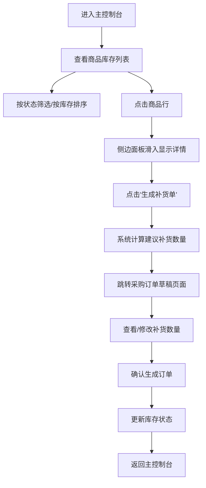

## 1. 产品概述

在线虚拟商店库存管理与自动补货预警系统，面向小型零售店主和电商运营人员，提供直观的库存监控控制台，实现库存实时可视化、低库存自动预警、补货建议生成及采购订单管理。

- 核心价值：帮助商家及时发现缺货风险，减少因库存不足导致的销售损失，提升库存管理效率
- 目标用户：小型零售店主、电商运营人员

## 2. 核心功能

### 2.1 用户角色
无需用户登录，单用户操作模式

### 2.2 功能模块
1. **主控制台页面**：商品数据表格、状态筛选、库存排序、侧边详情面板
2. **采购订单草稿页面**：补货清单展示、数量修改、订单确认提交

### 2.3 页面详情
| 页面名称 | 模块名称 | 功能描述 |
|-----------|-------------|---------------------|
| 主控制台 | 数据表格 | 展示商品编号、名称、当前库存量、阈值、状态，状态颜色标签（正常绿/预警橙/缺货红），支持按状态筛选和库存量排序 |
| 主控制台 | 行状态动画 | 库存量低于阈值时整行微弱红色背景闪烁动画（0.5s周期） |
| 主控制台 | 侧边面板 | 点击行后右侧滑入（ease-out 0.3s），展示商品详情、近7天销售小柱状图、设置阈值和生成补货单按钮 |
| 主控制台 | 响应式适配 | 宽度<768px时侧边面板变全屏遮罩弹窗，表格隐藏非关键列并显示"更多"展开按钮 |
| 采购订单草稿 | 补货清单 | 展示商品清单、建议数量、单价、总金额，支持手动修改数量 |
| 采购订单草稿 | 订单提交 | 确认生成订单，保存后返回主控制台并刷新库存状态 |

## 3. 核心流程

## 4. 用户界面设计

### 4.1 设计风格
- **主题色调**：深色主题
  - 主背景：#141414
  - 卡片背景：#1f1f1f
  - 文字主色：#e0e0e0
  - 正常状态：#52c41a（绿色）
  - 预警状态：#faad14（橙色）
  - 缺货状态：#f5222d（红色）
  - 悬停背景：#2a2a2a
- **按钮样式**：圆角设计（border-radius: 6px），hover放大1.05倍，点击涟漪效果
- **字体**：现代无衬线字体，清晰可读
- **布局风格**：卡片式布局，表格为主
- **图标风格**：简洁线性图标

### 4.2 页面设计概述
| 页面名称 | 模块名称 | UI元素 |
|-----------|-------------|-------------|
| 主控制台 | 数据表格 | 深色背景表格、行悬停高亮（0.2s缓动）、状态颜色标签、低库存行闪烁动画 |
| 主控制台 | 侧边面板 | 右侧滑入动画（ease-out 0.3s）、商品图片占位符、详情信息、小柱状图、操作按钮 |
| 采购订单草稿 | 补货清单 | 商品卡片列表、数量输入框、金额计算、确认按钮 |

### 4.3 响应式
- 桌面端优先设计
- 宽度<768px时：侧边面板变为全屏遮罩弹窗，表格列自适应隐藏，显示"更多"展开按钮
- 触摸操作优化

### 4.4 性能要求
- 搜索和筛选操作响应时间：≤200ms
- 补货建议计算：用户点击后1s内展示结果
