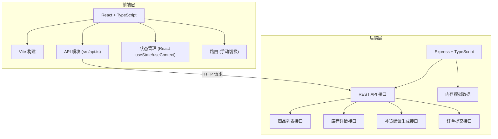
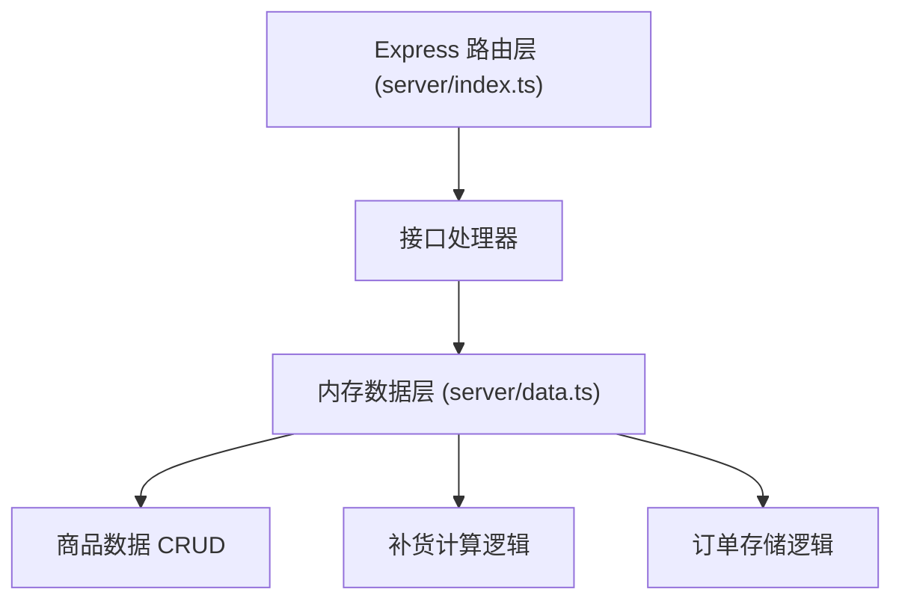
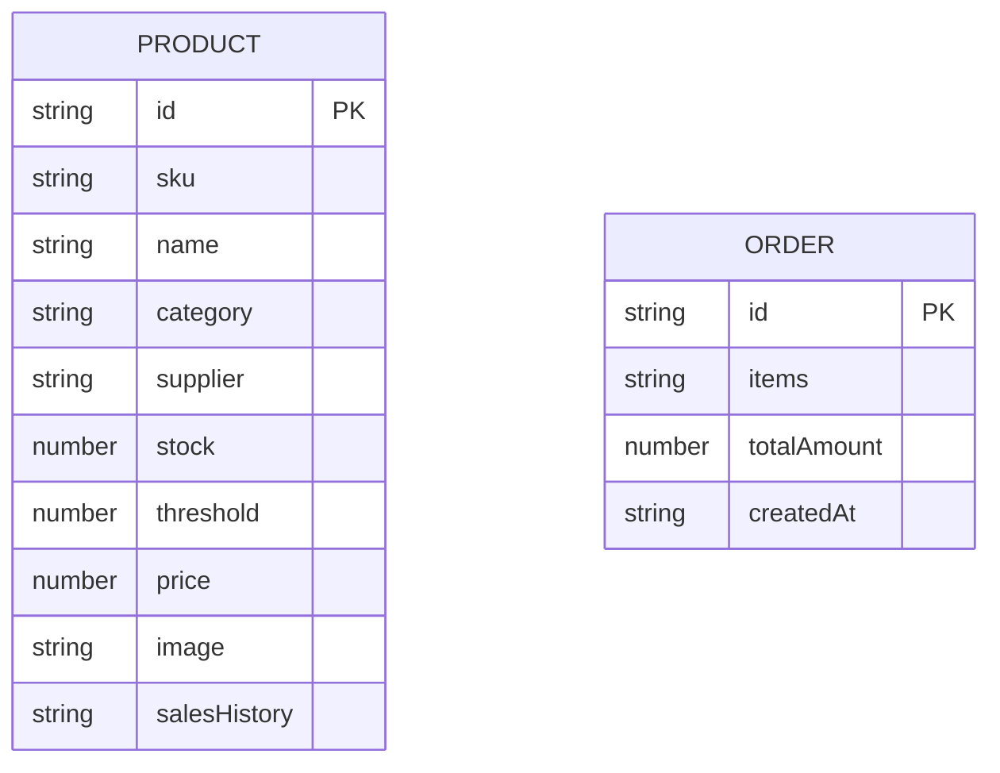

## 1. 架构设计



## 2. 技术描述
- **前端**：React@18 + TypeScript + Vite
- **后端**：Express@4 + TypeScript
- **构建工具**：Vite
- **数据存储**：内存数据模拟（server/data.ts）
- **HTTP通信**：Fetch API

## 3. 路由定义
| 路由（前端视图） | 用途 |
|-------|---------|
| / (dashboard) | 主控制台页面，展示商品库存列表和侧边详情面板 |
| /order (order-draft) | 采购订单草稿页面，展示补货清单并支持修改确认 |

## 4. API 定义

### 4.1 类型定义

```typescript
interface Product {
  id: string;
  sku: string;
  name: string;
  category: string;
  supplier: string;
  stock: number;
  threshold: number;
  price: number;
  image: string;
  salesHistory: number[]; // 近7天销量
}

interface RestockSuggestion {
  productId: string;
  product: Product;
  currentStock: number;
  threshold: number;
  suggestedQuantity: number;
  unitPrice: number;
  subtotal: number;
}

interface OrderDraft {
  id: string;
  items: RestockSuggestion[];
  totalAmount: number;
  createdAt: string;
}

type StockStatus = 'normal' | 'warning' | 'outOfStock';
```

### 4.2 接口列表

| 方法 | 路径 | 描述 | 请求体 | 响应 |
|------|------|------|--------|------|
| GET | /api/products | 获取商品列表 | - | Product[] |
| GET | /api/products/:id | 获取商品详情 | - | Product |
| POST | /api/products/:id/threshold | 设置商品阈值 | { threshold: number } | Product |
| POST | /api/restock/suggest | 生成补货建议 | { productIds: string[] } | RestockSuggestion[] |
| POST | /api/orders | 提交订单 | { items: RestockSuggestion[] } | { success: boolean, orderId: string } |

## 5. 服务端架构图



## 6. 数据模型

### 6.1 数据模型定义



### 6.2 初始数据
server/data.ts 中包含10种商品的模拟数据，包含库存、阈值、历史销量等字段。
