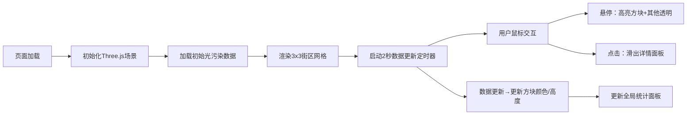

## 1. 产品概述
城市夜间光污染研究的交互式数据可视化平台，将不同区域的光污染等级与夜间灯光分布直观展示在三维地图上，辅助研究人员和城市规划者分析光污染分布情况。
- 面向城市规划研究者、环境科学工作者，提供直观的三维光污染数据展示
- 价值：将抽象的光污染数据转化为可交互的三维可视化模型，提升数据分析效率

## 2. 核心功能

### 2.1 用户角色
| 角色 | 注册方式 | 核心权限 |
|------|----------|----------|
| 研究人员 | 无需注册 | 浏览三维场景、查看街区详情、观察实时数据变化 |

### 2.2 功能模块
1. **主页面**：三维场景渲染、全局统计面板、数据详情面板
2. **三维热力图**：9个街区网格、颜色渐变、高度变化、交互高亮
3. **数据详情面板**：街区详情、实时数据、历史趋势柱状图
4. **全局统计**：平均污染指数、最高污染区块、实时更新动画

### 2.3 页面详情
| 页面名称 | 模块名称 | 功能描述 |
|----------|----------|----------|
| 主页面 | 三维场景模块 | 3x3街区网格、颜色/高度动态变化、鼠标交互（旋转/缩放/点击）、高亮效果 |
| 主页面 | 全局统计面板 | 左上角实时显示平均光污染指数、最高污染区块名称，每2秒刷新带缩放动画 |
| 主页面 | 数据详情面板 | 右侧滑入，展示街区名称、灯光强度、污染指数、光源类型、12小时柱状趋势图 |
| 主页面 | 数据模拟模块 | 每2秒自动微调所有街区污染值（±5范围），提供初始和更新数据接口 |

## 3. 核心流程
用户打开页面后，系统初始化Three.js三维场景并渲染9个街区网格，同时启动数据定时器每2秒更新污染数据。用户可通过鼠标旋转缩放观察整体分布，悬停方块查看高亮效果，点击任意方块查看详细数据面板。

## 4. 用户界面设计

### 4.1 设计风格
- **主色调**：深蓝色夜空 `#0b0b2b`，背景渐变 `#1a1a2e` 到 `#16213e`
- **强调色**：亮青色 `#00d4ff` 用于统计数据高亮
- **热力色带**：绿色 `#00ff00` → 黄色 → 红色 `#ff0000` 渐变表示污染等级
- **毛玻璃效果**：面板背景 `rgba(255,255,255,0.2)` + `blur(10px)`
- **圆角卡片**：12px圆角，半透明 `rgba(0,0,0,0.5)` 背景
- **动画曲线**：统一使用 `cubic-bezier(0.4, 0, 0.2, 1)`
- **字体**：使用JetBrains Mono等现代等宽字体提升科技感

### 4.2 页面设计概述
| 页面名称 | 模块名称 | UI元素 |
|----------|----------|--------|
| 主页面 | 三维场景区域 | 左侧占70%宽度，深蓝色夜空背景，半透明网格地面，3x3方块网格，环境光+方向光阴影 |
| 主页面 | 全局统计面板 | 左上角浮动卡片，白色文字，亮青色数字，缩放动画效果 |
| 主页面 | 数据详情面板 | 右侧占30%宽度，初始隐藏，滑入动画300ms，四项数据指标+Canvas柱状图 |

### 4.3 响应式
- 桌面端优先设计，主场景与面板横向布局
- 可适配不同屏幕分辨率，场景画布自适应容器尺寸

### 4.4 3D场景指导
- **环境**：深蓝色夜空背景 `#0b0b2b`，营造夜间氛围
- **光照**：环境光强度0.4 + 方向光（左上角，强度0.8）+ 阴影效果
- **相机**：透视相机，初始俯视角45度，支持OrbitControls旋转缩放
- **交互**：射线检测实现鼠标悬停/点击，悬停高亮边框，点击选中状态
- **性能**：使用BufferGeometry优化性能，材质复用，帧率不低于50FPS
