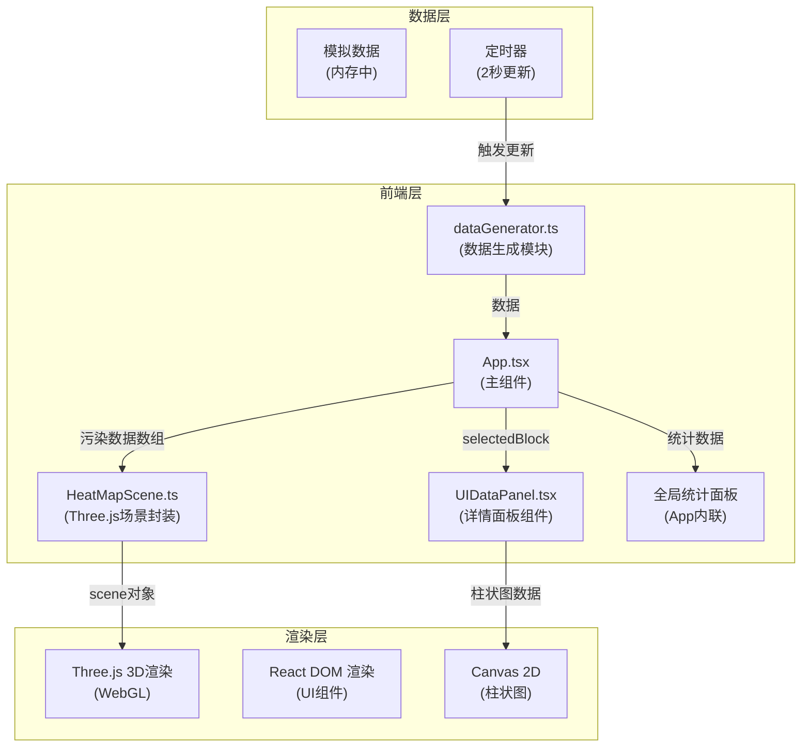
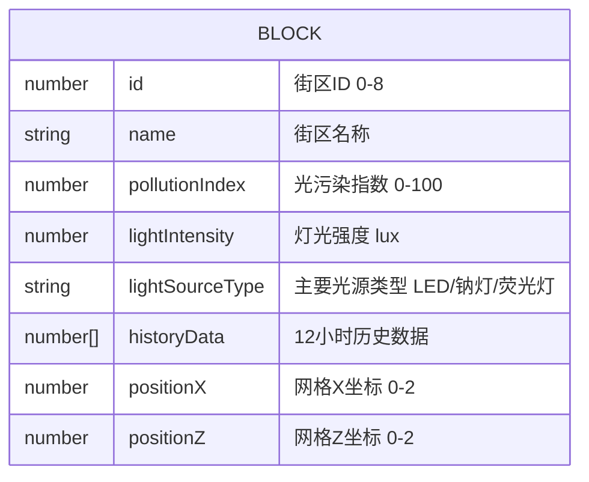

## 1. 架构设计



## 2. 技术描述
- **前端框架**：React@18 + TypeScript@5
- **构建工具**：Vite@5 + @vitejs/plugin-react@4
- **3D引擎**：Three.js@0.160 + @types/three@0.160
- **初始化方式**：Vite手动创建项目结构
- **后端**：无后端，使用前端模拟数据
- **数据库**：无数据库，数据在内存中生成和维护

### 文件结构与调用关系
```
src/
├── App.tsx              # 主组件，数据流向中心
│   ├── 调用 getInitialData() 获取初始数据
│   ├── 定时调用 updateData() 更新数据
│   ├── 创建 HeatMapScene 实例
│   ├── 传递 selectedBlock 给 UIDataPanel
│   └── 处理用户交互事件
├── HeatMapScene.ts      # Three.js场景封装
│   ├── 接收 App 传入的污染数据数组
│   ├── 生成/更新方块颜色和高度
│   └── 返回 scene 对象供渲染
├── UIDataPanel.tsx      # 详情面板组件
│   ├── 接收 App 传入的 selectedBlock
│   ├── 渲染四项数据指标
│   └── Canvas 绘制12小时柱状图
└── dataGenerator.ts     # 模拟数据模块
    ├── getInitialData() → 9个街区初始数据
    └── updateData() → 微调数据（±5）
```

## 3. 路由定义
| 路由 | 用途 |
|------|------|
| / | 主页面，包含三维场景和所有UI面板 |

## 4. 数据模型

### 4.1 数据模型定义



### 4.2 TypeScript 类型定义

```typescript
interface BlockData {
  id: number;
  name: string;
  pollutionIndex: number;  // 0-100
  lightIntensity: number;  // lux
  lightSourceType: 'LED' | '钠灯' | '荧光灯';
  historyData: number[];   // 12小时历史
  positionX: number;       // 0-2
  positionZ: number;       // 0-2
}

interface SceneConfig {
  gridSize: number;        // 网格大小 3x3
  blockSpacing: number;    // 方块间距
  minHeight: number;       // 最小高度 1
  maxHeight: number;       // 最大高度 5
  colorLow: string;        // 最低值颜色 #00ff00
  colorHigh: string;       // 最高值颜色 #ff0000
}
```

## 5. 核心配置参数

| 参数 | 值 | 说明 |
|------|----|------|
| 网格尺寸 | 3x3 | 9个街区 |
| 方块间距 | 2.5单位 | 视觉分离 |
| 高度范围 | 1-5单位 | 线性映射污染指数 |
| 颜色渐变 | #00ff00 → #ff0000 | 绿到红 |
| 更新间隔 | 2000ms | 数据刷新频率 |
| 数据波动 | ±5 | 每次更新变化范围 |
| 高亮边框 | 2px白色 | 选中/悬停效果 |
| 透明度过渡 | 0.3 | 非选中方块 |
| 动画时长 | 300ms | 面板滑入 |
| 缩放动画 | 1.0→1.2→1.0, 0.2s | 数字更新效果 |
