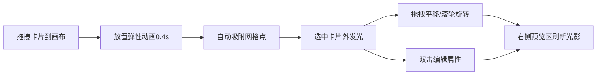

## 1. 产品概述

光影纸牌屋是一款基于浏览器的交互式数字沙盘应用，用户通过拖拽、旋转半透明彩色卡片来搭建建筑或艺术装置结构，系统实时计算卡片间的遮挡与光影效果，营造宁静而富有层次感的视觉体验。

- 目标用户：创意设计师、艺术爱好者、休闲用户
- 核心价值：提供低门槛、高自由度的视觉创作工具，通过光影效果带来沉浸式创作体验

---

## 2. 核心功能

### 2.1 功能模块

1. **画布区域**：卡片渲染、拖拽交互、旋转操作、网格吸附、放置动画
2. **底部工具栏**：六种预设颜色卡片、拖拽创建新卡片
3. **属性编辑面板**：颜色切换、透明度滑块、尺寸宽高调节
4. **光影预览区**：实时光影模拟、遮挡关系计算、Canvas逐像素阴影混合

### 2.2 页面详情

| 页面名称 | 模块名称 | 功能描述 |
|-----------|-------------|---------------------|
| 主页面 | 深色渐变画布 | 背景从#1a1a2e到#16213e渐变，浅灰色虚线网格 |
| 主页面 | 底部工具栏 | 六种预设半透明颜色（玫瑰红、琉璃蓝等），支持拖拽到画布 |
| 主页面 | 卡片组件 | 拖拽平移、滚轮旋转、选中发光、放置弹性动画、网格吸附 |
| 主页面 | 属性编辑面板 | 双击卡片弹出，修改颜色/透明度/尺寸 |
| 主页面 | 光影预览区 | 右侧实时渲染，逐像素阴影混合，每0.5秒刷新 |

---

## 3. 核心流程

用户从底部工具栏拖拽颜色卡片到画布 → 放置时弹性动画 → 自动吸附到网格点 → 鼠标拖拽平移卡片 → 滚轮旋转卡片（显示实时角度） → 双击打开属性面板修改颜色/透明度/尺寸 → 右侧预览区实时显示光影效果

---

## 4. 用户界面设计

### 4.1 设计风格

- **主色调**：深色渐变背景（#1a1a2e → #16213e）
- **卡片颜色**：
  - 玫瑰红 rgba(255,99,132,0.7)
  - 琉璃蓝 rgba(54,162,235,0.7)
  - 翡翠绿 rgba(75,192,192,0.7)
  - 薰衣紫 rgba(153,102,255,0.7)
  - 琥珀橙 rgba(255,159,64,0.7)
  - 珍珠白 rgba(230,230,230,0.7)
- **阴影颜色**：深蓝半透明
- **交互风格**：毛玻璃 + 极简主义，卡片圆角细腻投影
- **过渡动画**：统一0.25s ease，放置动画0.4s cubic-bezier
- **字体**：现代无衬线字体，清晰可辨

### 4.2 页面设计概览

| 区域 | 模块 | UI元素 |
|-----------|-------------|-------------|
| 左侧70% | 画布区域 | 深色渐变、虚线网格、半透明卡片、选中发光效果 |
| 右侧30% | 光影预览 | Canvas渲染阴影、深蓝半透明混合效果 |
| 底部 | 工具栏 | 毛玻璃背景、六色色板、拖拽源按钮 |
| 弹窗 | 属性编辑 | 颜色选择器、透明度滑块0.1-1.0、宽高滑块 |

### 4.3 响应式设计

- 桌面端/平板：左侧画布70%，右侧预览区30%，左右排列
- 移动端（<768px）：画布在上，预览区在下，上下排列
- 触摸操作优化：支持触屏拖拽与双指旋转

### 4.4 性能要求

- 拖拽和旋转操作：60fps流畅度
- 预览区刷新：每0.5秒刷新，帧率不低于20fps
- 主线程不卡顿：阴影计算优化
