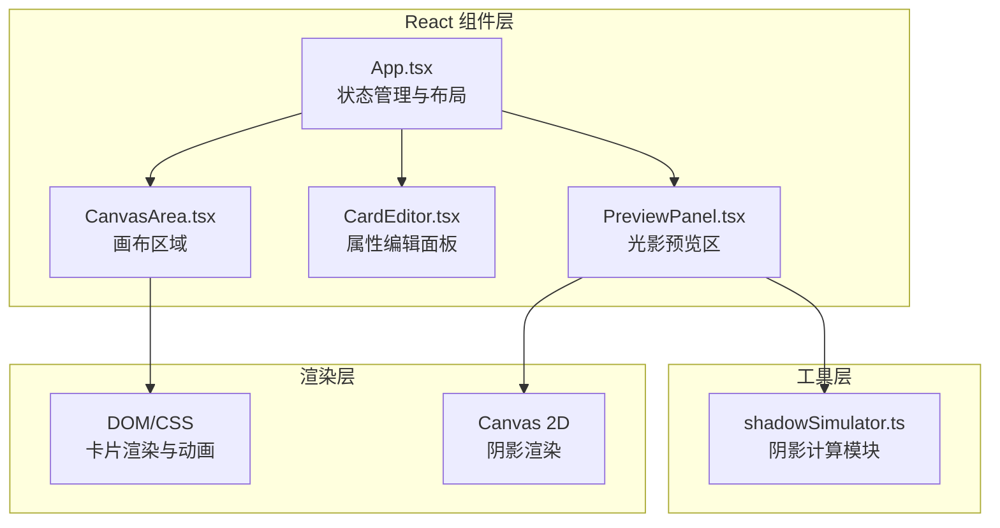

## 1. 架构设计



## 2. 技术栈说明

- **前端框架**：React 18 + TypeScript
- **构建工具**：Vite 5
- **样式方案**：原生CSS + CSS Variables（毛玻璃、渐变、动画）
- **渲染技术**：
  - 卡片：DOM + CSS Transform（高性能拖拽旋转）
  - 阴影：Canvas 2D API（逐像素混合计算）
- **状态管理**：React useState/useCallback（简单场景无需额外库）
- **性能优化**：
  - requestAnimationFrame 处理拖拽
  - setInterval 0.5s 定时刷新阴影
  - 阴影计算防抖与离屏Canvas

## 3. 文件结构

```
auto207/
├── package.json
├── vite.config.js
├── tsconfig.json
├── index.html
└── src/
    ├── App.tsx              # 主组件，布局与状态提升
    ├── components/
    │   ├── CanvasArea.tsx   # 画布区域，拖拽/旋转/网格吸附
    │   ├── CardEditor.tsx   # 属性编辑面板
    │   └── PreviewPanel.tsx # 光影预览区，Canvas渲染
    └── utils/
        └── shadowSimulator.ts  # 纯工具：阴影计算
```

## 4. 数据模型定义

### Card 类型

```typescript
interface Card {
  id: string;
  x: number;          // 中心X坐标
  y: number;          // 中心Y坐标
  rotation: number;   // 旋转角度（度）
  width: number;      // 卡片宽度（px）
  height: number;     // 卡片高度（px）
  color: string;      // rgba颜色字符串
  opacity: number;    // 透明度 0.1-1.0
  zIndex: number;     // 层级
}
```

### 预设颜色常量

```typescript
const PRESET_COLORS = [
  'rgba(255, 99, 132, 0.7)',  // 玫瑰红
  'rgba(54, 162, 235, 0.7)',  // 琉璃蓝
  'rgba(75, 192, 192, 0.7)',  // 翡翠绿
  'rgba(153, 102, 255, 0.7)', // 薰衣紫
  'rgba(255, 159, 64, 0.7)',  // 琥珀橙
  'rgba(230, 230, 230, 0.7)', // 珍珠白
];
```

## 5. 核心交互实现

### 5.1 卡片拖拽流程
1. mousedown 记录起点与卡片位置
2. mousemove 通过 transform: translate 实时更新
3. mouseup 计算最近网格点，执行吸附动画

### 5.2 旋转实现
- wheel 事件监听，deltaY 正负映射旋转方向
- 旋转步长：2度/格，以卡片中心为轴

### 5.3 阴影计算原理（shadowSimulator）
1. 输入：卡片几何数组 + 光源方向（默认左上45度）
2. 按 zIndex 从后到前排序
3. 每张卡片沿光源方向偏移生成投影多边形
4. 逐像素累加重叠区域 alpha 值（正片叠底混合）
5. 输出 ImageData 给 Canvas 渲染

### 5.4 性能策略
- 拖拽使用 transform 而非 top/left（触发GPU合成）
- 阴影计算使用离屏Canvas，结果缓存直到卡片列表变化
- 预览区刷新与用户交互解耦（独立interval）
