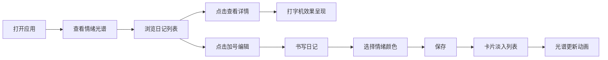

## 1. 产品概述

情绪调色板是一款日记与心情可视化应用，让用户以颜色记录每日情绪，通过渐变色带和情感分析雷达图直观展现情绪变化趋势。

- **核心价值**：用色彩语言替代传统 emoji，创造更细腻、更具艺术感的情绪记录体验
- **目标用户**：喜欢写日记、关注心理健康、追求美学体验的年轻用户群体
- **市场定位**：极简美学风格的情绪记录工具，主打视觉呈现和情感洞察

## 2. 核心功能

### 2.1 用户角色
| 角色 | 注册方式 | 核心权限 |
|------|----------|----------|
| 普通用户 | 无需注册（本地存储） | 记录日记、查看情绪光谱、浏览历史记录 |

### 2.2 功能模块
1. **日记列表模块**：按周分组展示日记，含日期、情绪色点、标题预览
2. **日记详情模块**：展示完整日记内容，打字机效果逐字呈现，情绪色块呼吸动画
3. **日记编辑模块**：富文本编辑 + 24色圆环情绪选择器
4. **情绪光谱模块**：7天情绪颜色平滑渐变条，周切换滑动动画
5. **情感分析模块**：文本情感分析（正面/负面/中性），雷达图可视化

### 2.3 页面详情
| 页面名称 | 模块名称 | 功能描述 |
|----------|----------|----------|
| 主页面 | 情绪光谱条 | 横跨顶部的7天渐变色带，周切换从左到右滑动动画（0.5s ease） |
| 主页面 | 日记列表 | 左侧按周分组，hover 显示2px左边框色条，点击选中日记 |
| 主页面 | 日记详情 | 右侧展示，20%高度情绪色块（呼吸动画），打字机效果内容 |
| 主页面 | 编辑模式 | 富文本框（加粗/斜体），颜色圆环选择器，保存后淡入动画 |

## 3. 核心流程

用户打开应用 → 查看当前周情绪光谱 → 浏览左侧日记列表 → 点击某天查看详情（打字机效果呈现） → 点击加号或空白区域进入编辑模式 → 书写日记并选择情绪颜色 → 保存后日记卡片淡入列表 → 切换周查看历史情绪变化

## 4. 用户界面设计

### 4.1 设计风格
- **主题**：深色模式（Dark Mode），营造沉浸感
- **主背景**：#1e1e2e（深紫灰色）
- **卡片背景**：#2a2a3e（稍浅的卡片色）
- **文字颜色**：#e0e0e0（浅灰白色）
- **情绪色**：24种高饱和度预设色，在深色背景上明亮突出
- **间距规范**：渐变色带与卡片间距 24px，内边距遵循 4px 倍数原则

### 4.2 页面设计概述
| 页面名称 | 模块名称 | UI 元素 |
|----------|----------|---------|
| 主页面 | 情绪光谱条 | 40px 高度，线性渐变，底部周标签，从左到右滑动动画 |
| 主页面 | 日记列表 | 左侧 35% 宽度，按周分组，卡片式布局，hover 左边框色条动画 |
| 主页面 | 日记详情 | 右侧 65% 宽度，顶部情绪色块（20%高度），呼吸动画，正文打字机效果 |
| 主页面 | 编辑模式 | 富文本工具栏浮动，24色圆环选择器，选中色块放大预览 |

### 4.3 动画效果
- **打字机效果**：每字 30ms 逐字出现
- **呼吸动画**：情绪色块透明度 0.5→1 循环，周期 4s
- **滑动动画**：周切换时光谱条从左到右滑动，0.5s ease
- **淡入动画**：新保存日记从底部淡入，0.3s
- **Hover 动画**：日期卡片左边框从透明过渡到情绪色，2px 宽度

### 4.4 性能指标
- 同时展示 50 篇日记时，保持 60fps 流畅
- 输入无卡顿，动画无掉帧
- 滚动列表性能优化（虚拟滚动或高效渲染）

### 4.5 响应式
- 桌面端优先设计
- 左右两栏布局（左 35% / 右 65%）
- 最小宽度支持 1024px
