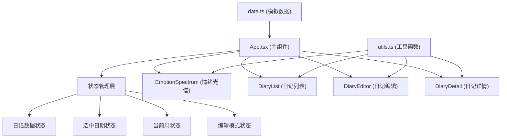

## 1. 架构设计



## 2. 技术描述

- **前端框架**：React 18 + TypeScript
- **构建工具**：Vite 5
- **样式方案**：纯 CSS（CSS 变量 + 关键帧动画）
- **状态管理**：React useState/useReducer（组件内状态提升）
- **富文本编辑**：contentEditable + document.execCommand（轻量实现）
- **数据存储**：本地模拟数据（14天样本）
- **图标**：内联 SVG / CSS 实现，避免额外依赖

## 3. 文件结构

```
src/
├── App.tsx              # 主组件，状态管理，布局容器
├── DiaryEditor.tsx      # 编辑组件：富文本框 + 颜色圆环选择器
├── EmotionSpectrum.tsx  # 情绪光谱条：渐变 + 滑动动画
├── DiaryList.tsx        # 日记列表：按周分组 + 选择交互
├── utils.ts             # 工具函数：情感分析、日期格式化、颜色映射
├── data.ts              # 模拟数据：14天日记样本
└── styles.css           # 全局样式：主题变量、动画、过渡
```

## 4. 核心组件说明

### 4.1 App.tsx
- 职责：整体布局、状态提升、组件协调
- 状态：diaries（日记数组）、selectedDate（选中日期）、currentWeekStart（当前周起始日）、isEditing（编辑模式）
- 布局：左右两栏 Flex 布局，顶部光谱条

### 4.2 EmotionSpectrum.tsx
- 输入：colors（7个颜色值数组）、weekLabel（周标签）、isAnimating（是否触发动画）
- 实现：CSS linear-gradient 平滑渐变，transform translateX 实现滑动动画
- 高度：40px

### 4.3 DiaryList.tsx
- 输入：diaries、selectedDate、currentWeekStart、onDateSelect、onAddClick
- 输出：按周分组的日记卡片列表
- 交互：点击选中、hover 左边框色条动画、加号按钮

### 4.4 DiaryEditor.tsx
- 输入：initialData（编辑时的初始数据）、onSave（保存回调）、onCancel（取消回调）
- 功能：富文本编辑（加粗、斜体）、24色圆环选择器、颜色预览
- 交互：选中色块放大预览 + 情绪名称显示

### 4.5 utils.ts
- `analyzeSentiment(text)`：情感分析模拟函数，返回 {positive, negative, neutral}
- `getEmotionName(color)`：颜色到情绪名称映射
- `formatDate(date)`：日期格式化
- `getWeekDates(weekStart)`：获取某周7天日期
- `groupByWeek(diaries)`：按周分组日记

## 5. 数据模型

### 5.1 Diary 接口
```typescript
interface Diary {
  id: string;
  date: string; // YYYY-MM-DD
  title: string;
  content: string; // HTML 格式
  emotionColor: string; // 十六进制颜色值
  sentiment?: {
    positive: number;
    negative: number;
    neutral: number;
  };
}
```

### 5.2 预设颜色（24色）
沿色环均匀分布的 24 种高饱和度颜色，覆盖红、橙、黄、绿、青、蓝、紫等色相。

## 6. 性能优化策略

1. **列表渲染优化**：使用 React.memo 包裹日记卡片，避免不必要重渲染
2. **打字机效果**：使用 requestAnimationFrame 或 CSS 动画实现流畅效果
3. **动画优化**：优先使用 transform 和 opacity 属性动画（GPU 加速）
4. **颜色计算缓存**：渐变色带计算结果缓存
5. **状态最小化**：仅提升必要状态到顶层，减少跨组件重渲染

## 7. 构建配置

- `base: './'`：相对路径部署
- 严格 TypeScript 模式
- React 17+ JSX 转换
- 开发服务器启用 HMR
