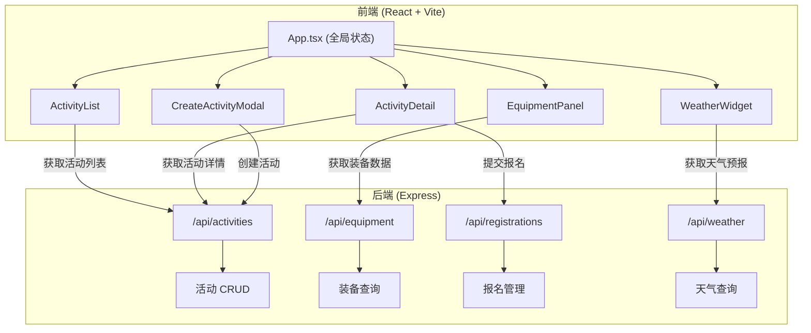
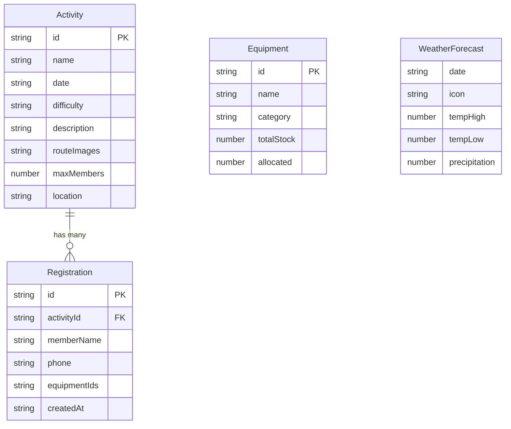

## 1. 架构设计



## 2. 技术说明

- 前端：React@18 + TypeScript@5 + Vite@5 + Tailwind CSS@3
- 初始化工具：vite-init（react-express-ts 模板）
- 后端：Express@4 + TypeScript + CORS
- 数据库：无（内存JSON模拟数据）
- 状态管理：zustand
- 图标：lucide-react
- 依赖：react@18, react-dom@18, typescript@5, vite@5, @vitejs/plugin-react@4, express@4, cors@2, uuid@9

## 3. 路由定义

| 路由 | 用途 |
|------|------|
| / | 主面板（活动列表+详情+装备+天气） |

## 4. API 定义

### 4.1 活动相关

| 方法 | 路径 | 描述 | 请求体 | 响应 |
|------|------|------|--------|------|
| GET | /api/activities | 获取所有活动 | - | Activity[] |
| GET | /api/activities/:id | 获取单个活动 | - | Activity |
| POST | /api/activities | 创建活动 | CreateActivityDTO | Activity |

### 4.2 装备相关

| 方法 | 路径 | 描述 | 请求体 | 响应 |
|------|------|------|--------|------|
| GET | /api/equipment | 获取所有装备 | - | Equipment[] |
| GET | /api/equipment/:activityId | 获取某活动的装备分配 | - | EquipmentAllocation[] |

### 4.3 报名相关

| 方法 | 路径 | 描述 | 请求体 | 响应 |
|------|------|------|--------|------|
| POST | /api/registrations | 报名 | CreateRegistrationDTO | Registration |
| GET | /api/registrations/:activityId | 获取某活动的报名列表 | - | Registration[] |

### 4.4 天气相关

| 方法 | 路径 | 描述 | 请求体 | 响应 |
|------|------|------|--------|------|
| GET | /api/weather/:activityId | 获取某活动的天气预报 | - | WeatherForecast[] |

### 4.5 TypeScript 类型定义

```typescript
interface Activity {
  id: string;
  name: string;
  date: string;
  difficulty: 'easy' | 'medium' | 'hard';
  description: string;
  routeImages: string[];
  maxMembers: number;
  location: string;
}

interface Equipment {
  id: string;
  name: string;
  category: 'tent' | 'sleeping_bag' | 'cookware' | 'first_aid';
  totalStock: number;
  allocated: number;
}

interface Registration {
  id: string;
  activityId: string;
  memberName: string;
  phone: string;
  equipmentIds: string[];
  createdAt: string;
}

interface WeatherForecast {
  date: string;
  icon: 'sunny' | 'cloudy' | 'rainy' | 'stormy' | 'snowy';
  tempHigh: number;
  tempLow: number;
  precipitation: number;
}
```

## 5. 服务器架构

```mermaid
flowchart LR
    "Express Router" --> "Activity Controller"
    "Express Router" --> "Equipment Controller"
    "Express Router" --> "Registration Controller"
    "Express Router" --> "Weather Controller"
    "Activity Controller" --> "内存数据 (activities[])"
    "Equipment Controller" --> "内存数据 (equipment[])"
    "Registration Controller" --> "内存数据 (registrations[])"
    "Weather Controller" --> "模拟天气数据"
```

## 6. 数据模型

### 6.1 数据模型定义



### 6.2 初始数据

- 8-10个模拟活动（不同难度、日期）
- 12-15件装备（4个类别各3-4件）
- 每个活动3-8条报名记录
- 3天模拟天气预报数据
