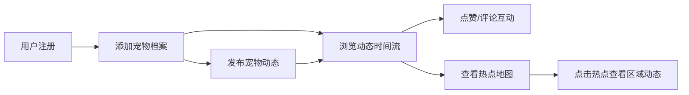

## 1. 产品概述

萌宠记是一款专为宠物主人打造的社交应用，帮助用户集中记录和分享宠物日常趣事，自动生成宠物社交图谱。解决了宠物萌照和趣事分散在不同社交媒体、缺乏专属展示互动空间的问题。

### 核心价值
- 宠物档案集中管理，一个平台记录所有爱宠信息
- 动态时间流瀑布流展示，沉浸式浏览宠物日常
- 智能推荐附近宠物，发现同好萌友
- 热点地图可视化，探索宠物出没热点区域

## 2. 核心功能

### 2.1 用户角色

| 角色 | 注册方式 | 核心权限 |
|------|----------|----------|
| 普通用户 | 用户名注册 | 添加宠物、发布动态、浏览动态、点赞评论、查看热点地图 |

### 2.2 功能模块

1. **首页**：顶部导航栏、左侧宠物档案栏、右侧动态时间流
2. **宠物档案**：宠物卡片展示（毛玻璃效果）、添加宠物、快捷操作
3. **动态时间流**：瀑布流布局、虚拟滚动、无限加载、图片懒加载、点赞粒子效果
4. **热点地图**：迷你热力图、区域热点标注、点击查看区域动态
5. **发布动态**：文字内容、最多三张图片上传

### 2.3 页面详情

| 页面名称 | 模块名称 | 功能描述 |
|----------|----------|----------|
| 首页 | 顶部导航栏 | 应用名称、用户头像、设置按钮、深灰色背景 |
| 首页 | 左侧宠物栏 | 宠物档案卡片列表、添加宠物按钮、快捷操作入口 |
| 首页 | 动态时间流 | 瀑布流卡片展示、点赞评论、发布时间、无限滚动加载 |
| 首页 | 热点地图 | 迷你热力图、热点区域标注、点击查看区域动态列表 |

## 3. 核心流程

### 用户主流程

用户注册登录后，首先添加自己的宠物档案（名称、品种、生日、头像）。在首页可以浏览所有用户发布的宠物动态，支持点赞和评论互动。系统根据宠物品种、标签和地理位置推荐附近的宠物动态。用户可以在迷你热点地图上查看宠物出没的热点区域，点击热点可查看该区域的动态列表。

## 4. 用户界面设计

### 4.1 设计风格

**设计理念**：温暖治愈、萌趣可爱、毛玻璃质感

- **主色调**：暖色系背景 `#f5f0e1`（米白暖色调）
- **点缀色**： `#e67e22`（暖橙色）
- **导航栏**：深灰色 `#2c3e50` 背景，白色文字
- **卡片风格**：毛玻璃效果（backdrop-filter）、圆角、柔和阴影
- **边框**：动态卡片带有随机柔和边框色（HSL色相基于用户ID哈希）
- **按钮风格**：圆润按钮，悬停有微动画反馈
- **字体**：温暖友好的无衬线字体，标题稍粗，正文清晰易读

### 4.2 页面设计概览

| 页面名称 | 模块名称 | UI 元素 |
|----------|----------|--------|
| 首页 | 导航栏 | 固定顶部、深灰背景、应用名居左、用户头像+设置按钮居右 |
| 首页 | 左侧栏 | 窄栏、宠物卡片网格、毛玻璃效果、悬停上浮+心跳爱心按钮 |
| 首页 | 右侧内容区 | 宽栏、瀑布流动态卡片、淡入上移动画、底部加载指示器 |
| 首页 | 热点地图 | 迷你尺寸、颜色渐变热力图、热点可点击 |

### 4.3 动画效果

- **卡片入场**：淡入上移 0.4s ease-out
- **宠物卡片悬停**：微上浮 + 阴影加深
- **爱心按钮**：心跳动画 1s 周期脉动
- **点赞效果**：微小爆炸粒子效果
- **加载指示器**：菊花旋转动画
- **滚动加载**：触底自动加载更多

### 4.4 响应式设计

- **桌面端**：左右两栏布局（左窄右宽）
- **移动端（768px以下）**：左侧栏隐藏，汉堡菜单呼出
- **虚拟滚动**：保证 60fps 流畅滚动
- **图片懒加载**：优化加载性能，FCP < 2秒

## 5. 性能要求

- 动态列表虚拟滚动，保证 60fps
- 图片懒加载，减少初始加载时间
- 首次内容绘制（FCP）不超过 2 秒
- 无限滚动加载，用户体验流畅
