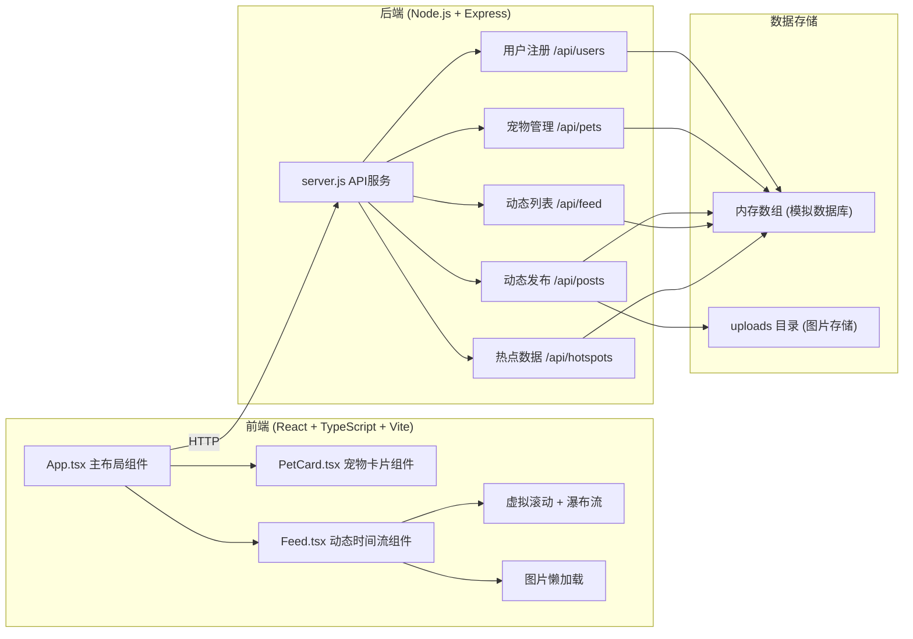
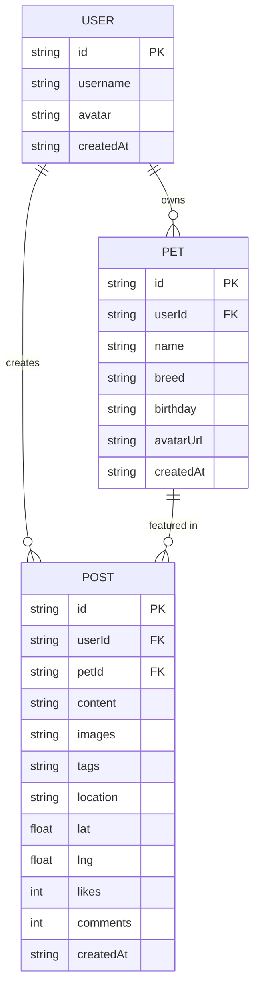

## 1. 架构设计



## 2. 技术描述

### 前端技术栈
- **框架**：React 18 + TypeScript
- **构建工具**：Vite 5
- **Vite 插件**：@vitejs/plugin-react
- **样式方案**：CSS Modules / 内联样式（自定义动画效果）
- **状态管理**：React Hooks (useState, useEffect, useRef)
- **图片上传**：FormData + multer (后端)

### 后端技术栈
- **运行时**：Node.js
- **框架**：Express 4
- **中间件**：
  - `cors`：跨域资源共享
  - `multer`：文件上传处理
  - `uuid`：生成唯一ID

### 数据存储
- **数据库**：内存数组模拟（无持久化）
- **文件存储**：`uploads/` 目录存储上传图片
- **代理配置**：Vite 代理 `/api` 到后端 3001 端口

## 3. 路由定义

| 路由路径 | 页面/组件 | 功能描述 |
|----------|----------|----------|
| `/` | App.tsx | 主页面，包含导航栏、左侧宠物栏、右侧动态流 |

> 说明：应用为单页应用，所有功能在首页内通过组件切换实现。

## 4. API 定义

### 4.1 用户注册

**POST /api/users**

请求体：
```typescript
interface RegisterRequest {
  username: string;
  avatar?: string;
}
```

响应体：
```typescript
interface User {
  id: string;
  username: string;
  avatar: string;
  createdAt: string;
}
```

### 4.2 添加宠物

**POST /api/pets**

请求体（multipart/form-data）：
```typescript
interface AddPetRequest {
  userId: string;
  name: string;
  breed: string;
  birthday: string;
  avatar: File;
}
```

响应体：
```typescript
interface Pet {
  id: string;
  userId: string;
  name: string;
  breed: string;
  birthday: string;
  avatarUrl: string;
  createdAt: string;
}
```

### 4.3 发布动态

**POST /api/posts**

请求体（multipart/form-data）：
```typescript
interface CreatePostRequest {
  userId: string;
  petId: string;
  content: string;
  images: File[]; // 最多3张
  tags?: string[];
  location?: string;
  lat?: number;
  lng?: number;
}
```

响应体：
```typescript
interface Post {
  id: string;
  userId: string;
  petId: string;
  content: string;
  images: string[];
  tags: string[];
  location?: string;
  lat?: number;
  lng?: number;
  likes: number;
  comments: number;
  createdAt: string;
}
```

### 4.4 获取动态列表

**GET /api/feed**

查询参数：
```typescript
interface FeedQuery {
  page?: number;      // 页码，默认1
  limit?: number;     // 每页数量，默认10
  userId?: string;    // 按用户筛选
  breed?: string;     // 按品种筛选
}
```

响应体：
```typescript
interface FeedResponse {
  posts: Post[];
  hasMore: boolean;
  total: number;
}
```

### 4.5 获取热点地图数据

**GET /api/hotspots**

响应体：
```typescript
interface Hotspot {
  id: string;
  name: string;
  lat: number;
  lng: number;
  intensity: number;  // 活跃度 0-100
  postCount: number;
}

interface HotspotsResponse {
  hotspots: Hotspot[];
}
```

### 4.6 点赞动态

**POST /api/posts/:id/like**

响应体：
```typescript
interface LikeResponse {
  success: boolean;
  likes: number;
}
```

## 5. 数据模型

### 5.1 数据模型定义



### 5.2 类型定义

```typescript
// 用户
interface User {
  id: string;
  username: string;
  avatar: string;
  createdAt: string;
}

// 宠物
interface Pet {
  id: string;
  userId: string;
  name: string;
  breed: string;
  birthday: string;
  avatarUrl: string;
  createdAt: string;
}

// 动态
interface Post {
  id: string;
  userId: string;
  petId: string;
  pet?: Pet;
  user?: User;
  content: string;
  images: string[];
  tags: string[];
  location?: string;
  lat?: number;
  lng?: number;
  likes: number;
  comments: number;
  createdAt: string;
}

// 热点区域
interface Hotspot {
  id: string;
  name: string;
  lat: number;
  lng: number;
  intensity: number;
  postCount: number;
}

// 边框颜色工具函数
function getUserBorderColor(userId: string): string {
  // 基于用户ID哈希生成HSL色相值
  let hash = 0;
  for (let i = 0; i < userId.length; i++) {
    hash = userId.charCodeAt(i) + ((hash << 5) - hash);
  }
  const hue = Math.abs(hash % 360);
  return `hsl(${hue}, 70%, 80%)`;
}
```

## 6. 项目文件结构

```
project-root/
├── package.json              # 根目录依赖配置
├── vite.config.js            # Vite 构建配置
├── tsconfig.json             # TypeScript 配置（严格模式）
├── index.html                # 入口 HTML 页面
├── uploads/                  # 图片上传目录
└── src/
    ├── App.tsx               # 主布局和路由组件
    ├── PetCard.tsx           # 宠物档案卡片组件
    ├── Feed.tsx              # 动态时间流组件
    ├── components/           # 其他子组件
    │   ├── Navbar.tsx        # 顶部导航栏
    │   ├── Sidebar.tsx       # 左侧边栏
    │   ├── PostCard.tsx      # 动态卡片
    │   ├── HotspotMap.tsx    # 热点地图
    │   └── LoadingSpinner.tsx # 加载指示器
    ├── hooks/                # 自定义 Hooks
    │   ├── useVirtualScroll.ts
    │   └── useInfiniteScroll.ts
    ├── utils/                # 工具函数
    │   ├── hashColor.ts
    │   └── formatDate.ts
    ├── types/                # 类型定义
    │   └── index.ts
    └── server/
        └── server.js         # Express 后端服务
```

## 7. 前端核心功能实现要点

### 7.1 虚拟滚动实现
- 使用 `useVirtualScroll` hook 计算可见项
- 仅渲染视口内的动态卡片
- 动态计算每项高度，支持瀑布流布局

### 7.2 瀑布流布局
- CSS columns 或 JavaScript 计算位置
- 左右两列或多列自适应
- 卡片随机柔和边框色

### 7.3 图片懒加载
- 使用 Intersection Observer API
- 图片进入视口前显示占位符
- 加载完成后淡入显示

### 7.4 毛玻璃效果
- CSS `backdrop-filter: blur()`
- 半透明背景色
- 适用于宠物档案卡片

### 7.5 动画效果
- 心跳动画：`@keyframes heartbeat` 1s 周期
- 卡片入场：`fadeInUp` 0.4s ease-out
- 点赞粒子：Canvas 或 CSS 动画实现爆炸效果

## 8. 后端实现要点

### 8.1 内存数据库
- 使用数组存储用户、宠物、动态数据
- 服务重启后数据丢失（演示用途）
- 初始化时生成一些示例数据

### 8.2 图片上传
- multer 中间件处理 multipart/form-data
- 图片保存到 `uploads/` 目录
- 静态文件服务提供访问

### 8.3 热点数据生成
- 基于动态的地理位置信息聚合
- 模拟生成热点区域数据
- 活跃度基于动态数量计算
