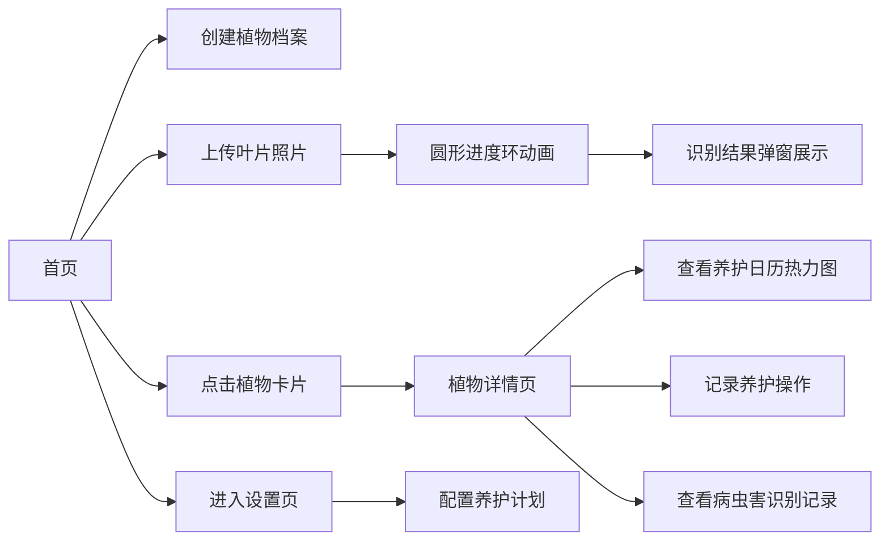

## 1. 产品概述

植物养护助手是一款面向养花新手和园艺爱好者的智能应用，帮助用户通过拍照识别植物病虫害，并提供个性化的养护提醒。

- 解决问题：新手用户难以判断植物健康状态、忘记浇水施肥时间
- 目标用户：养花新手、家庭园艺爱好者
- 产品价值：降低植物养护门槛，减少植物养死概率，提供科学养护指导

## 2. 核心功能

### 2.1 用户角色
| 角色 | 注册方式 | 核心权限 |
|------|----------|----------|
| 普通用户 | 直接使用（无需注册） | 创建植物档案、识别病虫害、记录养护日志、设置养护计划 |

### 2.2 功能模块
1. **植物列表页（首页）**：全局状态概览栏、病虫害识别入口、植物卡片墙
2. **植物详情页**：养护日历热力图、养护日志列表、病虫害识别结果展示
3. **设置页**：个性化养护计划配置

### 2.3 页面详情
| 页面名称 | 模块名称 | 功能描述 |
|----------|----------|----------|
| 植物列表页 | 全局状态概览栏 | 显示当天需浇水植物数（红）、近一周病虫害记录数（橙）、植物总数（绿），毛玻璃面板 |
| 植物列表页 | 病虫害识别入口 | 上传/拍摄叶片照片，圆形进度环动画，弹窗展示识别结果 |
| 植物列表页 | 植物卡片墙 | 卡片展示植物头像（圆形带边框）、品种、最近浇水时间、下次浇水倒计时（<2天橙色脉冲） |
| 植物列表页 | 创建档案 | 填写名称、品种、购买日期、上传头像照片 |
| 植物详情页 | 养护日历热力图 | 近30天浇水/施肥/光照记录达标情况，颜色深浅表示 |
| 植物详情页 | 养护日志列表 | 时间倒序，不同操作类型不同图标和背景色，新增记录掉落动画 |
| 植物详情页 | 识别结果弹窗 | 左半Canvas绘制病害区域（红色虚线轮廓），右半病害名、严重程度徽章、Markdown处理建议 |
| 设置页 | 养护计划抽屉 | 抽屉式面板，毛玻璃背景，配置浇水/施肥周期（天为单位，两个时间段） |

## 3. 核心流程

用户打开应用后，在首页查看全局状态概览。可以选择创建植物档案、上传照片识别病虫害、或点击已有植物进入详情页。在详情页可查看养护日历、记录养护操作、查看历史识别结果。

## 4. 用户界面设计

### 4.1 设计风格
- **主色调**：深绿色 #2e7d32
- **背景渐变**：浅绿色 #e8f5e9 到白色 #ffffff
- **点缀色**：橙色 #ff9800（警示）、红色 #f44336（危险）
- **卡片/面板**：圆角16px，box-shadow: 0 2px 8px rgba(0,0,0,0.08)
- **按钮**：hover时背景加深，上浮2px过渡动画
- **布局**：CSS Grid + Flexbox，响应式适配
- **字体**：选用优雅的无衬线字体，建立清晰的排版层次

### 4.2 页面设计概览
| 页面名称 | 模块名称 | UI元素 |
|----------|----------|--------|
| 首页 | 全局状态概览栏 | 毛玻璃面板、加粗数字、悬浮微阴影、三列统计 |
| 首页 | 进度环 | 深绿#2e7d32到浅绿#66bb6a渐变圆形进度条 |
| 首页 | 植物卡片 | 圆形头像（2px灰绿边框）、品种名称、浇水倒计时（<2天橙色脉冲） |
| 详情页 | 识别结果弹窗 | Canvas病害标注图（红色虚线轮廓）、严重程度徽章、Markdown渲染 |
| 详情页 | 养护日志 | 图标（水滴/树叶/花盆）、淡色背景、80ms间隔掉落动画、弹性缓动 |
| 详情页 | 日历热力图 | 颜色深浅表示达标情况，30天网格 |
| 设置页 | 抽屉面板 | 毛玻璃背景、0.3s ease-in-out滑入动画 |

### 4.3 响应式设计
- 桌面端：多列网格布局，卡片墙展示
- 移动端：单列自适应布局，卡片堆叠
- 触摸优化：按钮点击区域足够大，滑动操作友好

### 4.4 动画与微交互
- 上传进度环：平滑渐变动画
- 日志新增：从上往下掉落，80ms间隔，弹性缓动
- 浇水倒计时：<2天时脉冲闪烁动画
- 抽屉面板：0.3s ease-in-out滑入
- 按钮：hover上浮2px、背景加深
- 页面加载：渐进式内容显现
