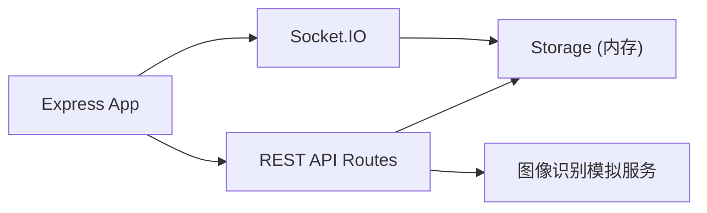

## 1. 架构设计

```mermaid
flowchart TB
    subgraph "Frontend (React + TypeScript + Vite"
        A["App.tsx - 路由管理
        B["PlantList.tsx - 植物列表页"]
        C["PlantDetail.tsx - 植物详情页"]
        D["Settings.tsx - 设置页"]
        E["api.ts - API和Socket.IO封装"]
        F["CSS样式模块"]
    end
    
    subgraph "Backend (Node.js + Express + TypeScript"
        G["server.ts - Express服务"]
        H["storage.ts - 内存数据存储"]
        I["REST API 路由"]
        J["WebSocket 推送"]
        K["图像识别模拟"]
    end
    
    A --> B
    A --> C
    A --> D
    B --> E
    C --> E
    D --> E
    E --> I
    E --> J
    G --> I
    G --> J
    G --> K
    I --> H
    K --> H
```

## 2. 技术描述

- **前端**：React 18 + TypeScript + Vite
- **样式方案**：原生CSS（CSS变量 + Grid + Flexbox），用户指定的自定义样式
- **状态管理**：React useState/useEffect
- **HTTP客户端**：axios
- **实时通信**：socket.io-client
- **后端**：Express 4 + TypeScript
- **实时推送**：socket.io
- **文件上传**：multer
- **数据存储**：内存存储（storage.ts模拟数据库）
- **ID生成**：uuid

## 3. 路由定义

| 路由路径 | 页面组件 | 用途 |
|----------|----------|------|
| / | PlantList | 首页 - 植物列表、全局状态概览、病虫害识别入口 |
| /plant/:id | PlantDetail | 植物详情页 - 养护日历、养护日志 |
| /settings | Settings | 设置页 - 个性化养护计划配置 |

## 4. API定义

### 4.1 后端API接口

#### 植物档案
| 方法 | 路径 | 描述 |
|------|------|------|
| GET | /api/plants | 获取所有植物列表 |
| GET | /api/plants/:id | 获取单个植物详情 |
| POST | /api/plants | 创建新植物档案 |
| PUT | /api/plants/:id | 更新植物档案 |
| DELETE | /api/plants/:id | 删除植物档案 |

#### 养护日志
| 方法 | 路径 | 描述 |
|------|------|------|
| GET | /api/plants/:id/logs | 获取植物养护日志 |
| POST | /api/plants/:id/logs | 新增养护日志记录 |

#### 养护计划
| 方法 | 路径 | 描述 |
|------|------|------|
| GET | /api/plants/:id/schedule | 获取植物养护计划 |
| PUT | /api/plants/:id/schedule | 更新植物养护计划 |

#### 图像识别
| 方法 | 路径 | 描述 |
|------|------|------|
| POST | /api/recognize | 上传叶片照片识别病虫害 |
| GET | /api/recognitions/:id | 获取识别结果详情 |
| GET | /api/plants/:id/recognitions | 获取植物的历史识别记录 |

#### 全局统计
| 方法 | 路径 | 描述 |
|------|------|------|
| GET | /api/stats/overview | 获取首页全局状态概览 |

### 4.2 数据类型定义

```typescript
interface Plant {
  id: string;
  name: string;
  species: string;
  purchaseDate: string;
  avatar: string;
  createdAt: string;
  lastWateredAt: string | null;
  schedule: CareSchedule;
}

interface CareSchedule {
  wateringPeriods: number[];
  fertilizingPeriods: number[];
}

interface CareLog {
  id: string;
  plantId: string;
  type: 'water' | 'fertilize' | 'repot' | 'light';
  timestamp: string;
  note?: string;
}

interface RecognitionResult {
  id: string;
  plantId: string;
  disease: string;
  severity: 'low' | 'medium' | 'high';
  severityLabel: string;
  recommendation: string;
  imageUrl: string;
  diseaseRegions: Array<{ x: number; y: number; width: number; height: number }>;
  timestamp: string;
}

interface StatsOverview {
  needWatering: number;
  recentDiseases: number;
  totalPlants: number;
}
```

### 4.3 WebSocket事件

| 事件名 | 方向 | 描述 |
|--------|------|------|
| stats:updated | Server → Client | 全局统计数据更新 |
| recognition:completed | Server → Client | 图像识别完成通知 |
| care:due | Server → Client | 养护提醒通知 |

## 5. 服务端架构



- **入口文件**：server.ts 统一处理HTTP和WebSocket
- **数据层**：storage.ts 提供内存数据读写
- **模拟服务**：图像识别模拟（随机返回预设结果）

## 6. 项目文件结构

```
项目根目录/
├── package.json
├── index.html
├── tsconfig.json
├── vite.config.js
└── src/
    ├── frontend/
    │   ├── App.tsx
    │   ├── PlantList.tsx
    │   ├── PlantDetail.tsx
    │   ├── Settings.tsx
    │   └── api.ts
    └── backend/
        ├── server.ts
        └── storage.ts
```

## 7. 性能指标

- 图像上传与识别请求：≤ 3秒内返回结果
- 植物档案列表加载渲染：≤ 500ms
- 页面切换动画：0.3s ease-in-out

## 8. 启动命令

- 前端开发：`npm run dev`（Vite开发服务器）
- 后端启动：`npm start`（Express服务器）
- 依赖安装：`npm install`
