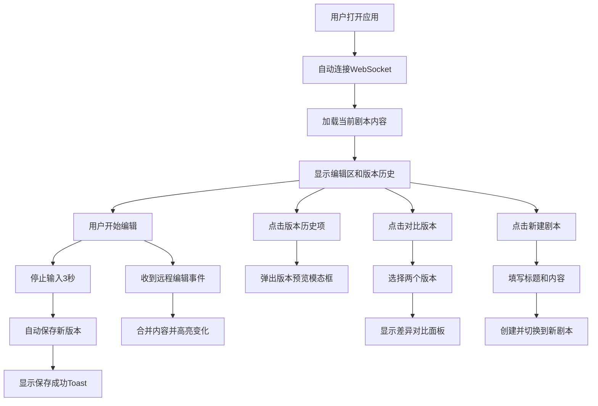

## 1. 产品概述

在线影视剧本协同写作与版本比对平台，支持多位作者在浏览器中实时协作编辑同一个剧本，自动保存历史版本，并提供直观的版本差异对比功能。

- **核心价值**：解决多人剧本创作时的协作效率问题，提供实时同步、版本追溯和差异比对能力
- **目标用户**：编剧团队、影视创作者、内容协作团队
- **市场定位**：轻量级、易用的在线剧本协作工具，无需安装即可使用

## 2. 核心功能

### 2.1 用户角色

| 角色 | 注册方式 | 核心权限 |
|------|----------|----------|
| 协作用户 | 自动分配匿名身份 | 编辑剧本、查看历史、创建版本、对比差异 |

### 2.2 功能模块

1. **主编辑页面**：剧本编辑区、协作面板、版本历史侧边栏
2. **实时协作模块**：WebSocket实时同步、协作者光标显示、冲突提示
3. **版本管理模块**：自动保存、手动保存、版本列表、版本预览
4. **版本比对模块**：双版本选择、差异高亮、统计信息
5. **剧本管理模块**：新建剧本、剧本切换

### 2.3 页面详情

| 页面名称 | 模块名称 | 功能描述 |
|-----------|-------------|---------------------|
| 主编辑页面 | 顶部导航栏 | 剧本切换下拉菜单、新建剧本按钮 |
| 主编辑页面 | 编辑区 | 带行号的文本编辑器、实时高亮、冲突警告 |
| 主编辑页面 | 编辑区头部 | 剧本标题、保存时间、手动保存按钮 |
| 主编辑页面 | 协作面板 | 在线协作者头像列表 |
| 主编辑页面 | 版本历史侧边栏 | 版本列表、对比模式切换、版本预览 |
| 主编辑页面 | 版本对比面板 | 双版本并排显示、差异高亮、连接线 |
| 模态框 | 新建剧本 | 标题输入、初始内容、创建确认 |
| 模态框 | 版本预览 | 完整内容展示、毛玻璃效果 |
| 提示组件 | Toast通知 | 保存成功提示、自动淡出 |

## 3. 核心流程

## 4. 用户界面设计

### 4.1 设计风格

- **主题**：深色主题，专业创作氛围
- **主背景色**：#1e1e2e
- **编辑区背景**：#252535
- **文本颜色**：#cdd6f4
- **行号区背景**：#181826
- **行号文字**：#6c7086
- **侧边栏背景**：#181826
- **新增高亮**：#e6ffed（绿色背景）
- **删除高亮**：#ffeef0（红色背景+删除线）
- **警告提示**：黄色背景+感叹号图标

### 4.2 交互设计

- **按钮**：圆角8px，hover时亮度提升20%（filter: brightness(1.2)），点击时缩放0.95（0.1s过渡）
- **模态框**：从中心淡入（opacity 0→1 0.3s，scale 0.9→1 0.3s ease-out）
- **Toast**：3秒后淡出（opacity过渡0.5s）
- **差异高亮**：0.3s背景过渡动画
- **侧边栏抽屉**：0.3s ease-out滑入滑出

### 4.3 页面设计概览

| 页面名称 | 模块名称 | UI元素 |
|-----------|-------------|-------------|
| 主编辑页面 | 整体布局 | 左右两栏（70%/30%），深色主题，等宽字体 |
| 主编辑页面 | 编辑区 | 行号列（浅灰背景）+ 文本区（白色背景），Consolas/monospace字体 |
| 主编辑页面 | 协作头像 | 圆形首字母头像，随机背景色，柔光阴影 |
| 主编辑页面 | 版本列表 | 版本号、时间、作者，悬停效果 |
| 主编辑页面 | 对比面板 | 左右并排，灰色虚线连接线，差异高亮 |
| 模态框 | 版本预览 | 毛玻璃效果，半透明黑色背景 |

### 4.4 响应式设计

- **桌面端（≥768px）**：左右两栏布局，编辑区70%，侧边栏30%
- **移动端（<768px）**：编辑区占满全宽，侧边栏作为抽屉从右侧滑出，汉堡菜单按钮切换

## 5. 性能要求

- **编辑响应延迟**：≤50ms（按键到文本显示）
- **WebSocket消息延迟**：≤200ms（本地网络环境）
- **版本历史加载**：≤1秒（含后端查询）
