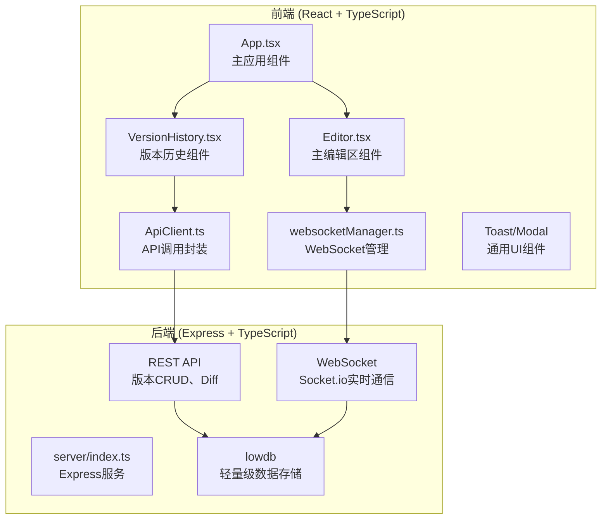
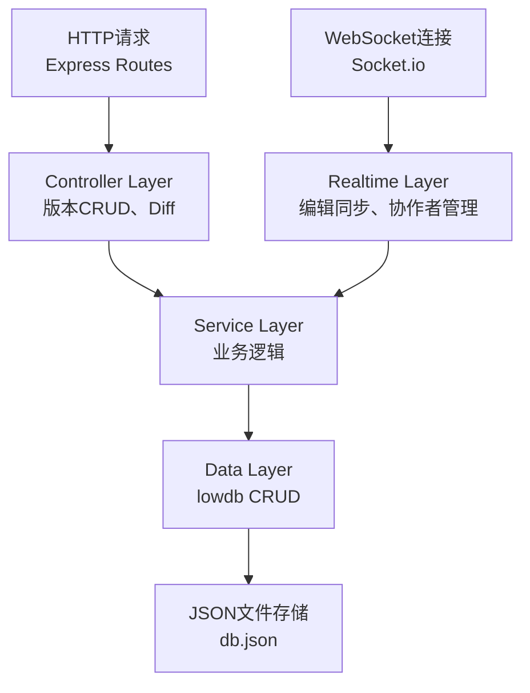
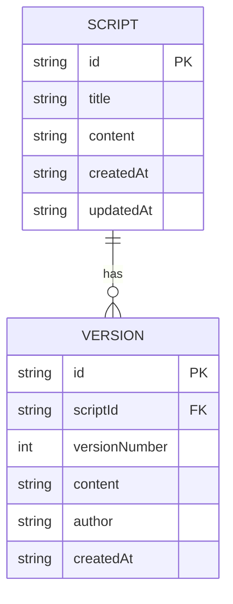

## 1. 架构设计



## 2. 技术描述

- **前端**：React 18 + TypeScript + Vite
- **后端**：Express 4 + TypeScript
- **实时通信**：Socket.io (WebSocket)
- **数据存储**：lowdb（JSON文件存储）
- **Diff算法**：diff库
- **构建工具**：Vite
- **包管理器**：npm

### 依赖包

| 包名 | 用途 |
|------|------|
| react, react-dom | 前端框架 |
| typescript | 类型安全 |
| vite, @vitejs/plugin-react | 构建工具 |
| express | 后端服务 |
| cors | 跨域支持 |
| uuid | 唯一ID生成 |
| lowdb | 轻量级数据库 |
| socket.io, socket.io-client | WebSocket通信 |
| diff | 版本差异比对 |
| lucide-react | 图标库 |

## 3. 路由定义

| 路由 | 用途 |
|-------|---------|
| / | 主应用页面 |
| /api/scripts | 获取剧本列表 |
| /api/scripts/:id | 获取/更新剧本详情 |
| /api/scripts/:id/versions | 获取版本列表 |
| /api/scripts/:id/versions/:versionId | 获取版本详情 |
| /api/scripts/:id/versions | 创建新版本（POST） |
| /api/scripts/:id/diff | 对比两个版本（POST） |

## 4. API 定义

### TypeScript 类型定义

```typescript
// 剧本
interface Script {
  id: string;
  title: string;
  content: string;
  createdAt: string;
  updatedAt: string;
}

// 版本
interface Version {
  id: string;
  scriptId: string;
  versionNumber: number;
  content: string;
  author: string;
  createdAt: string;
}

// 协作者
interface Collaborator {
  id: string;
  name: string;
  avatarColor: string;
  currentLine?: number;
}

// Diff结果
interface DiffResult {
  added: number;
  removed: number;
  modified: number;
  changes: DiffChange[];
}

interface DiffChange {
  type: 'added' | 'removed' | 'unchanged';
  value: string;
  lineNumber: number;
}

// WebSocket消息
interface EditorMessage {
  type: 'edit' | 'cursor' | 'save' | 'join' | 'leave';
  scriptId: string;
  userId: string;
  payload: any;
}
```

### API 请求/响应

```typescript
// GET /api/scripts
// Response: Script[]

// POST /api/scripts
// Body: { title: string; content: string }
// Response: Script

// GET /api/scripts/:id/versions
// Response: Version[]

// POST /api/scripts/:id/versions
// Body: { content: string; author: string }
// Response: Version

// POST /api/scripts/:id/diff
// Body: { version1Id: string; version2Id: string }
// Response: DiffResult
```

## 5. 服务器架构图



## 6. 数据模型

### 6.1 数据模型定义



### 6.2 数据结构（lowdb）

```json
{
  "scripts": [
    {
      "id": "uuid",
      "title": "剧本标题",
      "content": "剧本内容...",
      "createdAt": "2024-01-01T00:00:00Z",
      "updatedAt": "2024-01-01T00:00:00Z"
    }
  ],
  "versions": [
    {
      "id": "uuid",
      "scriptId": "script-uuid",
      "versionNumber": 1,
      "content": "版本内容...",
      "author": "作者名",
      "createdAt": "2024-01-01T00:00:00Z"
    }
  ]
}
```

## 7. 文件结构

```
project/
├── package.json
├── vite.config.js
├── tsconfig.json
├── index.html
├── src/
│   ├── App.tsx
│   ├── main.tsx
│   ├── Editor.tsx
│   ├── VersionHistory.tsx
│   ├── websocketManager.ts
│   ├── ApiClient.ts
│   ├── types.ts
│   ├── components/
│   │   ├── Toast.tsx
│   │   ├── Modal.tsx
│   │   ├── Avatar.tsx
│   │   └── DiffViewer.tsx
│   ├── hooks/
│   │   └── useDebounce.ts
│   ├── utils/
│   │   └── diffUtils.ts
│   └── index.css
└── server/
    ├── index.ts
    ├── db.ts
    ├── types.ts
    └── utils/
        └── diff.ts
```

## 8. 性能优化策略

1. **编辑区性能**：使用contenteditable或textarea + 虚拟行号，避免重渲染
2. **WebSocket优化**：批量发送编辑事件，使用OT（操作转换）或CRDT算法处理冲突
3. **版本存储**：只存储增量diff而非完整内容，减少存储空间
4. **防抖策略**：用户停止输入3秒后自动保存，使用debounce
5. **懒加载**：版本列表分页加载，大版本内容按需加载
