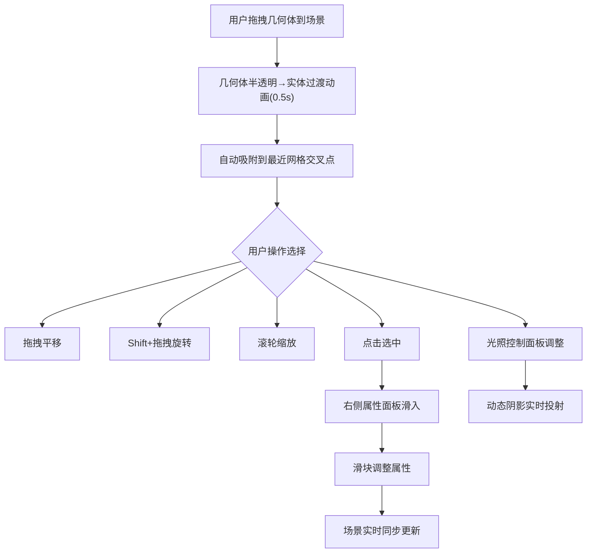

## 1. 产品概述

三维抽象几何体手势交互摆放工具，面向设计师与艺术家，解决在无实体模型情况下无法直观感受和调整抽象几何体在空间中位置、旋转与光影关系的问题。通过浏览器中的鼠标拖拽（模拟手势），用户可在三维空间中交互式摆放、组合立方体、球体、圆锥、环面等基本几何体，并实时调整光照与材质，获得沉浸式的空间构图体验。

## 2. 核心功能

### 2.1 用户角色

| 角色 | 注册方式 | 核心权限 |
|------|----------|----------|
| 设计师/艺术家 | 无需注册 | 使用全部几何体摆放、变换、光照调整功能 |

### 2.2 功能模块

1. **主场景页面**：三维场景、工具栏、属性面板、光照控制面板

### 2.3 页面详情

| 页面名称 | 模块名称 | 功能描述 |
|----------|----------|----------|
| 主场景页面 | 左侧工具栏 | 包含立方体、球体、圆锥、环面四种几何体×3种材质（金属/玻璃/哑光），支持拖拽放置到场景 |
| 主场景页面 | 中央三维场景 | Three.js渲染的三维空间，含网格、阴影、方向光，支持几何体选中和变换操作 |
| 主场景页面 | 右侧属性面板 | 展示选中物体的位置X/Y/Z、旋转角度、缩放比例、材质类型，支持滑块实时调整 |
| 主场景页面 | 光照控制面板 | 主光角度调整、两盏方向光强度比例联动滑块，实时投射动态阴影 |
| 主场景页面 | FPS计数器 | 底部显示白色小字FPS，监控渲染性能 |

## 3. 核心流程

1. 用户从左侧工具栏拖拽几何体到中央场景，几何体半透明过渡到实体动画后吸附到最近网格交叉点
2. 用户点击场景中的几何体选中，右侧属性面板滑入展示详细属性
3. 用户通过鼠标拖拽平移几何体、Shift+拖拽旋转（显示旋转轴圆弧）、滚轮缩放（显示缩放标签）
4. 用户通过光照控制面板调整主光角度和光强比例，场景实时更新阴影
5. 用户通过属性面板滑块调整位置、旋转、缩放、材质，场景同步更新

## 4. 用户界面设计

### 4.1 设计风格

- 主色调：暗色主题背景 #1a1a2e
- 辅助色：浅蓝色发光边缘 #00bfff，暖色主光 #ffd700，冷色辅光 #4169e1
- 面板风格：半透明磨砂玻璃效果 rgba(255,255,255,0.1)
- 按钮/滑块：鼠标悬停时浅蓝色 #00bfff 1px发光边缘
- 字体：JetBrains Mono（数字标签）、Noto Sans SC（UI文案）
- 布局：左侧工具栏200px可折叠、右侧属性面板300px滑入、中央场景占满

### 4.2 页面设计概览

| 页面名称 | 模块名称 | UI元素 |
|----------|----------|--------|
| 主场景页面 | 左侧工具栏 | 磨砂玻璃面板、几何体图标网格(4×3)、拖拽手柄、折叠按钮 |
| 主场景页面 | 中央三维场景 | 深色背景、浅灰色半透明网格线框、FPS计数器、选中高亮动画 |
| 主场景页面 | 右侧属性面板 | 磨砂玻璃面板、位置/旋转/缩放/材质滑块、0.3s滑入动画 |
| 主场景页面 | 光照控制面板 | 右上角浮动面板、主光角度滑块、光强比例联动双滑块 |

### 4.3 响应式适配

- 桌面端（≥768px）：左工具栏200px + 中央场景 + 右属性面板300px
- 移动端（<768px）：左工具栏和右面板变为浮动按钮，点击展开为全屏覆盖面板

### 4.4 3D场景指引

- 环境：暗色空间，无HDRI，使用自定义方向光
- 光照：主光暖色 #ffd700 + 辅光冷色 #4169e1 + 环境光，支持动态阴影
- 相机：透视相机，OrbitControls轨道控制，带阻尼
- 构图：网格辅助空间感知，几何体吸附网格交叉点
- 交互：拖拽放置、平移/旋转/缩放变换、选中高亮
- 动画：放置过渡动画(0.5s ease-out)、旋转轴半透明圆弧、缩放数字标签
- 性能：10个复杂几何体(含材质/阴影/反射)时≥30FPS
