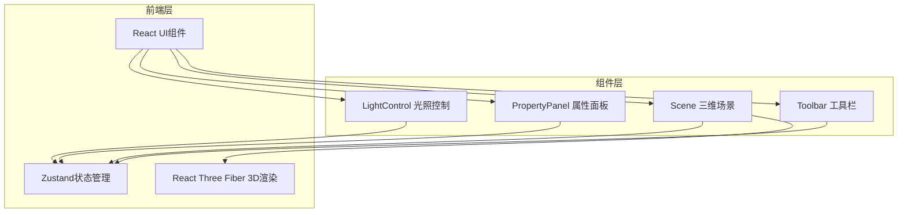
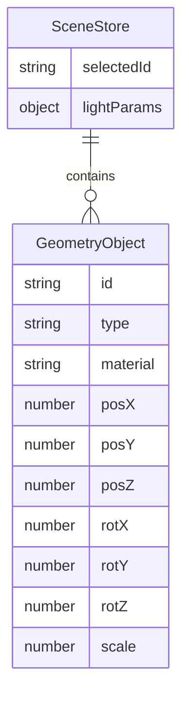

## 1. 架构设计

## 2. 技术说明

- 前端：React@18 + TypeScript + Vite
- 3D渲染：Three.js + @react-three/fiber + @react-three/drei
- 状态管理：Zustand
- 初始化工具：vite-init (react-ts模板)
- 后端：无
- 数据库：无

## 3. 路由定义

| 路由 | 用途 |
|------|------|
| / | 主场景页面，包含三维场景、工具栏、属性面板、光照控制 |

## 4. API定义

无后端API，所有数据通过Zustand状态管理在客户端管理。

## 5. 服务端架构图

不适用，纯前端项目。

## 6. 数据模型

### 6.1 数据模型定义

### 6.2 数据定义

- **GeometryObject**：
  - id: string (uuid)
  - type: 'cube' | 'sphere' | 'cone' | 'torus'
  - material: 'metal' | 'glass' | 'matte'
  - posX/posY/posZ: number (世界坐标)
  - rotX/rotY/rotZ: number (弧度)
  - scale: number (统一缩放比例)

- **LightParams**：
  - mainLightAngle: number (主光角度，0-360度)
  - mainLightIntensity: number (主光强度，0-3)
  - fillLightIntensity: number (辅光强度，0-3)
  - ambientIntensity: number (环境光强度，0-1)

- **SceneStore方法**：
  - addGeometry(type, material): 添加几何体
  - removeGeometry(id): 删除几何体
  - selectGeometry(id): 选中几何体
  - updateGeometry(id, props): 更新几何体属性
  - updateLightParams(params): 更新光照参数
