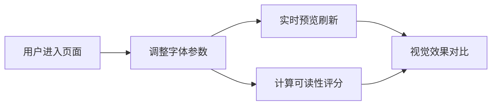

## 1. 产品概述

交互式字体排印样式沙盒，为前端设计师和排版爱好者提供直观的字体参数调优工具，实时预览不同排版配置的视觉效果，自动计算可读性评分和视觉指标。

- 核心价值：解决设计落地页时反复调整CSS字体参数的痛点，提供可视化对比和量化指标
- 目标用户：前端设计师、排版爱好者、UI开发者

## 2. 核心功能

### 2.1 用户角色
无角色区分，所有用户拥有完整功能权限。

### 2.2 功能模块
1. **实时预览区**：60%宽屏区域，毛玻璃卡片展示200词英文长文本，支持样式调整和平滑过渡动画
2. **参数控制面板**：40%宽度，三组参数滑块/开关/色块选择器
3. **智能分析面板**：右下角展示可读性评分（圆形进度环）和三项子指标条形图

### 2.3 页面详情
| 页面名称 | 模块名称 | 功能描述 |
|-----------|-------------|---------------------|
| 主页面 | 实时预览区 | 浅灰背景#f5f5f5，毛玻璃卡片居中，文本0.15s过渡动画，阴影悬停加深效果 |
| 主页面 | 字形参数组 | 字重100-900滑块、字宽50%-200%滑块、斜体开关、大小写转换按钮 |
| 主页面 | 排版参数组 | 行高1.0-2.0滑块、字间距-0.1em-0.5em滑块、段间距0-40px滑块、首行缩进开关 |
| 主页面 | 颜色参数组 | 文本颜色色块选择器、背景颜色色块选择器 |
| 主页面 | 智能分析面板 | 可读性评分圆形进度环（琥珀色→绿色渐变）、易读性指数/视觉节奏/对比度比率条形图 |

## 3. 核心流程

用户进入页面→拖动滑块/点击开关调整参数→实时预览区文本刷新→智能分析面板计算并更新评分和指标→对比不同参数组合的视觉效果

## 4. 用户界面设计

### 4.1 设计风格
- 主色调：浅灰#f5f5f5背景，浅蓝#e0f7fa到深蓝#0277bd滑块渐变
- 强调色：琥珀色#ffb300到绿色#4caf50评分环渐变
- 卡片风格：毛玻璃效果backdrop-filter: blur(12px)，轻微阴影浮动
- 动画风格：0.15s文本过渡，0.3s阴影悬停，0.6s评分数值动画cubic-bezier
- 排版风格：现代简洁，留白充足

### 4.2 页面设计概述
| 页面名称 | 模块名称 | UI元素 |
|-----------|-------------|-------------|
| 主页面 | 布局 | 宽屏两栏60%/40%分割，右下角浮动分析面板 |
| 主页面 | 预览卡片 | 圆角、毛玻璃、阴影过渡、居中显示 |
| 主页面 | 滑块控件 | 数值显示在上、渐变填充轨道、平滑拖动 |
| 主页面 | 评分组件 | 7px粗细进度环、中心数值、条形图指标 |

### 4.3 响应性
- Desktop-first设计，最小支持1280px宽度
- 滑块触控优化，支持键盘操作
- 性能要求：30fps以上，无卡顿

### 4.4 3D场景指引
不适用
