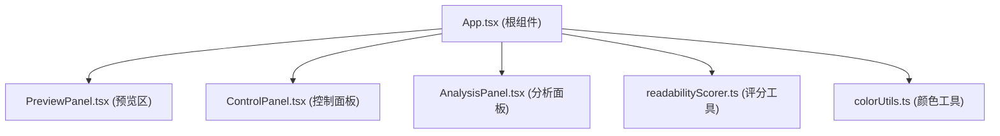

## 1. 架构设计

纯前端React应用，单页面无后端，状态通过React hooks在父子组件间传递。



## 2. 技术描述
- 前端：React@18 + TypeScript + Vite
- 初始化工具：Vite脚手架
- 后端：无
- 数据库：无
- 样式：内联样式/CSS-in-JS实现过渡动画
- 性能优化：useCallback/useMemo减少重渲染，requestAnimationFrame平滑动画

## 3. 路由定义
| 路由 | 用途 |
|-------|---------|
| / | 主页面，字体排印沙盒 |

## 4. API定义
无后端API。

## 5. 服务器架构图
无后端服务。

## 6. 数据模型

### 6.1 字体参数类型定义

```typescript
interface FontParams {
  fontWeight: number;      // 100-900
  fontStretch: number;     // 50-200 (%)
  fontStyle: 'normal' | 'italic';
  textTransform: 'none' | 'uppercase' | 'lowercase' | 'capitalize';
  lineHeight: number;      // 1.0-2.0
  letterSpacing: number;   // -0.1 to 0.5 (em)
  paragraphSpacing: number; // 0-40 (px)
  textIndent: boolean;     // 首行缩进
  textColor: string;       // hex color
  backgroundColor: string; // hex color
  isBold: boolean;
  isItalic: boolean;
  isUnderline: boolean;
}
```

### 6.2 可读性评分类型定义

```typescript
interface ReadabilityScore {
  total: number;           // 0-100 百分制
  legibilityIndex: number; // 0-100 易读性指数
  visualRhythm: number;    // 0-100 视觉节奏
  contrastRatio: number;   // 0-100 对比度比率
}
```
