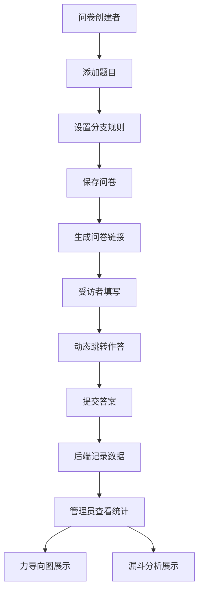

## 1. 产品概述

自适应条件分支问卷生成与实时数据分析应用，解决在线问卷收集客户反馈时遇到的重复填写和无效数据问题。通过动态逻辑跳转提高数据质量，并提供力导向图可视化的分支流向分析。

- 核心目标：让问卷创建者设置基于前序答案的逻辑跳转规则，受访者作答时系统实时跟踪分支路径，后台以可视化方式展示数据流向和转化漏斗。
- 目标用户：问卷创建者（市场调研、客户反馈收集人员）、受访者、数据管理员。

## 2. 核心功能

### 2.1 用户角色

| 角色 | 使用方式 | 核心权限 |
|------|----------|----------|
| 问卷创建者 | 直接访问创建页面 | 创建/编辑问卷、设置分支规则、预览问卷 |
| 受访者 | 通过问卷链接访问 | 填写问卷、动态跳转作答 |
| 管理员 | 访问仪表盘页面 | 查看问卷统计、力导向图分析、转化漏斗 |

### 2.2 功能模块

1. **问卷创建页面**：题目添加（单选/多选/文本）、分支规则配置、实时预览
2. **问卷作答页面**：动态题目显示、连续编号、进度条、动画过渡
3. **管理员仪表盘**：问卷列表、力导向图分支流向、漏斗转化分析

### 2.3 页面详情

| 页面名称 | 模块名称 | 功能描述 |
|-----------|-------------|---------------------|
| 问卷创建页 | 题目编辑器 | 添加/删除/编辑题目，支持单选、多选、文本类型 |
| 问卷创建页 | 分支规则配置 | 为每个题目设置基于上一题答案的跳转规则，折叠面板展示 |
| 问卷创建页 | 实时预览区 | 模拟受访者视角，动态显示/隐藏题目 |
| 问卷作答页 | 自适应答题 | 按逻辑动态显示题目，连续编号，滑入动画 |
| 问卷作答页 | 进度展示 | 底部进度条显示"已完成 X/Y 题" |
| 仪表盘 | 问卷列表 | 左侧显示所有问卷，点击查看详情 |
| 仪表盘 | 力导向图 | Canvas绘制，节点大小反映访问次数，边宽反映用户数 |
| 仪表盘 | 漏斗柱状图 | 横向柱状图展示转化率，颜色绿到红渐变，悬停显示平均时长 |

## 3. 核心流程

### 3.1 问卷创建流程
问卷创建者添加题目 → 为题目设置类型和选项 → 配置分支跳转规则 → 实时预览效果 → 保存问卷至后端

### 3.2 问卷作答流程
受访者进入问卷 → 显示第一题 → 选择答案 → 系统根据规则计算下一题 → 动态显示/隐藏题目 → 提交答案 → 后端记录路径和时长

### 3.3 数据分析流程
管理员选择问卷 → 后端汇总所有受访者路径 → 前端解析路径结构 → 渲染力导向图和漏斗图 → 支持拖拽平移交互

## 4. 用户界面设计

### 4.1 设计风格

- 主色调：#1890ff（蓝色）作为主色调，#52c41a 到 #f5222d 作为漏斗渐变色
- 按钮样式：统一圆角 8px，点击缩放反馈 0.1s scale 1.05
- 字体：使用系统字体栈，标题 18px-24px，正文 14px
- 布局风格：卡片式布局，创建页两栏布局，仪表盘三栏布局
- 图标：使用 lucide-react 图标库

### 4.2 页面设计概述

| 页面名称 | 模块名称 | UI 元素 |
|-----------|-------------|-------------|
| 问卷创建页 | 左侧编辑区 | 白色背景，圆角表单，折叠面板（0.3s ease 过渡） |
| 问卷创建页 | 右侧预览区 | 浅灰 #f0f2f5 背景，毛玻璃卡片效果 |
| 问卷作答页 | 题目卡片 | 垂直流式布局，0.4s ease-out 滑入动画 |
| 问卷作答页 | 进度条 | 底部固定，显示完成进度 |
| 仪表盘 | 力导向图 | Canvas 绘制，支持拖拽平移，节点颜色基于题号哈希 |
| 仪表盘 | 漏斗图 | 横向柱状图，颜色渐变，悬停弹窗 |

### 4.3 响应式

- Desktop-first 设计
- 屏幕宽度 < 768px 时，创建页面变为单栏纵向堆叠布局
- 仪表盘变为上下堆叠布局
- 移动端触摸优化，增大点击区域

### 4.4 性能约束

- 力导向图节点 ≤ 50 个时，每次布局更新 ≤ 100ms 完成重绘
- 动画帧率 ≥ 45fps
