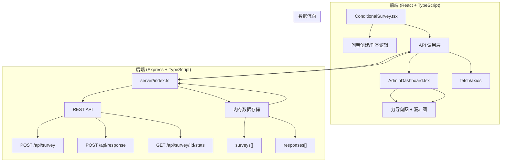
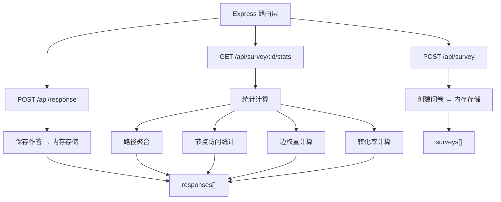
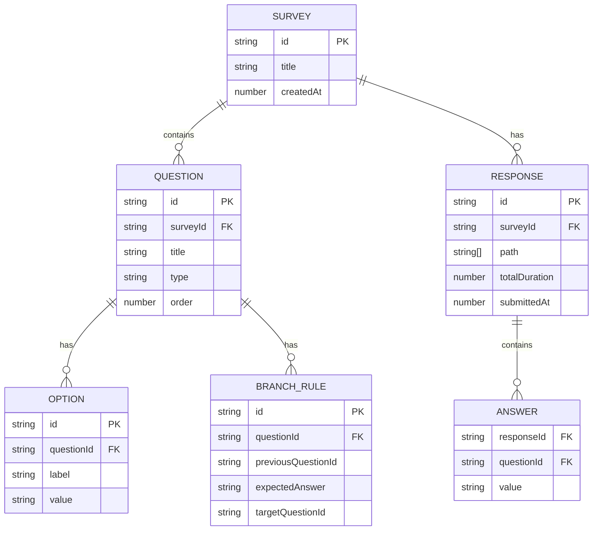

## 1. 架构设计



## 2. 技术描述

- 前端：React@18 + TypeScript + Vite
- 构建工具：Vite 5
- 后端：Express@4 + TypeScript
- 数据存储：内存数组（无数据库）
- 依赖：react, react-dom, typescript, vite, @vitejs/plugin-react, express, cors, uuid
- 样式：原生 CSS（不使用 Tailwind）
- 图标：lucide-react
- 状态管理：React useState/useRef（简单场景无需 Zustand）

## 3. 路由定义

| 路由 | 用途 |
|-------|---------|
| / | 问卷创建与作答主页面 |
| /dashboard | 管理员仪表盘页面 |

## 4. API 定义

### 4.1 TypeScript 类型定义

```typescript
// 题目类型
type QuestionType = 'single' | 'multiple' | 'text';

// 选项
interface Option {
  id: string;
  label: string;
  value: string;
}

// 跳转规则
interface BranchRule {
  id: string;
  previousQuestionId: string;
  expectedAnswer: string;
  targetQuestionId: string;
}

// 题目
interface Question {
  id: string;
  title: string;
  type: QuestionType;
  options: Option[];
  branchRules: BranchRule[];
  order: number;
}

// 问卷
interface Survey {
  id: string;
  title: string;
  questions: Question[];
  createdAt: number;
}

// 作答记录
interface Response {
  id: string;
  surveyId: string;
  answers: Record<string, string | string[]>;
  path: string[];
  timings: Record<string, number>;
  totalDuration: number;
  submittedAt: number;
}

// 统计数据
interface NodeStats {
  questionId: string;
  questionTitle: string;
  visitCount: number;
  averageTime: number;
}

interface EdgeStats {
  from: string;
  to: string;
  count: number;
}

interface SurveyStats {
  surveyId: string;
  totalResponses: number;
  nodes: NodeStats[];
  edges: EdgeStats[];
  conversionRates: Record<string, number>;
}
```

### 4.2 请求/响应

- **POST /api/survey**
  - Request: `{ title: string; questions: Question[] }`
  - Response: `{ id: string; ...Survey }`

- **POST /api/response**
  - Request: `{ surveyId: string; answers: Record<string, any>; path: string[]; timings: Record<string, number>; totalDuration: number }`
  - Response: `{ success: boolean; id: string }`

- **GET /api/survey/:id/stats**
  - Response: `SurveyStats`

## 5. 服务器架构图



## 6. 数据模型

### 6.1 数据模型定义



### 6.2 内存数据结构

```typescript
// 内存存储
const surveys: Survey[] = [];
const responses: Response[] = [];

// 力导向图节点数据
interface GraphNode {
  id: string;
  label: string;
  x: number;
  y: number;
  vx: number;
  vy: number;
  radius: number;
  color: string;
  visitCount: number;
}

interface GraphEdge {
  source: string;
  target: string;
  count: number;
  width: number;
}
```

## 7. 性能优化策略

1. **力导向图性能**：
   - 使用 Canvas 2D 而非 SVG 绘制
   - 实现 d3-force 简化版力导向布局
   - 限制迭代次数（每次布局 ≤ 50 次迭代）
   - 使用 requestAnimationFrame 保证 45fps+
   - 节点 ≤ 50 个时重绘 ≤ 100ms

2. **前端优化**：
   - 使用 React.memo 避免不必要重渲染
   - Canvas 绘制分离逻辑层和渲染层
   - 答案提交防抖处理

3. **后端优化**：
   - 统计数据预计算缓存
   - 内存数组使用 Map 做索引加速查询
