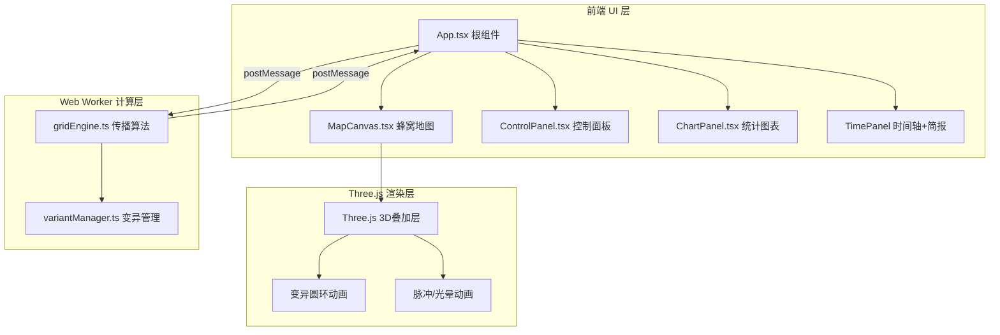
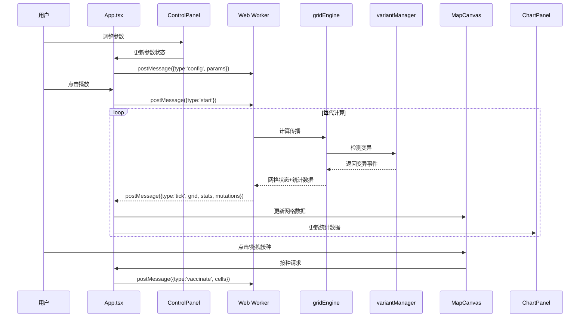

## 1. 架构设计



## 2. 技术说明

- **前端框架**：React 18 + TypeScript + Vite
- **样式方案**：Tailwind CSS 3
- **3D渲染**：Three.js（变异圆环扩散动画、感染格脉冲放大、免疫光晕脉冲）
- **2D渲染**：Canvas 2D（蜂窝网格地图、折线图表）
- **后台计算**：Web Worker（gridEngine.ts 传播算法 + variantManager.ts 变异逻辑）
- **状态管理**：Zustand
- **构建工具**：Vite
- **无后端服务**

## 3. 路由定义

| 路由 | 用途 |
|------|------|
| / | 主界面，包含地图、控制面板、图表、时间轴 |

## 4. 数据流架构



## 5. 文件组织

```
├── package.json
├── vite.config.js
├── tsconfig.json
├── index.html
├── src/
│   ├── engine/
│   │   ├── gridEngine.ts      # Web Worker：30x30网格传播算法
│   │   └── variantManager.ts  # 变异管理器：计算变异概率、生成简报
│   ├── ui/
│   │   ├── MapCanvas.tsx      # Canvas蜂窝地图 + Three.js叠加层
│   │   ├── ControlPanel.tsx   # 控制面板滑块组件
│   │   ├── ChartPanel.tsx     # Canvas折线图表
│   │   └── TimePanel.tsx      # 时间轴+变异简报面板
│   ├── store/
│   │   └── useSimStore.ts     # Zustand全局状态
│   ├── types/
│   │   └── index.ts           # TypeScript类型定义
│   ├── App.tsx                # 根组件
│   ├── main.tsx               # 入口
│   └── index.css              # 全局样式+Tailwind
```

## 6. 核心数据模型

### 6.1 网格单元状态

```typescript
enum CellState {
  Healthy = 0,
  Infected = 1,
  Immune = 2,
  Mutated = 3
}

interface Cell {
  state: CellState
  infectionAge: number
  immunityAge: number
  isMutated: boolean
  variantId: number
}

interface SimParams {
  transmissionRate: number
  immunityDuration: number
  mutationRate: number
  initialInfected: number
}

interface MutationEvent {
  generation: number
  x: number
  y: number
  newRate: number
}

interface GenerationStats {
  healthy: number
  infected: number
  immune: number
  mutated: number
}
```

### 6.2 Web Worker消息协议

```typescript
type WorkerCommand =
  | { type: 'config'; params: SimParams }
  | { type: 'start' }
  | { type: 'pause' }
  | { type: 'seek'; generation: number }
  | { type: 'vaccinate'; cells: [number, number][] }
  | { type: 'batchVaccinate'; bounds: { x1: number; y1: number; x2: number; y2: number } }

type WorkerResponse =
  | { type: 'tick'; grid: Cell[][]; stats: GenerationStats; generation: number; mutations: MutationEvent[] }
  | { type: 'ready' }
```
