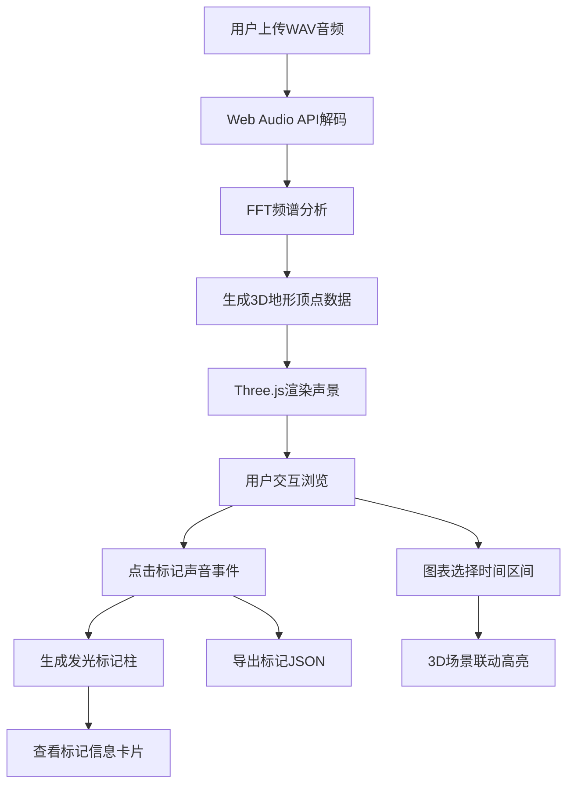

## 1. 产品概述

深海生态声景分析仪是一款面向海洋生物研究人员和爱好者的Web应用，通过将水下录音（WAV格式）可视化为三维声景地形，帮助用户直观地分析和标记海洋声景中的声音事件（如鲸鱼叫声、船舶噪声等）。

- **核心目标**：将音频频谱数据转化为可交互的3D可视化模型，支持声景探索与事件标记
- **目标用户**：海洋生物研究人员、海洋声学爱好者、环境监测人员
- **市场价值**：填补水下声学可视化工具的空白，为海洋生态研究提供直观的分析手段

## 2. 核心功能

### 2.1 用户角色

| 角色 | 注册方式 | 核心权限 |
|------|----------|----------|
| 普通用户 | 无需注册 | 上传音频、3D声景浏览、事件标记、数据导出 |

### 2.2 功能模块

1. **音频上传与波形预览**：WAV文件上传、波形可视化、播放控制
2. **3D声景地形**：频谱数据三维化、OrbitControls交互、半透明彩色网格渲染
3. **事件标记系统**：点击标记、发光柱体、信息卡片、标记管理
4. **能量趋势图表**：三频带能量折线图、时间区间选择、视角联动
5. **数据导出**：标记事件JSON导出

### 2.3 页面详情

| 页面名称 | 模块名称 | 功能描述 |
|----------|----------|----------|
| 主页面 | 音频上传区 | 支持拖拽/点击上传WAV文件，最长30秒 |
| 主页面 | 波形预览区 | 浅蓝色波形绘制，白色播放游标，播放/暂停控制 |
| 主页面 | 3D声景区 | Three.js渲染的频谱地形，自由旋转缩放 |
| 主页面 | 标记面板 | 标记列表展示，JSON导出按钮 |
| 主页面 | 能量图表区 | 三频带实时能量曲线，时间区间选择 |

## 3. 核心流程

用户上传WAV音频文件 → 系统解码并进行FFT频谱分析 → 生成3D声景地形模型 → 用户旋转/缩放浏览声景 → 点击标记感兴趣的声音事件 → 查看/编辑标记信息 → 选择时间区间查看特定时段 → 导出标记数据为JSON文件

## 4. 用户界面设计

### 4.1 设计风格

- **主色调**：深海蓝色系，背景 #0d1b2a，波形 #42a5f5
- **渐变色彩**：低频蓝色 → 中频绿色 → 高频红色的频谱色阶
- **发光效果**：标记柱体、光束、信息卡片采用发光/毛玻璃效果
- **字体**：现代无衬线字体，清晰的层级对比
- **动画**：平滑过渡、滑入效果、按压反馈

### 4.2 页面设计概述

| 页面名称 | 模块名称 | UI元素 |
|----------|----------|--------|
| 主页面 | 左侧面板（30%宽度） | 上传区域（拖拽感应）、波形画布（#42a5f5线条，#0d1b2a背景）、播放控制按钮、标记列表 |
| 主页面 | 右侧3D场景（70%宽度） | Three.js画布、OrbitControls控制、半透明彩色网格地形、渐变光照环境、标记发光柱 |
| 主页面 | 底部图表区 | Chart.js折线图（#4fc3f7低频、#81c784中频、#ffb74d高频）、时间选择滑块 |
| 主页面 | 信息卡片 | 毛玻璃背景（backdrop-filter: blur(8px)）、白色半透明、圆角、顶部滑入动画（0.3s ease-out） |

### 4.3 响应式

- 桌面端优先设计，左侧30%/右侧70%布局
- 平板端自适应调整比例
- 移动端垂直堆叠布局，优化触摸交互

### 4.4 3D场景指导

- **环境光照**：HemisphereLight从浅蓝到深蓝渐变，模拟水下光照环境
- **地形材质**：半透明MeshStandardMaterial，顶点着色实现蓝到红的频率色阶
- **相机设置**：PerspectiveCamera，初始视角俯视45度，OrbitControls支持阻尼效果
- **交互元素**：Raycaster检测点击，点击处射出0.5秒白色光束，生成永久发光柱（浅蓝到浅绿渐变）
- **高亮效果**：时间区间选择后，对应Z轴范围的地形叠加淡黄色半透明覆盖层
- **性能优化**：地形网格使用BufferGeometry，帧率稳定30fps以上
