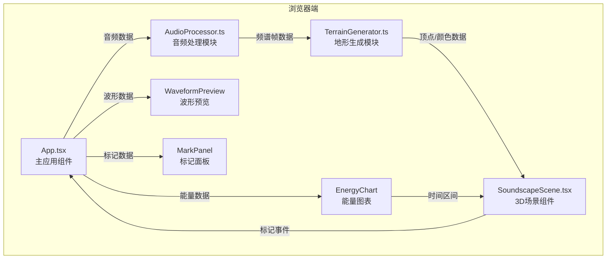

## 1. 架构设计



## 2. 技术描述

- **前端框架**：React 18 + TypeScript 5 + Vite 5
- **3D渲染**：Three.js 0.160 + @types/three
- **音频处理**：Web Audio API（AudioContext、AnalyserNode）
- **构建工具**：Vite 5 + @vitejs/plugin-react
- **状态管理**：React useState/useRef（无需额外状态库）

## 3. 数据模型

### 3.1 频谱帧数据

```typescript
interface SpectrumFrame {
  time: number;
  frequencies: Float32Array;
  energy: {
    low: number;
    mid: number;
    high: number;
  };
}
```

### 3.2 标记事件数据

```typescript
interface MarkerEvent {
  id: string;
  index: number;
  time: number;
  frequencyRange: [number, number];
  amplitude: number;
  position: { x: number; y: number; z: number };
  createdAt: number;
}
```

### 3.3 地形数据

```typescript
interface TerrainData {
  vertices: Float32Array;
  colors: Float32Array;
  indices: Uint32Array;
  dimensions: { width: number; depth: number; heightScale: number };
}
```

## 4. 核心API

### 4.1 AudioProcessor

```typescript
class AudioProcessor {
  constructor();
  async decodeAudioFile(file: File): Promise<AudioBuffer>;
  analyzeSpectrum(audioBuffer: AudioBuffer, fftSize?: number): Promise<SpectrumFrame[]>;
  getWaveformData(audioBuffer: AudioBuffer, samples?: number): Float32Array;
  getBandEnergy(frequencies: Float32Array, sampleRate: number): { low: number; mid: number; high: number };
}
```

### 4.2 TerrainGenerator

```typescript
class TerrainGenerator {
  constructor(spectrumData: SpectrumFrame[]);
  generateGeometry(): TerrainData;
  getMesh(): THREE.Mesh;
  getVertexAt(timeIndex: number, freqIndex: number): THREE.Vector3;
  highlightTimeRange(startTime: number, endTime: number): THREE.Mesh;
}
```

### 4.3 导出数据格式

```json
{
  "exportedAt": "2026-06-20T10:30:00.000Z",
  "audioDuration": 30,
  "markers": [
    {
      "id": "marker_001",
      "index": 1,
      "time": 12.5,
      "frequencyRange": [200, 800],
      "amplitude": 0.75,
      "position": { "x": 15, "y": 8, "z": 25 }
    }
  ]
}
```

## 5. 性能指标

| 指标 | 目标值 |
|------|--------|
| 3D场景帧率 | ≥ 30 FPS |
| 音频分析+地形生成 | ≤ 2秒 |
| 最大音频时长 | 30秒 |
| 支持的FFT大小 | 512-2048 |
| 标记点数量 | 无限制（建议≤100） |

## 6. 文件结构

```
├── package.json
├── vite.config.js
├── tsconfig.json
├── index.html
└── src/
    ├── AudioProcessor.ts      # 音频解码与频谱分析
    ├── TerrainGenerator.ts    # 3D地形数据生成
    ├── SoundscapeScene.tsx    # Three.js场景组件
    ├── App.tsx                # 主应用组件
    └── styles.css             # 全局样式
```
