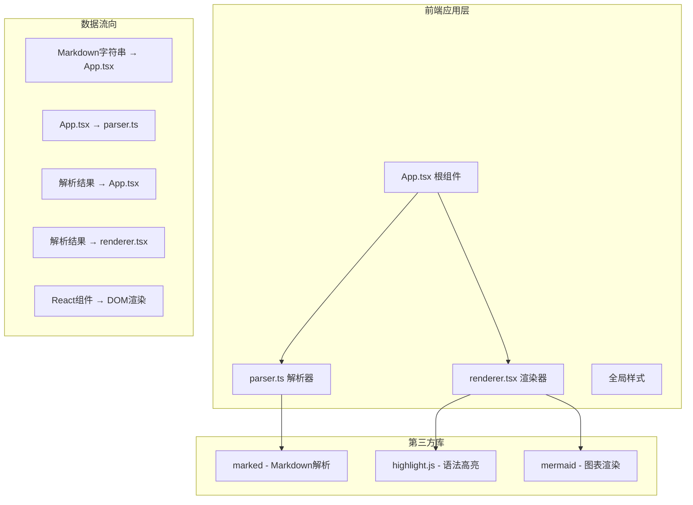

## 1. 架构设计



## 2. 技术描述

- **前端框架**：React 18 + TypeScript
- **构建工具**：Vite + @vitejs/plugin-react
- **Markdown解析**：marked
- **语法高亮**：highlight.js
- **图表渲染**：mermaid
- **状态管理**：React useState/useEffect（轻量场景，无需状态管理库）
- **样式方案**：纯CSS + CSS变量（主题切换）

## 3. 文件结构

```
auto224/
├── index.html
├── package.json
├── vite.config.js
├── tsconfig.json
└── src/
    ├── App.tsx          # 根组件，布局管理，状态管理
    ├── parser.ts        # Markdown解析器，识别代码块和图表
    └── renderer.tsx     # 渲染器，渲染解析结果
```

### 模块职责与调用关系

| 文件 | 职责 | 输入 | 输出 | 被调用 | 调用 |
|------|------|------|------|--------|------|
| App.tsx | 根组件、布局、状态管理、防抖 | - | 完整页面 | index.html | parser.ts, renderer.tsx |
| parser.ts | Markdown解析、代码块/图表识别、关联建立 | markdown字符串 | 解析结果数组 | App.tsx | marked库 |
| renderer.tsx | 渲染解析结果、代码高亮、图表渲染、联动UI | 解析结果数组 | React元素 | App.tsx | highlight.js, mermaid |

### 数据流向

1. **输入阶段**：用户在textarea输入 → App.tsx接收markdown字符串
2. **解析阶段**：App.tsx → parser.ts（使用marked解析为AST）→ 返回关联数据数组
3. **渲染阶段**：App.tsx → renderer.tsx（接收关联数据）→ 渲染为DOM
4. **交互阶段**：用户操作 → 更新App.tsx状态 → 重新渲染

## 4. 核心数据结构

### 4.1 解析结果类型

```typescript
// 代码块类型
interface CodeBlock {
  type: 'code';
  id: string;
  language: 'javascript' | 'python' | 'html' | 'css' | string;
  code: string;
  lineCount: number;
}

// 图表块类型
interface ChartBlock {
  type: 'chart';
  id: string;
  chartType: string;
  code: string;
}

// 普通文本块
interface TextBlock {
  type: 'text';
  html: string;
}

// 代码+图表联动组
interface CodeChartGroup {
  type: 'codeChartGroup';
  id: string;
  codeBlock: CodeBlock;
  chartBlock: ChartBlock;
  expanded: boolean;
}

// 联合类型
type BlockItem = CodeBlock | ChartBlock | TextBlock | CodeChartGroup;
```

### 4.2 主题类型

```typescript
type Theme = 'light' | 'dark';

interface ThemeConfig {
  bgColor: string;
  textColor: string;
  codeBgColor: string;
  codeTextColor: string;
  borderColor: string;
}
```

## 5. 核心功能实现思路

### 5.1 防抖实现
- 使用useEffect + setTimeout实现300ms防抖
- 输入变化时清除上一个定时器，设置新定时器
- 定时器触发后更新渲染用的markdown状态

### 5.2 Markdown解析
- 使用marked的lexer将markdown解析为token数组
- 遍历token数组，识别code类型的token
- 检测连续的代码块：当一个javascript/python/html/css代码块后紧跟一个mermaid代码块（无空行间隔），则将它们组合为一个CodeChartGroup
- 其他内容转换为HTML文本块

### 5.3 代码高亮
- 使用highlight.js高亮代码
- 支持4种语言：javascript, python, html, css
- 行号通过CSS伪元素或额外元素实现
- 语言标签根据语言显示不同颜色

### 5.4 图表联动
- CodeChartGroup中维护expanded状态
- 点击箭头切换expanded状态
- 使用CSS transition实现高度动画
- 高度动画通过max-height或height属性实现
- 联动线和箭头作为组的一部分渲染

### 5.5 主题切换
- 使用CSS变量定义主题色
- 通过修改根元素的data-theme属性切换主题
- CSS transition实现平滑过渡

### 5.6 分隔条拖动
- 监听mousedown/mousemove/mouseup事件
- 根据鼠标位置计算左右栏宽度比例
- 使用React state存储宽度比例
- 移动端禁用拖动，切换为上下布局

### 5.7 复制功能
- 使用navigator.clipboard.writeText API
- 点击后显示"已复制"文本，2秒后恢复
- 涟漪动画通过CSS伪元素和transform实现

## 6. 性能优化策略

1. **防抖渲染**：300ms防抖，避免频繁解析和渲染
2. **mermaid懒初始化**：只在图表渲染时调用mermaid.render
3. **CSS动画优先**：展开/收拢动画使用CSS transition而非JS动画
4. **避免不必要重渲染**：使用React.memo优化渲染组件
5. **虚拟DOM**：React内置的虚拟DOM优化
