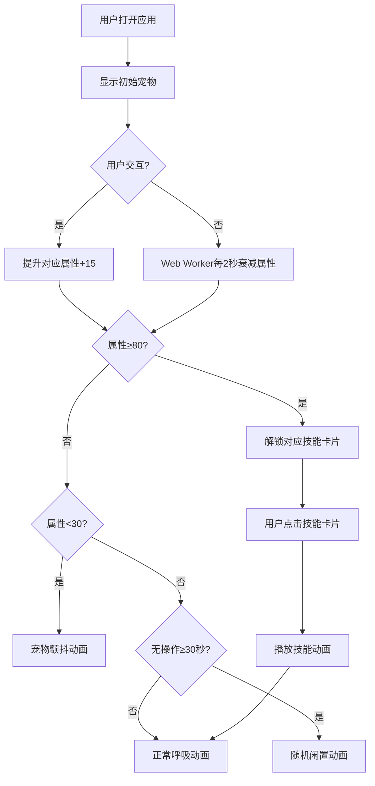

## 1. 产品概述
电子宠物养成与技能学习交互应用，用户可在浏览器中领养像素风格虚拟宠物，通过互动提升宠物属性并解锁技能动画。

- 主要目的：提供轻松有趣的虚拟宠物养成体验
- 目标用户：喜欢休闲养成类游戏的互联网用户
- 产品价值：通过像素艺术风格和流畅动画交互，带来治愈系的线上陪伴体验

## 2. 核心功能

### 2.1 用户角色
| 角色 | 注册方式 | 核心权限 |
|------|---------|---------|
| 普通用户 | 无需注册，直接使用 | 宠物交互、技能解锁、动画播放 |

### 2.2 功能模块
1. **宠物展示区**：Canvas画布渲染像素宠物，包含呼吸、颤抖、闲置等动画
2. **交互面板**：喂食、清洁、玩耍三个按钮，带悬停和点击粒子效果
3. **属性状态条**：显示饱食度、清洁度、快乐度，HSL颜色渐变映射
4. **技能系统**：属性达标后自动解锁技能卡片，点击播放技能动画
5. **属性衰减系统**：Web Worker后台定时计算属性自动衰减

### 2.3 页面详情
| 页面名称 | 模块名称 | 功能描述 |
|---------|---------|----------|
| 主页面 | 宠物展示区 | 32x32像素宠物精灵，渐变背景，呼吸/颤抖/闲置动画 |
| 主页面 | 属性进度条 | 三条横向进度条，HSL红到绿渐变，0.3s过渡动画 |
| 主页面 | 交互面板 | 三个圆形按钮，悬停放大，点击粒子特效，属性+15 |
| 主页面 | 技能列表 | 技能卡片滑入动画，点击播放技能动画，播放期间禁用交互 |

## 3. 核心流程
用户打开应用 → 展示初始宠物（站立+呼吸动画）→ 用户点击交互按钮提升属性 → Web Worker每2秒衰减属性0.5点 → 属性低于30时宠物颤抖，高于80时呼吸舒展 → 属性达到80阈值解锁对应技能卡片 → 点击技能卡片播放技能动画 → 无操作30秒后随机播放闲置动画

## 4. 用户界面设计

### 4.1 设计风格
- **主色调**：暖橙色#FFA500，浅绿色#E8F5E9/#C8E6C9
- **辅助色**：深绿色#388E3C，蓝色#1976D2，金色#FDD835，白色#FFFFFF
- **按钮风格**：圆形按钮，圆角12px，悬停放大1.1倍带阴影
- **毛玻璃效果**：backdrop-filter: blur(8px)，半透明白色背景rgba(255,255,255,0.2)
- **圆角风格**：所有卡片和按钮border-radius: 12px
- **宠物精灵**：32x32像素，几何色块构成，暖橙+白色调

### 4.2 页面设计概述
| 页面名称 | 模块名称 | UI元素 |
|---------|---------|--------|
| 主页面 | 宠物展示区 | Canvas占50%高度，渐变背景#E8F5E9→#C8E6C9，居中宠物精灵 |
| 主页面 | 属性进度条 | 三条横向进度条，HSL色值映射，0.3s ease-out过渡 |
| 主页面 | 交互面板 | 三个圆形按钮（深绿/蓝/金），悬停放大，点击粒子特效 |
| 主页面 | 技能列表 | 毛玻璃卡片，从右向左滑入（0.4s cubic-bezier），技能名+图标 |

### 4.3 响应式
- **桌面端**（≥768px）：三区域布局，顶部宠物区，左下交互面板，右下技能列表
- **移动端**（<768px）：上下布局，顶部宠物区50%高度，下方交互面板与技能列表左右并排
- 进度条宽度根据容器自动缩放

### 4.4 动画特效
- 呼吸动画：默认轻微上下浮动，属性>80时幅度增大1.5倍
- 颤抖动画：属性<30时，每0.5s左右偏移2像素
- 点击粒子：点击按钮时5个随机方向彩色小点扩散，0.4s消失
- 技能解锁：卡片从右向左滑入，0.4s cubic-bezier
- 闲置动画：30秒无操作后随机播放（打哈欠/左顾右盼/挠头），0.8-1.2秒
- 技能动画：跳舞（旋转跳动1.5s）、翻滚（360度旋转1.2s）、唱歌（张嘴1.8s）
