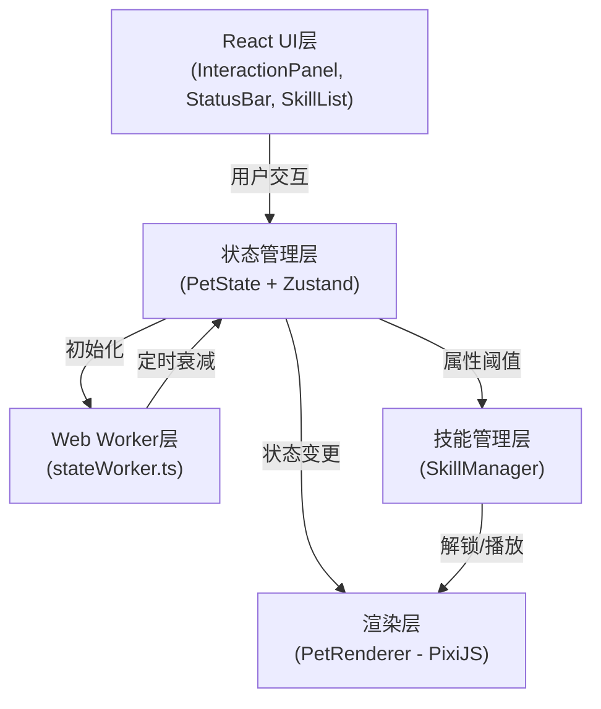

## 1. 架构设计


## 2. 技术描述
- **前端框架**：React 18 + TypeScript 5
- **构建工具**：Vite 5 + @vitejs/plugin-react
- **渲染引擎**：PixiJS 7 + @pixi/react
- **状态管理**：Zustand（轻量级状态管理）
- **后台计算**：Web Worker（属性衰减）
- **样式方案**：原生CSS + CSS变量

## 3. 文件结构
| 文件路径 | 职责说明 |
|---------|---------|
| `package.json` | 项目依赖与启动脚本 |
| `vite.config.js` | Vite构建配置 |
| `tsconfig.json` | TypeScript严格模式配置 |
| `index.html` | 应用入口页面 |
| `src/main.tsx` | React应用入口，挂载根组件 |
| `src/App.tsx` | 应用根组件，布局与整体协调 |
| `src/game/PetRenderer.ts` | PixiJS渲染器，像素精灵绘制与动画播放 |
| `src/game/SkillManager.ts` | 技能定义、解锁条件、动画序列管理 |
| `src/data/PetState.ts` | 宠物状态类型、初始值、状态更新函数，Worker通信 |
| `src/worker/stateWorker.ts` | Web Worker，每2秒计算属性衰减 |
| `src/components/InteractionPanel.tsx` | 交互面板：喂食/清洁/玩耍按钮 |
| `src/components/StatusBar.tsx` | 属性进度条：HSL渐变映射 + 过渡动画 |
| `src/components/SkillList.tsx` | 已学习技能列表与卡片组件 |
| `src/styles/global.css` | 全局样式：毛玻璃、响应式布局、动画 |

## 4. 状态模型

### 4.1 宠物状态
```typescript
interface PetStats {
  hunger: number;      // 饱食度 0-100
  cleanliness: number; // 清洁度 0-100
  happiness: number;   // 快乐度 0-100
}

interface PetState extends PetStats {
  learnedSkills: SkillId[];
  isAnimating: boolean;
  currentAnimation: AnimationType | null;
  lastInteractionTime: number;
}
```

### 4.2 技能定义
```typescript
type SkillId = 'dance' | 'roll' | 'sing';

interface Skill {
  id: SkillId;
  name: string;
  icon: string;
  unlockThreshold: { stat: keyof PetStats; value: number };
  duration: number;
  animationSequence: AnimationFrame[];
}
```

## 5. 核心算法

### 5.1 属性衰减
- Worker每2秒触发一次
- 每个属性衰减0.5点
- 下限为0，不出现负值
- 通过postMessage发送更新后的状态给主线程

### 5.2 技能解锁
- 属性更新时检查是否达到解锁阈值（≥80）
- 未学习过的技能触发解锁流程
- SkillManager通知渲染器播放解锁动画
- 将技能id加入learnedSkills数组

### 5.3 闲置检测
- 记录每次交互的时间戳
- 每10秒检查一次：当前时间 - 上次交互时间 ≥ 30秒
- 满足条件时从三种闲置动画中随机选择一种播放

## 6. 性能指标
- **主线程帧率**：≥30FPS（通过requestAnimationFrame + PixiJS ticker保证）
- **Worker延迟**：≤50ms（仅做简单数值计算，无复杂逻辑）
- **内存占用**：稳定，无内存泄漏（及时清理事件监听与动画引用）
