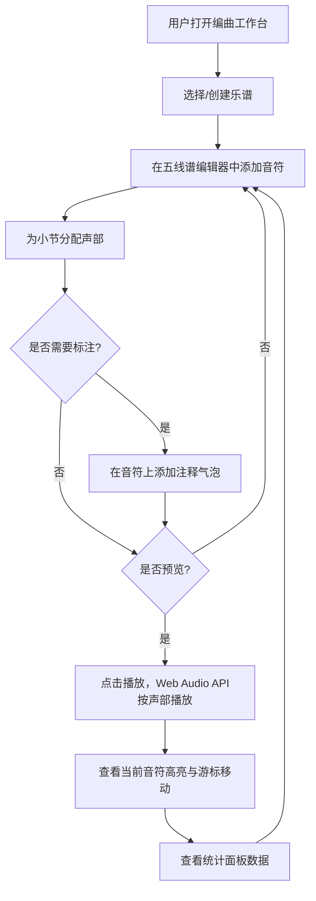

## 1. 产品概述

面向业余乐队成员的在线协作编曲与乐谱生成平台，解决异地成员无法同时在乐谱上标注修改意见、分配声部及预览合奏效果的痛点。目标用户为有编曲需求但缺乏专业协作工具的业余乐队，产品核心价值在于将零散的线下沟通整合为可视化、可回放的在线协作流程。

## 2. 核心功能

### 2.1 用户角色
| 角色 | 注册方式 | 核心权限 |
|------|----------|----------|
| 乐队成员 | 邀请制 | 编辑分配到的声部音符、添加注释、播放预览 |

### 2.2 功能模块
1. **编曲工作台**：五线谱编辑器、钢琴卷帘窗视图、音符增删拖拽、声部管理、播放预览
2. **注释协作**：气泡式注释、链式回复、未读提醒

### 2.3 页面详情
| 页面名称 | 模块名称 | 功能描述 |
|----------|----------|----------|
| 编曲工作台 | 五线谱编辑器 | 在五线谱上点击添加音符，拖拽移动音符位置（弹性吸附动画 0.25s cubic-bezier），右键删除音符；支持切换钢琴卷帘窗视图；音符颜色根据音高从低音#2196f3渐变到高音#f44336 |
| 编曲工作台 | 声部管理面板 | 为当前小节指定声部（主唱、吉他、贝斯、鼓），每个声部用不同颜色高亮条标记在小节下方 |
| 编曲工作台 | 播放控制 | 点击播放按钮，Web Audio API按声部顺序依次播放每个小节；当前音符高亮为#ffeb3b，水平游标从左到右匀速移动（BPM可设，默认120） |
| 编曲工作台 | 注释气泡 | 在声部音符上添加文字注释，气泡悬浮在音符上方，可拖拽调整位置；支持链式回复讨论；未读注释在声部面板显示红色角标数字 |
| 编曲工作台 | 统计面板 | 自动统计每声部总时长和平均音高，以堆叠条形图展示，鼠标悬停显示具体数值 |

## 3. 核心流程

## 4. 用户界面设计

### 4.1 设计风格
- 主色调：深灰#1e1e1e背景，亮灰#bdbdbd五线谱线
- 强调色：低音蓝#2196f3 → 高音红#f44336渐变，播放高亮黄#ffeb3b
- 按钮风格：圆角扁平按钮，hover时微光扩散动画（box-shadow glow）
- 字体：等宽字体用于音符/节拍显示，无衬线字体用于面板文字
- 布局：三栏式深色主题专业编曲界面
- 注释气泡：毛玻璃效果（backdrop-filter: blur(8px)）

### 4.2 页面设计概览
| 页面名称 | 模块名称 | UI要素 |
|----------|----------|--------|
| 编曲工作台 | 声部管理面板 | 深色侧边栏，声部列表带颜色标识条，未读角标红色数字 |
| 编曲工作台 | 五线谱编辑区 | 深色背景五线谱，音符圆形带音高渐变色，播放游标白色竖线，工具栏在顶部 |
| 编曲工作台 | 注释气泡 | 半透明毛玻璃背景，白色文字，可拖拽，回复楼层缩进显示 |
| 编曲工作台 | 统计面板 | Canvas绘制的堆叠条形图，hover时tooltip显示数值 |

### 4.3 响应式适配
- 桌面优先设计，浏览器宽度 ≥ 768px 时三栏布局
- 宽度 < 768px 时：声部面板折叠为顶栏下拉菜单，统计面板折叠为底栏抽屉（点击展开），编辑区占满宽度

### 4.4 性能要求
- 播放时音符高亮与游标移动保持60fps
- 注释气泡超过50个时，屏幕外的气泡转换为小圆点标记，点击展开
