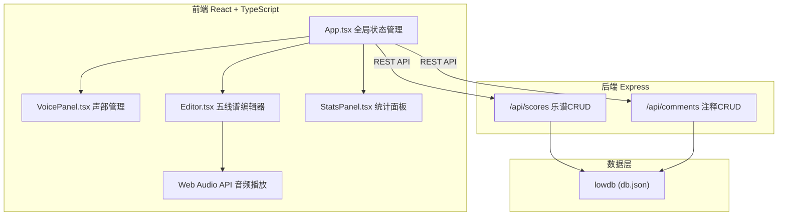
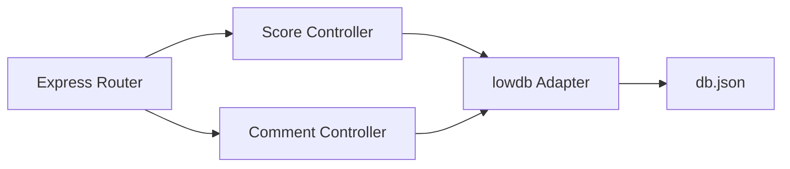
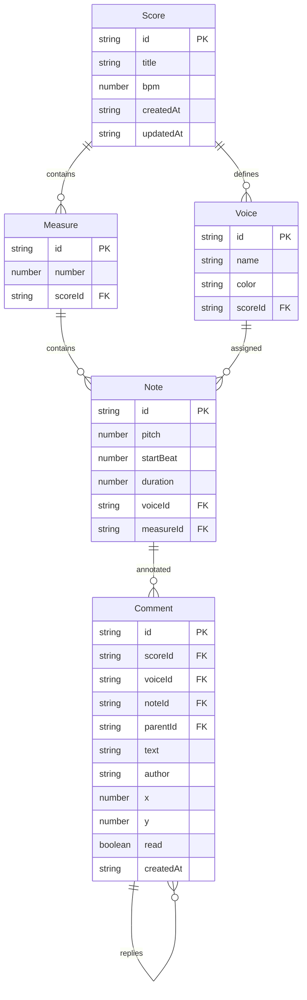

## 1. 架构设计



## 2. 技术说明
- 前端：React 18 + TypeScript + Vite（状态管理用 useReducer）
- 初始化工具：vite-init（react-ts 模板）
- 后端：Express 4 + cors + lowdb + uuid
- 数据存储：lowdb（JSON文件存储在 server/data/db.json）
- 音频播放：Web Audio API（浏览器原生）
- 图表渲染：Canvas 2D（StatsPanel 内部实现）

## 3. 路由定义
| 路由 | 用途 |
|------|------|
| / | 编曲工作台主界面（单页应用） |

## 4. API 定义

### 4.1 乐谱 API
| 方法 | 路径 | 描述 | 请求体 | 响应 |
|------|------|------|--------|------|
| GET | /api/scores | 获取所有乐谱 | - | Score[] |
| GET | /api/scores/:id | 获取单个乐谱 | - | Score |
| POST | /api/scores | 创建乐谱 | Score (无id) | Score |
| PUT | /api/scores/:id | 更新乐谱 | Score | Score |
| DELETE | /api/scores/:id | 删除乐谱 | - | { success: true } |

### 4.2 注释 API
| 方法 | 路径 | 描述 | 请求体 | 响应 |
|------|------|------|--------|------|
| GET | /api/comments?scoreId=&voiceId= | 获取注释 | - | Comment[] |
| POST | /api/comments | 创建注释 | Comment (无id) | Comment |
| PUT | /api/comments/:id | 更新注释 | Comment | Comment |
| DELETE | /api/comments/:id | 删除注释 | - | { success: true } |

### 4.3 TypeScript 类型定义

```typescript
interface Note {
  id: string;
  pitch: number;
  startBeat: number;
  duration: number;
  voiceId: string;
}

interface Voice {
  id: string;
  name: string;
  color: string;
}

interface Measure {
  id: string;
  number: number;
  voiceIds: string[];
  notes: Note[];
}

interface Score {
  id: string;
  title: string;
  bpm: number;
  voices: Voice[];
  measures: Measure[];
  createdAt: string;
  updatedAt: string;
}

interface Comment {
  id: string;
  scoreId: string;
  voiceId: string;
  noteId: string;
  parentId: string | null;
  text: string;
  author: string;
  x: number;
  y: number;
  read: boolean;
  createdAt: string;
}
```

## 5. 服务端架构图



## 6. 数据模型

### 6.1 数据模型定义



### 6.2 数据定义语言
使用 lowdb JSON 文件存储，初始数据结构：

```json
{
  "scores": [],
  "comments": []
}
```

初始化时预置一条示例乐谱数据，包含4个声部（主唱、吉他、贝斯、鼓）和2个小节的示例音符。
