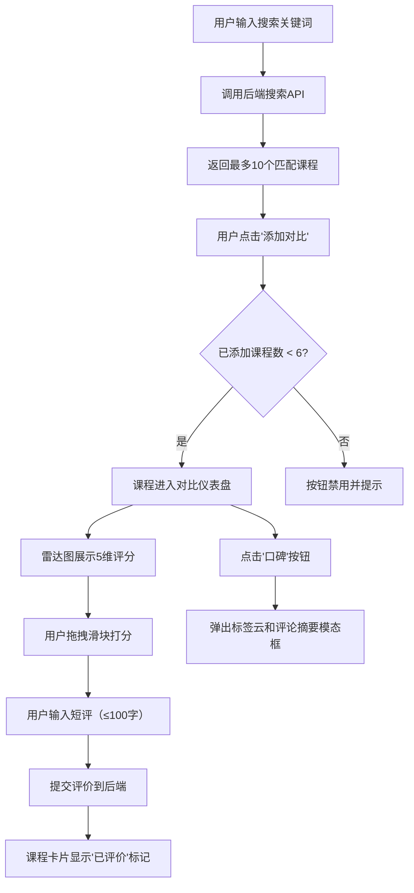

## 1. 产品概述

在线课程对比与口碑聚合应用，帮助家长在海量在线教育课程中快速对比课程质量、教师风格和价格梯度。通过集中展示课程大纲、教师信息、价格、评分和标签云，让家长能够做出更明智的选课决策。

- 目标用户：为孩子挑选在线教育课程的家长
- 核心价值：解决"选择困难症"，提供多维度课程对比工具
- 产品定位：轻量级、可视化的在线课程口碑聚合平台

## 2. 核心 Features

### 2.1 User Roles

| Role | Registration Method | Core Permissions |
|------|---------------------|------------------|
| 普通用户 | 无需注册，直接使用 | 搜索课程、添加对比、自定义打分与短评、查看口碑标签云 |

### 2.2 Feature Module

1. **首页（唯一页面）**：
   - 顶部导航栏
   - 搜索框（带展开动画）
   - 课程搜索结果列表
   - 对比仪表盘（最多6个课程并排对比）
   - 口碑模态框

### 2.3 Page Details

| Page Name | Module Name | Feature description |
|-----------|-------------|---------------------|
| 首页 | 顶部导航栏 | 深蓝背景、白色文字、品牌Logo展示 |
| 首页 | 搜索框 | 居中布局、聚焦时宽度从200px动画展开到600px、关键词搜索课程 |
| 首页 | 搜索结果列表 | 最多展示10个匹配课程、支持添加到对比面板 |
| 首页 | 对比仪表盘 | 水平滚动布局、展示课程卡片、响应式垂直堆叠 |
| 首页 | 课程卡片 | 雷达图展示5维评分、用户自定义打分滑块、短评输入框、口碑按钮 |
| 首页 | 口碑模态框 | 标签云展示、最近5条用户短评摘要 |

## 3. Core Process

用户在搜索框输入关键词（如"少儿编程"），后端返回匹配的课程列表。用户点击"添加对比"按钮，课程进入对比仪表盘。在仪表盘中，用户可以并排查看多个课程的详细信息，通过雷达图直观对比课程质量，使用滑块进行自定义打分并撰写短评。点击"口碑"按钮可查看课程的标签云和用户评论摘要。

## 4. User Interface Design

### 4.1 Design Style

- **主色调**：深蓝 #2c3e50（导航栏）、浅灰 #f5f7fa（背景）、白色 #ffffff（卡片）
- **强调色**：蓝色 #3498db（雷达图、输入框焦点）、红色 #e74c3c（价格、滑块左端）、绿色 #2ecc71（滑块右端）
- **按钮风格**：圆角矩形，hover 时背景色变化
- **字体**：选用 "Noto Sans SC" 作为中文字体，搭配现代无衬线英文字体
  - 标题：18px-24px，字重600
  - 正文：14px-16px，字重400
  - 价格：28px-32px，红色大字，字重700
- **布局风格**：卡片式设计，顶部导航，卡片带圆角和阴影
- **图标风格**：使用简单线性图标，与整体简洁风格统一

### 4.2 Page Design Overview

| Page Name | Module Name | UI Elements |
|-----------|-------------|-------------|
| 首页 | 顶部导航栏 | 深蓝背景、白色文字、居中布局、高度60px |
| 首页 | 搜索框 | 居中于导航栏下方、圆角8px、0.4s宽度展开动画（200px→600px）、输入时placeholder上移 |
| 首页 | 搜索结果列表 | 下拉展示、每个结果包含课程名+简介+添加按钮 |
| 首页 | 对比仪表盘 | flex-wrap水平布局、间距20px、卡片宽度280px、可横向滚动 |
| 首页 | 课程卡片 | 白色背景、border-radius:16px、box-shadow: 0 4px 12px rgba(0,0,0,0.08)、内边距20px |
| 首页 | 雷达图 | Canvas绘制、5维雷达、半透明填充 rgba(52,152,219,0.3)、边框 #3498db |
| 首页 | 评分滑块 | 轨道 #ddd、填充渐变 #e74c3c→#2ecc71、滑块圆形带阴影、拖拽显示数值浮层 |
| 首页 | 短评输入框 | 底部边框、获得焦点时 #3498db 细线动画（0.2s ease）、字数统计 |
| 首页 | 口碑模态框 | fade-in 0.3s、半透明黑色遮罩 rgba(0,0,0,0.5)、标签云字号12px-32px |

### 4.3 Responsiveness

- **Desktop-first** 设计，断点：768px
- 窗口宽度 < 768px 时：
  - 仪表盘改为垂直堆叠布局
  - 每个卡片宽度100%
  - 搜索框最大宽度调整为90%
  - 字体大小适当缩小

### 4.4 动画与微交互

1. **搜索框展开**：聚焦时 width: 200px → 600px，transition: width 0.4s ease
2. **卡片 hover**：transform: translateY(-4px)，box-shadow 加深，transition: all 0.3s ease
3. **滑块拖拽**：实时显示数值浮层，跟随滑块位置
4. **输入框焦点**：底部边框从透明→#3498db，transition: border-color 0.2s ease
5. **模态框出现**：opacity: 0→1，transform: scale(0.95)→scale(1)，transition: all 0.3s ease
6. **标签云**：标签出现时 staggered fade-in 动画

### 4.5 性能约束

- 搜索响应时间 ≤ 500ms
- 雷达图绘制帧率 ≥ 30fps
- 标签云渲染时间 ≤ 200ms
