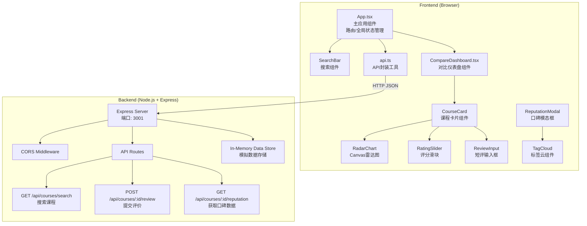
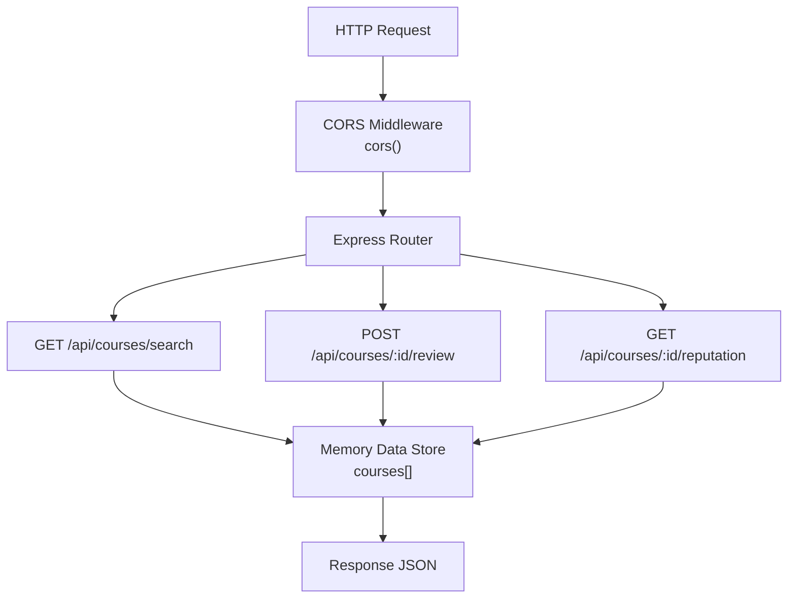

## 1. Architecture Design



## 2. Technology Description

- **Frontend**: React@18 + TypeScript@5 + Vite@5
- **Frontend Build Tool**: Vite@5 with @vitejs/plugin-react@4
- **Backend**: Node.js + Express@4
- **Data Storage**: In-Memory (JavaScript objects)
- **Cross-Origin**: cors@2
- **ID Generation**: uuid@9
- **Styling**: CSS Modules / 内联样式 (无额外UI库)
- **Charting**: Native HTML5 Canvas API (雷达图)

## 3. Project Structure

```
auto227/
├── .trae/documents/           # 项目文档
│   ├── prd.md                 # PRD文档
│   └── tech-architecture.md   # 技术架构文档
├── server/                    # 后端代码
│   ├── index.js               # Express服务器入口
│   └── data.js                # 模拟数据源
├── src/                       # 前端源代码
│   ├── components/            # React组件
│   │   ├── CompareDashboard.tsx   # 对比仪表盘
│   │   ├── CourseCard.tsx         # 课程卡片
│   │   ├── RadarChart.tsx         # Canvas雷达图
│   │   ├── RatingSlider.tsx       # 评分滑块
│   │   ├── ReviewInput.tsx        # 短评输入框
│   │   ├── ReputationModal.tsx    # 口碑模态框
│   │   ├── TagCloud.tsx           # 标签云
│   │   └── SearchBar.tsx          # 搜索栏
│   ├── types/                 # TypeScript类型定义
│   │   └── index.ts
│   ├── utils/                 # 工具函数
│   │   └── api.ts             # API请求封装
│   ├── App.tsx                # 主应用组件
│   ├── main.tsx               # React入口
│   └── App.css                # 全局样式
├── index.html                 # HTML入口
├── package.json               # 项目依赖
├── tsconfig.json              # TypeScript配置
└── vite.config.js             # Vite配置
```

## 4. Data Flow

1. **搜索流程**:
   - 用户输入关键词 → [SearchBar.tsx] → [api.ts: searchCourses()] → GET /api/courses/search → [server/index.js] → [server/data.js] → 返回课程列表 → [App.tsx] 管理状态 → 渲染搜索结果

2. **添加对比流程**:
   - 用户点击"添加对比" → [SearchBar.tsx] → 回调 [App.tsx: addToCompare()] → 状态更新 → [CompareDashboard.tsx] 接收 props → 渲染课程卡片

3. **评分提交流程**:
   - 用户拖拽滑块 + 输入短评 → [RatingSlider.tsx] + [ReviewInput.tsx] → [CourseCard.tsx] 收集数据 → [api.ts: submitReview()] → POST /api/courses/:id/review → [server/index.js] → 内存存储 → 返回成功 → [CourseCard.tsx] 显示"已评价"

4. **口碑查看流程**:
   - 用户点击"口碑"按钮 → [CourseCard.tsx] → 打开 [ReputationModal.tsx] → [api.ts: getReputation()] → GET /api/courses/:id/reputation → [server/index.js] → [server/data.js] → 返回标签云数据和评论 → 渲染 [TagCloud.tsx]

## 5. Type Definitions

```typescript
// src/types/index.ts

interface Course {
  id: string;
  name: string;
  teacher: {
    name: string;
    avatar: string;
    bio: string;
  };
  price: number;
  outline: string[];
  rating: number; // 0-5, 半星精度
  radarScores: {
    contentDepth: number;     // 内容深度 0-10
    funFactor: number;        // 趣味性 0-10
    teacherQuality: number;   // 师资力量 0-10
    valueForMoney: number;    // 性价比 0-10
    afterClassService: number; // 课后服务 0-10
  };
  tags: { name: string; count: number }[];
  reviews: UserReview[];
  userReview?: UserReview; // 当前用户的评价
}

interface UserReview {
  id: string;
  courseId: string;
  rating: number; // 1-10
  comment: string;
  createdAt: string;
}

interface ReputationData {
  tags: { name: string; count: number }[];
  recentReviews: UserReview[];
}

interface SearchResult {
  courses: Course[];
}
```

## 6. API Definitions

| Method | Endpoint | Request | Response | Description |
|--------|----------|---------|----------|-------------|
| GET | `/api/courses/search` | `?keyword=string` | `{ courses: Course[] }` | 搜索匹配课程（最多10个） |
| POST | `/api/courses/:id/review` | `{ rating: number, comment: string }` | `{ success: boolean, review: UserReview }` | 提交用户评分和短评 |
| GET | `/api/courses/:id/reputation` | N/A | `{ tags: Tag[], recentReviews: UserReview[] }` | 获取口碑数据（标签云+最近5条评论） |

## 7. Server Architecture



## 8. Component Hierarchy & Call Graph

```
App.tsx
├── state: searchKeyword, searchResults, compareCourses
├── handlers: handleSearch(), addToCompare(), removeFromCompare(), updateCourseReview()
│
├── SearchBar.tsx
│   ├── props: onSearch(), onAddCourse()
│   └── state: keyword, isExpanded
│
└── CompareDashboard.tsx
    ├── props: courses[], onUpdateReview()
    │
    └── CourseCard.tsx (×6 max)
        ├── props: course, onSubmitReview(), onRemove()
        ├── state: sliderValue, reviewText, showReputation
        │
        ├── RadarChart.tsx (Canvas)
        │   └── props: scores (5维数据)
        │
        ├── RatingSlider.tsx
        │   ├── props: value, onChange()
        │   └── state: showTooltip
        │
        ├── ReviewInput.tsx
        │   └── props: value, onChange(), maxLength=100
        │
        └── ReputationModal.tsx
            ├── props: courseId, onClose()
            ├── state: isLoading, reputationData
            │
            └── TagCloud.tsx
                └── props: tags[], minSize=12, maxSize=32
```

## 9. Performance Optimizations

1. **搜索防抖**: SearchBar 中使用 `useDebounce` 钩子，延迟 300ms 发送请求，避免频繁API调用
2. **雷达图缓存**: RadarChart 组件使用 `useRef` 缓存 Canvas 上下文，使用 `requestAnimationFrame` 确保 30fps+ 绘制
3. **组件 memoization**: 使用 `React.memo` 包裹 CourseCard、RadarChart 等组件，避免不必要的重渲染
4. **标签云优化**: TagCloud 使用 CSS transform 进行布局，避免重排
5. **搜索结果缓存**: 在 api.ts 中实现简单的 LRU 缓存，相同关键词1分钟内不重复请求

## 10. Build & Run Scripts

```json
// package.json scripts
{
  "dev": "concurrently \"npm run server\" \"npm run client\"",
  "server": "node server/index.js",
  "client": "vite",
  "build": "tsc && vite build",
  "preview": "vite preview"
}
```

启动命令: `npm run dev`
- 后端服务: http://localhost:3001
- 前端开发服务器: http://localhost:5173
