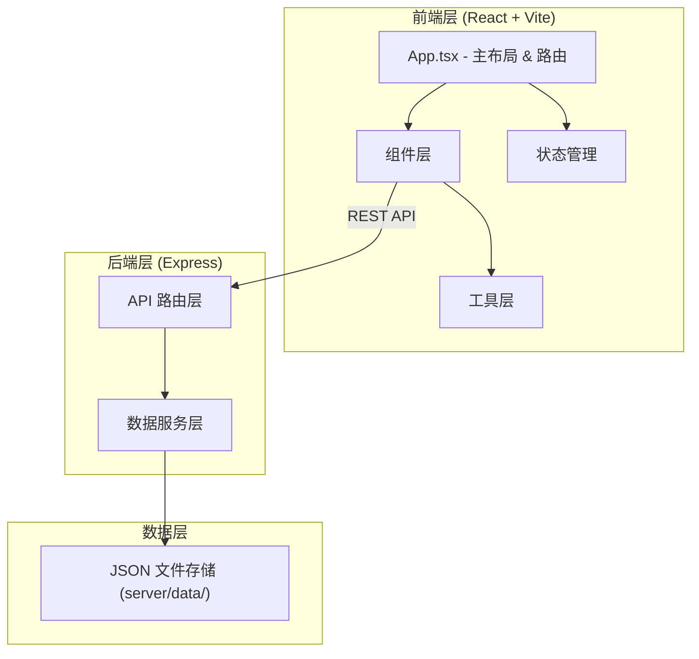
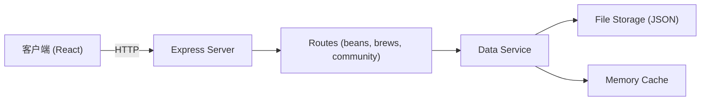
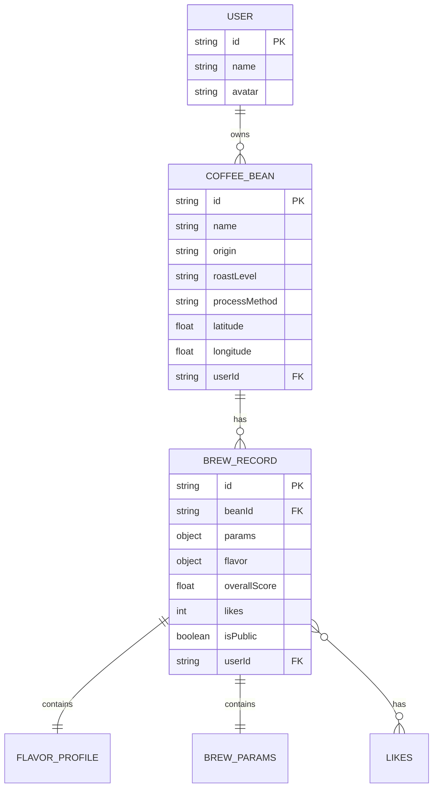

## 1. 架构设计



## 2. 技术栈说明

- **前端**：React 18 + TypeScript + Vite
- **后端**：Express 4 + TypeScript
- **数据存储**：JSON 文件持久化（内存缓存 + 文件读写）
- **样式方案**：CSS Modules / 内联样式（按需求使用）
- **状态管理**：React Context + useState/useReducer
- **图标库**：lucide-react
- **构建工具**：Vite（路径别名 @ 配置）

## 3. 路由定义

| 路由 | 用途 |
|------|------|
| / | 个人主页（咖啡豆档案 + 风味时间线） |
| /brew/new | 新建冲煮记录 |
| /brew/:id | 查看冲煮记录详情 |
| /community | 社区页（横向滚动卡片流） |
| /beans/:id | 咖啡豆详情（含该豆子的所有冲煮记录时间线） |

## 4. API 定义

### 4.1 咖啡豆 API

```typescript
// 咖啡豆数据模型
interface CoffeeBean {
  id: string;
  name: string;
  origin: string;
  roastLevel: 'light' | 'medium' | 'medium-dark' | 'dark';
  processMethod: string;
  latitude: number;
  longitude: number;
  createdAt: string;
  userId: string;
}

// GET /api/beans - 获取用户所有咖啡豆
// POST /api/beans - 创建咖啡豆档案
// PUT /api/beans/:id - 更新咖啡豆档案
// DELETE /api/beans/:id - 删除咖啡豆档案
```

### 4.2 冲煮记录 API

```typescript
// 风味评分
interface FlavorProfile {
  acidity: number;      // 酸度 1-10
  bitterness: number;   // 苦度 1-10
  sweetness: number;    // 甜度 1-10
  body: number;         // 醇厚度 1-10
  aftertaste: number;   // 余韵 1-10
  cleanliness: number;  // 干净度 1-10
}

// 冲煮参数
interface BrewParams {
  waterTemp: number;      // 水温 85-98°C
  grindSize: number;      // 研磨度 1-10
  waterRatio: number;     // 粉水比 10-20 (1:X)
  pourTime: number;       // 注水时间（秒）
}

// 冲煮记录
interface BrewRecord {
  id: string;
  beanId: string;
  beanName: string;
  params: BrewParams;
  flavor: FlavorProfile;
  overallScore: number;   // 综合评分（风味平均值）
  notes?: string;
  likes: number;
  isPublic: boolean;
  createdAt: string;
  userId: string;
}

// GET /api/brews - 获取用户冲煮记录列表
// GET /api/brews/:id - 获取单条冲煮记录
// POST /api/brews - 创建冲煮记录
// PUT /api/brews/:id - 更新冲煮记录
// DELETE /api/brews/:id - 删除冲煮记录
// POST /api/brews/:id/like - 点赞
```

### 4.3 社区 API

```typescript
// GET /api/community/brews - 获取公开冲煮记录（按点赞数排序）
// Query: { page?: number, limit?: number, sortBy?: 'likes' | 'date' }
```

## 5. 服务器架构图



## 6. 数据模型

### 6.1 ER 图



### 6.2 初始数据

预置 20 条模拟冲煮记录，包含：
- 5 个不同的咖啡豆档案
- 每颗豆子 3-5 条冲煮记录
- 覆盖不同烘焙度和处理法
- 包含公开和私有记录
- 预设点赞数用于社区排序
