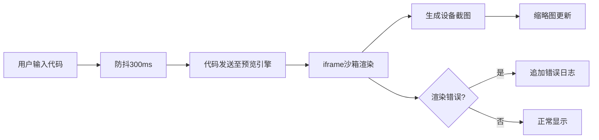
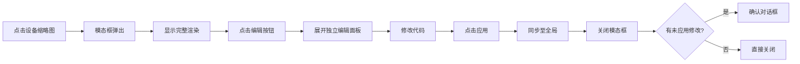

## 1. 产品概述

响应式组件预览与调试沙箱是一款面向前端开发者的轻量级本地工具，解决开发者在浏览器中直接预览和调试响应式组件在不同设备上渲染效果的痛点。用户可输入HTML/CSS/JS代码，实时查看组件在手机、平板、笔记本、4K屏幕等设备上的预览效果，并支持二次编辑和调试。

### 核心价值
- 提供多设备同步预览能力，减少开发者在不同设备间切换调试的时间
- 支持代码实时编辑与防抖同步，提升开发效率
- 内置错误捕获与日志系统，帮助快速定位代码问题
- 主题色可定制，满足不同开发者的视觉偏好

## 2. 核心功能

### 2.1 功能模块

1. **代码编辑模块**：HTML/CSS/JS三标签页编辑器，带行号显示，支持实时输入与防抖同步
2. **预览引擎模块**：多设备iframe沙箱渲染，支持截图生成与缩略图展示
3. **设备放大模块**：点击设备缩略图放大预览，支持单设备独立编辑与应用同步
4. **日志面板模块**：捕获渲染错误与代码日志，支持级别分类、复制与清空
5. **主题切换模块**：四色主题快速切换，全局CSS变量驱动视觉一致性

### 2.2 页面详情

| 页面名称 | 模块名称 | 功能描述 |
|---------|---------|---------|
| 主页面 | 顶部标题栏 | 显示产品名称，提供主题色切换按钮 |
| 主页面 | 代码编辑区 | 三标签页切换（HTML/CSS/JS），多行文本编辑，行号显示 |
| 主页面 | 设备预览区 | 2x2网格布局展示四个设备缩略图，悬浮高亮，点击放大 |
| 主页面 | 日志面板 | 可滚动日志列表，按时间倒序排列，支持复制与清空 |
| 模态框 | 设备放大预览 | 居中模态框展示设备完整渲染内容，顶部提示条 |
| 模态框 | 单设备编辑面板 | 独立编辑器修改单设备代码，应用按钮同步回全局 |

## 3. 核心流程

### 3.1 主工作流程

用户输入代码 → 防抖等待300ms → 代码字符串发送给预览引擎 → iframe沙箱渲染 → 生成各设备截图 → 缩略图更新显示 → 如有错误捕获并追加到日志

### 3.2 设备放大编辑流程

点击设备缩略图 → 模态框弹出 → 显示设备完整渲染 → 点击编辑按钮 → 展开独立编辑面板 → 修改代码 → 点击应用 → 同步至全局 → 关闭模态框（如有未应用修改则确认）

## 4. 用户界面设计

### 4.1 设计风格

- **主色调**：蓝色 #4A90D9（可通过主题切换更换）
- **背景色**：编辑器深色 #1E1E1E，页面浅灰 #F5F5F5，标题栏深色 #2C3E50
- **文字色**：编辑器浅绿 #D4D4D4，正文深灰 #333，标题白色
- **字体**：系统字体栈 -apple-system, BlinkMacSystemFont, 'Segoe UI', Roboto
- **按钮风格**：圆角4px，主色填充，悬浮微亮
- **布局风格**：左右分栏（桌面）/ 上下堆叠（移动端），卡片式缩略图
- **动效**：0.25s ease 过渡，0.3s ease-in-out 主题切换

### 4.2 页面设计概述

| 页面名称 | 模块名称 | UI 元素 |
|---------|---------|---------|
| 主页面 | 顶部标题栏 | 深色背景，白色文字，左侧产品名称，右侧圆形调色盘按钮 |
| 主页面 | 标签页栏 | 36px高度，未选中灰色背景，选中白色背景加粗，顶部主色横条 |
| 主页面 | 代码编辑器 | 深色背景，浅绿文字，14px字号，1.6行高，左侧行号 |
| 主页面 | 设备预览网格 | 2x2布局，缩略图浅灰边框，悬浮主色边框，左下角设备标签 |
| 主页面 | 日志面板 | 最大高度200px，可滚动，日志带色点标识级别，最新在上 |
| 模态框 | 放大预览 | 半透明遮罩，80%宽度，顶部提示条，底部操作按钮 |
| 模态框 | 编辑面板 | 左侧独立编辑器，右侧预览，应用按钮主色填充 |

### 4.3 响应式设计

- **桌面端（≥1024px）**：左右分栏布局，左侧编辑区45%，右侧预览区55%
- **平板端（620px-1024px）**：上下堆叠布局，编辑区60%高度，预览区40%高度
- **移动端（<620px）**：标签页水平滚动，缩略图1列布局占满宽度

### 4.4 视觉细节

- **缩略图**：白色背景，设备比例缩放，四周8px留白，浅灰圆角边框
- **日志条目**：info级灰色圆点，warn级黄色圆点，error级红色圆点
- **主题切换**：四色方块（浅蓝、深紫、翠绿、嫣红），点击立即切换
- **复制反馈**：点击日志300ms"已复制"提示
