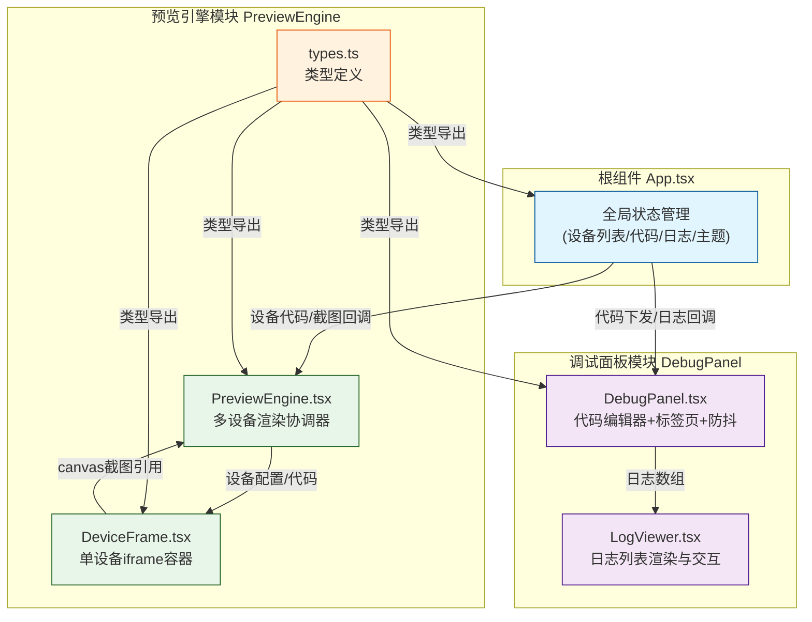

## 1. 架构设计



## 2. 技术描述

### 2.1 技术栈
- **前端框架**：React@18 + TypeScript@5
- **构建工具**：Vite@5 + @vitejs/plugin-react@4
- **工具库**：
  - uuid：唯一标识生成
  - lodash.debounce：输入防抖处理
  - d3-scale：设备缩略图尺寸比例计算
- **通信机制**：自定义事件 + postMessage + ref 桥接

### 2.2 初始化方式
使用 Vite 官方脚手架初始化 React + TypeScript 项目，手动配置所需依赖。

### 2.3 模块通信机制

#### 跨模块通信方案
1. **父子组件通信**：标准 React props + callback
2. **预览引擎与 iframe 通信**：window.postMessage 双向通信
3. **模块间桥接**：
   - ref 暴露 canvas 引用给父组件
   - CustomEvent 自定义事件（代码同步、错误捕获）
   - App 作为状态管理中枢向下分发

#### 数据流方向
```
用户输入 → DebugPanel (防抖300ms) → App (更新状态) → PreviewEngine (分发代码) 
→ DeviceFrame (postMessage) → iframe (渲染) → 截图canvas → App → 日志(如有错误)
```

## 3. 目录结构与文件定义

```
auto23/
├── package.json
├── vite.config.js
├── tsconfig.json
├── index.html
└── src/
    ├── App.tsx                    # 根组件，状态管理中枢
    ├── styles.css                 # 全局样式与CSS变量
    ├── PreviewEngine/             # 预览引擎模块
    │   ├── PreviewEngine.tsx      # 核心组件，多设备协调
    │   ├── DeviceFrame.tsx        # 单设备iframe容器
    │   └── types.ts               # 类型定义
    └── DebugPanel/                # 调试面板模块
        ├── DebugPanel.tsx         # 核心组件，代码编辑器
        └── LogViewer.tsx          # 日志查看器
```

## 4. 核心类型定义

### 4.1 设备类型枚举
```typescript
export enum DeviceType {
  MOBILE = 'mobile',
  TABLET = 'tablet',
  LAPTOP = 'laptop',
  DESKTOP_4K = 'desktop_4k'
}

export interface DeviceConfig {
  type: DeviceType;
  name: string;
  width: number;
  height: number;
}
```

### 4.2 代码载荷与预览结果
```typescript
export type CodePayload = {
  html: string;
  css: string;
  js: string;
};

export interface PreviewResult {
  deviceType: DeviceType;
  canvasRef: React.RefObject<HTMLCanvasElement>;
  timestamp: number;
}

export interface LogEntry {
  id: string;
  timestamp: number;
  level: 'info' | 'warn' | 'error';
  message: string;
}
```

## 5. 性能约束实现

### 5.1 代码同步防抖
- 使用 lodash.debounce 包装代码变更回调，延迟300ms执行
- 防抖函数在 useEffect 清理阶段取消，防止内存泄漏

### 5.2 日志数量限制
- 日志数组最多保留100条记录
- 追加新日志时使用 `slice(-100)` 自动丢弃最旧条目

### 5.3 iframe 沙箱优化
- iframe 设置 `sandbox="allow-scripts"` 隔离执行环境
- 使用 `srcdoc` 属性直接注入HTML，避免网络请求
- 渲染完成后通过 postMessage 通知父组件截图

### 5.4 渲染性能
- 设备缩略图使用 canvas 绘制而非实时 iframe
- 主题切换使用 CSS 变量，避免全局重渲染
- 代码切换标签页时使用状态保留，不重新挂载组件

## 6. 关键技术实现点

### 6.1 iframe 截图方案
```
iframe 加载完成 → html2canvas 或原生 canvas.drawImage → 
生成缩略图 canvas → 通过 ref 暴露给父组件
```

### 6.2 错误捕获机制
- iframe 内部监听 `window.onerror` 和 `console.error`
- 通过 postMessage 将错误信息发送给父组件
- DeviceFrame 接收后触发自定义事件，App 收集日志

### 6.3 单设备独立编辑
- 模态框内维护独立的代码状态副本
- 点击"应用"时通过回调同步回全局状态
- 关闭模态框前检查 `hasUnsavedChanges` 标志，弹出 confirm

### 6.4 主题色切换
- CSS 变量 `--primary-color` 驱动所有主题相关样式
- 切换时更新 `document.documentElement.style.setProperty`
- 所有过渡元素统一使用 `transition: all 0.3s ease-in-out`
