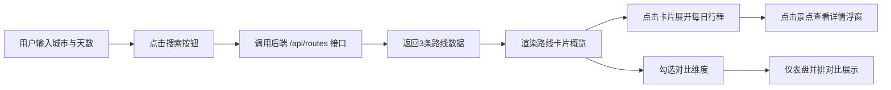

## 1. 产品概述

智能旅行路线规划与多维度对比应用，帮助用户在单一页面内完成目的地景点、交通、天气的综合对比，并获取个性化行程建议。解决旅行规划中信息分散、难以权衡的痛点。

- 目标用户：需要规划旅行路线、对比多维度信息的出行人群
- 产品价值：一站式行程生成与对比，提升旅行规划效率与决策质量

## 2. 核心功能

### 2.1 功能模块

1. **搜索栏模块**：城市输入框、天数选择器、搜索按钮（含加载动画）
2. **路线卡片模块**：3张并排路线卡片，展示概览信息，支持展开查看每日行程
3. **并排对比仪表盘**：多维度数据对比表格，支持勾选维度、拖拽排序
4. **景点详情浮窗**：点击景点弹出毛玻璃风格详情弹窗
5. **评分仪表盘**：美食评分与交通便利度半圆弧仪表盘

### 2.2 页面详情

| 页面名称 | 模块名称 | 功能描述 |
|-----------|-------------|---------------------|
| 首页 | 搜索栏 | 输入目的地城市和旅行天数，点击搜索触发路线生成，搜索按钮含加载旋转动画 |
| 首页 | 路线卡片区 | 3张卡片水平排列（移动端垂直），每张展示路线标题、天数、综合适配度进度条、预估花费范围、美食与交通仪表盘 |
| 首页 | 行程详情区 | 点击卡片展开每日行程，水平时间线展示，带滑动展开动画 |
| 首页 | 并排对比仪表盘 | 位于下方，浅灰背景，支持勾选3-5个对比维度，数据单元格颜色渐变，维度可拖拽排序 |
| 首页 | 景点详情浮窗 | 毛玻璃背景居中弹窗，展示景点名称、简介、建议时长、渐变占位图 |

## 3. 核心流程

用户打开应用 → 输入城市和天数 → 点击搜索（按钮显示旋转动画"生成中..."）→ 系统返回3条备选路线 → 用户查看路线卡片概览 → 点击卡片展开每日行程 → 点击具体景点查看详情浮窗 → 用户勾选对比维度 → 在仪表盘中并排对比各路线 → 完成决策

## 4. 用户界面设计

### 4.1 设计风格

- **主色调**：活力橙 #ff7043（强调色）、深蓝 #1a237e（标题色）
- **背景色**：暖白 #fafafa（页面背景）、浅灰 #f5f7fa（仪表盘背景）
- **卡片样式**：白色背景，圆角 16px，box-shadow: 0 2px 8px rgba(0,0,0,0.08)
- **按钮风格**：圆角胶囊按钮，主色填充，hover 上浮效果（transform: translateY(-2px)，0.2s ease）
- **字体**：现代无衬线字体，标题加粗
- **整体风格**：现代扁平风格，精致微交互

### 4.2 页面设计概览

| 页面名称 | 模块名称 | UI 元素 |
|-----------|-------------|-------------|
| 首页 | 搜索栏 | 城市输入框（圆角）、天数下拉选择器、橙色搜索按钮（带加载动画） |
| 首页 | 路线卡片 | 标题（深蓝）、适配度进度条（红→绿渐变）、半圆弧仪表盘（美食/交通评分）、预估花费范围 |
| 首页 | 行程详情 | 水平时间线（圆点标记），浅灰 #f0f0f0 到白色渐变背景，0.4s ease-out 滑动展开 |
| 首页 | 对比仪表盘 | 可勾选维度复选框、拖拽手柄（排序）、数据表格（浅绿→浅红渐变）、条形图 |
| 首页 | 景点浮窗 | 毛玻璃半透明背景、居中显示、右上角X关闭、0.25s ease-out 缩放入场 |

### 4.3 响应式设计

- 桌面端（≥768px）：3张卡片水平排列（每张宽32%，间距2%），仪表盘标准表格布局
- 移动端（<768px）：3张卡片垂直排列，仪表盘改为可横向滑动的表格
