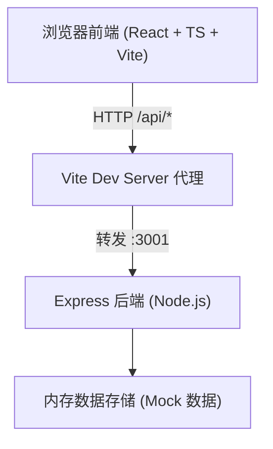
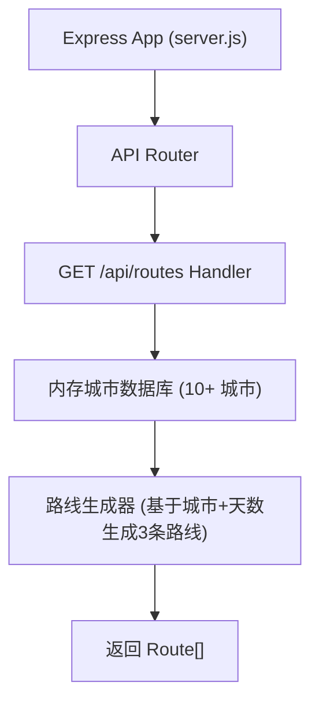

## 1. 架构设计



## 2. 技术栈说明

- **前端框架**：React@18 + TypeScript@5
- **构建工具**：Vite@5 + @vitejs/plugin-react
- **后端框架**：Express@4
- **跨域处理**：cors 中间件
- **ID 生成**：uuid
- **开发并发**：concurrently（同时启动 Vite 和 Express）
- **状态管理**：React Hooks（useState、useCallback），单页应用无需额外状态库

## 3. 项目文件结构

```
auto230/
├── package.json                 # 项目依赖与脚本
├── vite.config.js               # Vite 构建配置 + /api 代理到 :3001
├── tsconfig.json                # TS 严格模式，target ES2020
├── index.html                   # 入口 HTML
├── server.js                    # Express 后端入口 + 内存数据 + API 路由
└── src/
    ├── main.tsx                 # React 入口
    ├── App.tsx                  # 主组件（状态管理、API 调用、布局）
    ├── App.css                  # 全局样式
    ├── types.ts                 # 共享类型定义
    ├── data/
    │   └── mockCities.ts        # 前端备用城市数据（可选）
    ├── components/
    │   ├── SearchBar.tsx        # 搜索栏组件
    │   ├── RouteCard.tsx        # 路线卡片组件
    │   ├── Dashboard.tsx        # 并排对比仪表盘
    │   ├── AttractionModal.tsx  # 景点详情浮窗
    │   └── GaugeChart.tsx       # 半圆弧仪表盘
    └── utils/
        ├── hashColor.ts         # 基于名称哈希生成渐变色
        └── gradientColor.ts     # 值→颜色渐变工具
```

### 文件调用关系与数据流向

1. **server.js**：启动 Express 服务，内存存储 10+ 城市数据，暴露 `GET /api/routes?city=xxx&days=N` 返回 3 条路线
2. **src/App.tsx**：
   - 调用 `/api/routes` 获取路线列表
   - 维护 `routes`、`expandedRouteId`、`compareDimensions`、`selectedAttraction` 等状态
   - 将 `route` 数据传给 `RouteCard`，将完整 `routes` + `compareDimensions` 传给 `Dashboard`
3. **src/components/RouteCard.tsx**：
   - 接收单个 `route` 对象
   - 用户点击 → 通知 App 切换展开状态
   - 内部渲染 `GaugeChart` 显示美食/交通评分
   - 点击景点 → 通知 App 显示 `AttractionModal`
4. **src/components/Dashboard.tsx**：
   - 接收 `routes` 数组 + `dimensions` 数组
   - 维度勾选/排序变更 → 通知 App 更新
5. **src/components/AttractionModal.tsx**：
   - 接收 `attraction` 对象，展示毛玻璃弹窗
   - 使用 `hashColor` 工具生成渐变占位图

## 4. API 定义

### GET /api/routes

查询参数：
- `city` (string, required)：目的地城市名称
- `days` (number, required)：旅行天数

响应类型：

```typescript
interface Route {
  id: string;
  title: string;               // "文化古迹线"
  theme: string;               // 简要特色描述
  totalDays: number;
  fitScore: number;            // 0-100 综合适配度
  costRange: { min: number; max: number }; // 预估总花费
  foodScore: number;           // 0-100
  transportScore: number;      // 0-100
  attractionTypes: number;     // 景点类型数
  weatherSuitability: number;  // 天气适宜度 0-100
  dailyItinerary: DailyPlan[];
}

interface DailyPlan {
  day: number;
  date: string;
  weather: string;
  weatherAlert?: string;
  attractions: Attraction[];
  transport: string;
  dailyCost: number;
}

interface Attraction {
  id: string;
  name: string;
  description: string;
  duration: string;            // "建议游玩 2 小时"
  type: string;
  time: string;                // "09:00"
}
```

响应示例：
```json
{
  "success": true,
  "data": [
    { "id": "r1", "title": "文化古迹线", "...": "..." }
  ]
}
```

## 5. 后端服务架构



## 6. 数据模型

### 6.1 数据关系


### 6.2 数据字段

- **City**：name, foodScore, transportScore, attractions[], baseCost
- **Route**：id, title, theme, fitScore, costRange, foodScore, transportScore, attractionTypes, weatherSuitability, dailyItinerary[]
- **DailyPlan**：day, weather, weatherAlert?, attractions[], transport, dailyCost
- **Attraction**：id, name, description, duration, type, time
