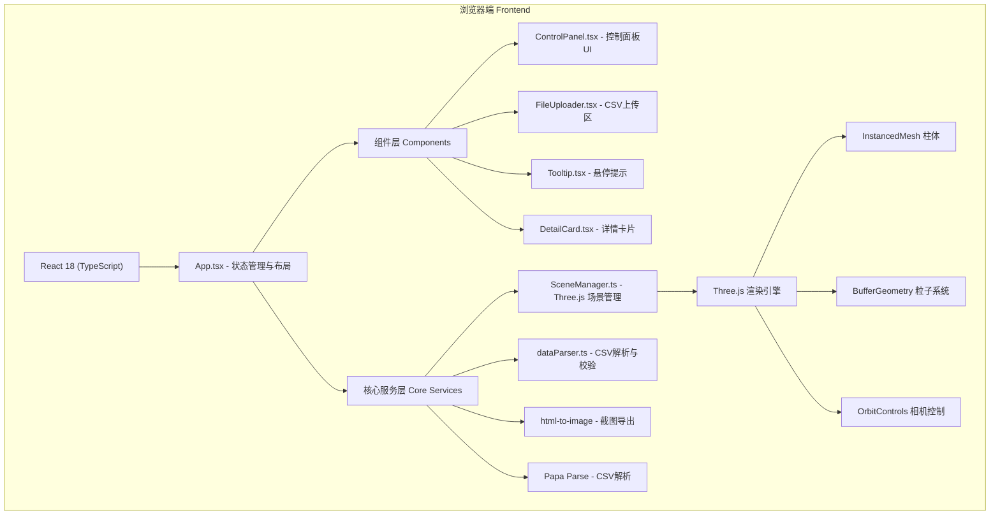

## 1. 架构设计



## 2. 技术说明

- **前端框架**：React 18 + TypeScript 5 + Vite 5
- **样式方案**：Tailwind CSS 3 + 内联CSS变量（深色主题token）
- **3D渲染**：Three.js 0.160（原生，不使用R3F以获得最大性能控制）
- **状态管理**：React useState + useRef（轻量场景，无需Zustand）
- **数据解析**：Papa Parse 5
- **截图导出**：html-to-image（WebGL场景使用renderer.domElement.toDataURL）
- **UI图标**：lucide-react
- **构建工具**：Vite 5 + @vitejs/plugin-react

## 3. 核心数据结构与类型定义

### 3.1 数据点类型
```typescript
interface LightDataPoint {
  id: string;
  latitude: number;
  longitude: number;
  intensity: number;           // 原始光照强度
  normalizedIntensity: number; // 归一化 0-1
  level: 'low' | 'medium' | 'high' | 'extreme';
  position: { x: number; y: number; z: number }; // 场景内坐标
  color: string;               // 映射颜色
}
```

### 3.2 渲染模式枚举
```typescript
type RenderMode = 'bar' | 'heatmap' | 'particles';
```

### 3.3 场景状态类型
```typescript
interface SceneSettings {
  scale: number;      // 0.5 - 2.0
  opacity: number;    // 0.2 - 1.0
  colorMap: string;   // 'default' | 'cool' | 'warm' | 'mono'
}
```

## 4. SceneManager 类接口设计

```typescript
class SceneManager {
  constructor(container: HTMLElement, onHover?: (data: LightDataPoint | null) => void, onClick?: (data: LightDataPoint) => void);
  init(): void;
  loadData(points: LightDataPoint[]): void;
  setRenderMode(mode: RenderMode): Promise<void>;    // 0.5s过渡动画
  setScale(scale: number): void;
  setOpacity(opacity: number): void;
  resetCamera(): Promise<void>;                       // 0.8s弧线动画
  flyTo(dataPoint: LightDataPoint): Promise<void>;    // 0.6s飞入
  captureScreenshot(): string;                        // 返回base64 PNG
  dispose(): void;
  private animate(): void;                            // RAF循环
  private createBarMesh(): InstancedMesh;
  private createHeatmapMesh(): InstancedMesh;
  private createParticles(): Points;
}
```

## 5. 性能优化策略

1. **几何体复用**：使用 `InstancedMesh` 渲染500+柱体，单个draw call
2. **粒子系统**：使用 `BufferGeometry` + `Points`，动态更新position数组
3. **材质共享**：同模式下所有实例共享 `MeshStandardMaterial`
4. **射线检测优化**：仅在鼠标移动时触发 `Raycaster`，使用LOD或包围盒预筛选
5. **动画插值**：所有过渡使用 `requestAnimationFrame` + 线性/缓动函数，避免CSS重排
6. **渲染节流**：非交互期间可降频至30FPS（可选）
7. **内存管理**：模式切换时 dispose 旧几何体与材质，避免GPU内存泄漏

## 6. 项目文件结构

```
auto231/
├── .trae/documents/
│   ├── PRD.md
│   └── ARCHITECTURE.md
├── index.html
├── package.json
├── vite.config.ts
├── tsconfig.json
├── tailwind.config.js
├── postcss.config.js
└── src/
    ├── main.tsx               # React入口
    ├── App.tsx                # 主组件，布局+状态管理
    ├── index.css              # Tailwind + 全局主题变量
    ├── SceneManager.ts        # Three.js场景管理核心类
    ├── dataParser.ts          # CSV解析+归一化+校验
    ├── types.ts               # 全局TypeScript类型
    ├── hooks/
    │   └── useSceneRef.ts     # 管理SceneManager引用的hook
    ├── components/
    │   ├── ControlPanel.tsx   # 左侧控制面板
    │   ├── FileUploader.tsx   # CSV拖拽上传区
    │   ├── Tooltip.tsx        # 悬停毛玻璃提示
    │   ├── DetailCard.tsx     # 详情浮动面板
    │   └── ProgressRing.tsx   # 上传环形进度条
    └── utils/
        ├── colorMapper.ts     # 强度→颜色映射
        ├── easing.ts          # 缓动函数库
        └── mockData.ts        # 示例/回退数据生成
```
