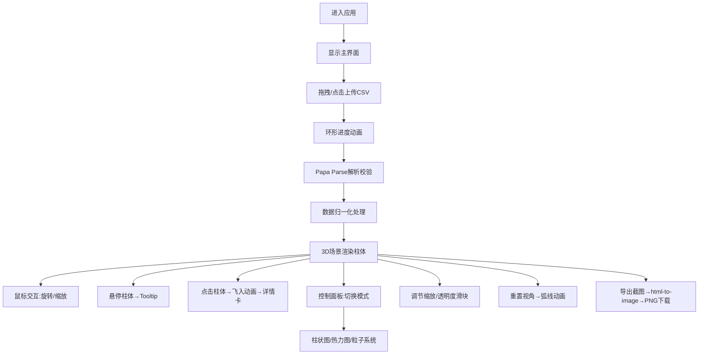

## 1. 产品概述

城市光污染三维可视化分析器是一款面向城市规划师和环保爱好者的专业Web应用。通过上传CSV格式的城市光照数据，在浏览器中以Three.js 3D场景直观呈现夜间城市光污染分布情况，帮助用户理解、分析和展示光污染问题。

- 核心价值：将抽象的光污染数据转化为沉浸式3D可视化体验，支持多模式分析与导出
- 目标用户：城市规划师、环境研究人员、环保爱好者、教育工作者

## 2. 核心功能

### 2.1 功能模块清单

1. **主界面模块**：CSV拖拽上传区、数据解析状态展示、文件信息摘要
2. **3D场景模块**：Three.js 3D渲染器、柱体/热力图/粒子三种渲染模式、相机控制
3. **控制面板模块**：渲染模式切换、缩放/透明度滑块、颜色映射选择、视角重置、截图导出
4. **交互反馈模块**：悬停Tooltip、点击飞入动画、详情卡片、进度指示环

### 2.2 页面详情

| 页面名称 | 模块名称 | 功能描述 |
|---------|---------|----------|
| 主应用页 | CSV上传区 | 拖拽/点击上传，环形进度动画（#00bcd4→#3f51b5渐变扩散），解析状态提示，显示数据条数和经纬度范围 |
| 主应用页 | 3D场景容器 | 深蓝色渐变背景（#0a192f→#020c1b），半透明暗色网格地面，柱体/热力/粒子三种模式渲染，60FPS流畅度 |
| 主应用页 | 左侧控制面板 | 320px宽，可折叠滑出（0.3s ease-out），模式切换、滑块调节、视角重置、导出截图按钮 |
| 主应用页 | 交互组件 | 悬停柱体高亮+毛玻璃Tooltip、点击柱体平滑飞入（0.6s ease-in-out）+详情面板 |

## 3. 核心流程

用户进入应用后，首先看到深色主题的主界面，中央为3D场景占位背景，左侧展开控制面板，上方或中央为CSV上传拖拽区。用户将CSV文件拖入上传区，触发环形进度动画，系统使用Papa Parse解析数据并校验。解析成功后，场景自动渲染500+数据柱体。用户可通过鼠标旋转/缩放场景，悬停查看Tooltip，点击飞入详情。在控制面板切换三种渲染模式、调节参数、重置视角或导出PNG截图。

## 4. 用户界面设计

### 4.1 设计风格

- **主色调**：深色科技风，主背景#0a192f，卡片背景#112240，强调色#64ffda（青绿）和#00bcd4（青色）
- **柱体色带**：深紫#4a148c → 蓝紫 → 青色 → 亮黄#ffee58（光照强度由低到高）
- **按钮风格**：圆角8px，hover亮色边框动画（0.2s ease），半透明毛玻璃质感
- **字体方案**：主标题使用Space Grotesk或同类几何无衬线字体，正文使用Roboto Mono等宽字体增强数据感
- **布局风格**：桌面端左右分栏（左320px面板+右场景），移动端顶部抽屉式面板
- **图标风格**：使用lucide-react线性图标，统一stroke宽度

### 4.2 页面设计概述

| 页面名称 | 模块名称 | UI要素描述 |
|---------|---------|-----------|
| 主应用页 | CSV上传区 | 虚线边框拖拽区域，中央图标+提示文字，环形SVG进度环从中心扩散，渐变填充|
| 主应用页 | 3D场景 | 全屏容器，背景径向渐变+薄雾效果，地面半透明网格（#1a2a4a，alpha 0.3），柱体顶部辉光点光源 |
| 主应用页 | 控制面板 | 卡片式分组，按钮带发光hover效果，滑块自定义轨道与thumb，折叠按钮为左侧边缘半透明箭头 |
| 主应用页 | Tooltip | 毛玻璃backdrop-filter，背景#152238，白色文字，带三角指向器，等级标签对应颜色徽章 |
| 主应用页 | 详情卡片 | 半透明浮动面板，从底部滑入动画，含模拟的人口密度、能源消耗、建议措施等扩展信息 |

### 4.3 响应式设计

- **桌面端（>768px）**：左侧固定320px控制面板，右侧全屏3D场景，面板可左滑折叠
- **移动端（≤768px）**：顶部抽屉式控制面板（默认收起），3D场景全屏展示，点击顶部汉堡按钮下拉面板
- **触控优化**：双指缩放、单指旋转、单击选中柱体，所有触控目标≥44px

### 4.4 3D场景指导

- **环境与氛围**：深蓝宇宙渐变背景，微弱体积雾增强纵深感，整体"赛博夜景"科技美学
- **光照设置**：环境光（低强度蓝紫色）+ 半球光 + 每个柱体顶部对应颜色的点光源（强度随高度）
- **相机设置**：PerspectiveCamera初始45°俯视角，OrbitControls启用阻尼，支持自动旋转开关
- **镜头运动**：点击柱体时使用TWEEN或requestAnimationFrame平滑插值position与lookAt（0.6s ease-in-out）
- **合成与后期**：柱体使用MeshStandardMaterial+emissive实现自发光，必要时启用UnrealBloomPass增强辉光
- **性能预算**：500柱体InstancedMesh渲染，粒子系统使用BufferGeometry+Points，目标帧率≥60FPS
