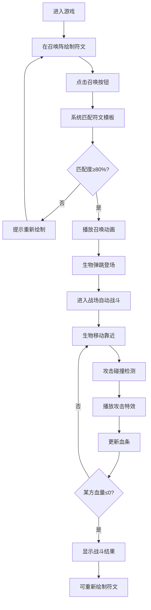

## 1. 产品概述

像素符文召唤阵是一款基于浏览器的魔法召唤战斗游戏，玩家通过在召唤阵画板上绘制特定符文图案来召唤不同属性的像素风格魔法生物，并观看它们在战场上自动对战。

- **主要用途**：提供休闲娱乐体验，让玩家通过手绘交互感受魔法召唤的乐趣
- **目标用户**：喜欢休闲游戏、像素风格和魔法题材的玩家
- **核心价值**：将传统手绘魔法阵的概念与现代化的游戏机制结合，创造独特的交互体验

## 2. 核心功能

### 2.1 用户角色
本游戏为单用户休闲游戏，无多角色区分。

### 2.2 功能模块
1. **主界面**：召唤阵画板、符文绘制、召唤按钮、战场区域、UI控制面板
2. **符文绘制系统**：鼠标/触屏绘制、粒子拖尾效果、6种符文模板匹配
3. **召唤系统**：匹配度检测（阈值80%）、召唤动画、颜色闪烁效果、粒子爆发
4. **战斗系统**：2D自动战斗、精灵动画、碰撞检测、血条显示、攻击特效
5. **AI系统**：对手生物召唤、AI行为逻辑、自动战斗决策

### 2.3 页面详情
| 页面名称 | 模块名称 | 功能描述 |
|-----------|-------------|---------------------|
| 主界面 | 召唤阵画板 | 直径400px圆形绘制区域，深紫色背景，放射状渐变光晕，金色发光线条（#ffd700），线宽4px，发光阴影2px，粒子拖尾效果（0.5秒渐隐） |
| 主界面 | 符文匹配 | 6种符文模板（火焰三角形、水流波浪线、大地菱形、风羽扇形、雷电Z形、暗影螺旋形），80%匹配度阈值 |
| 主界面 | 召唤动画 | 匹配成功时对应颜色闪烁（火焰-红#ff4444，水流-蓝#4488ff，大地-棕#8B4513，风羽-绿#44ff88，雷电-黄#ffdd44，暗影-紫#9944ff），0.8秒粒子爆发，全屏闪光过渡（0.3秒淡出） |
| 主界面 | 战场区域 | 600x400px，浅灰色背景#2a2a3a，网格线，64x64像素生物精灵，弹跳登场动画（上抛0.3s，落地压缩0.1s，再弹起0.2s） |
| 主界面 | 战斗系统 | 自动移动靠近、攻击检测、白色闪光碰撞特效、屏幕震动（0.1秒偏移4px）、血条显示（红到绿渐变，数值精确到1） |
| 主界面 | UI装饰 | 暗色主题，金色描边按钮和边框，动态旋转星轨装饰（0.05rad/s） |

## 3. 核心流程

玩家进入游戏后，在左侧召唤阵画板上绘制符文图案，点击"召唤"按钮，系统匹配符文模板，成功则召唤对应属性的生物进入战场，与AI对手的生物进行自动战斗。

## 4. 用户界面设计

### 4.1 设计风格
- **主色调**：深紫色背景 #1a0a2e，金色 #ffd700 作为强调色
- **按钮风格**：金色描边，深紫底色，悬停时有发光效果
- **字体**：像素风格字体与现代无衬线字体结合，营造复古与现代融合的感觉
- **布局**：左右分栏布局，左侧为召唤阵区域，右侧为战场区域，顶部为状态栏
- **图标风格**：像素风格图标，与生物精灵保持一致

### 4.2 页面设计概述
| 页面名称 | 模块名称 | UI元素 |
|-----------|-------------|-------------|
| 主界面 | 召唤阵区域 | 居中圆形画板，放射状光晕，旋转星轨装饰，金色发光画笔 |
| 主界面 | 战场区域 | 浅灰色网格背景，顶部血条，中央对战区域，攻击闪光特效 |
| 主界面 | 控制面板 | 召唤按钮（金色描边），重置按钮，符文提示图标 |
| 主界面 | 动画效果 | 粒子拖尾、召唤闪光、生物弹跳、攻击震动、全屏过渡 |

### 4.3 响应性
- 桌面端优先设计，支持鼠标操作
- 支持触屏设备的绘制操作
- 最小支持分辨率：1280x768

### 4.4 性能要求
- 绘制和战斗动画保持30fps以上
- 粒子系统优化，避免过多粒子导致性能下降
- PixiJS精灵渲染优化，合理使用对象池
