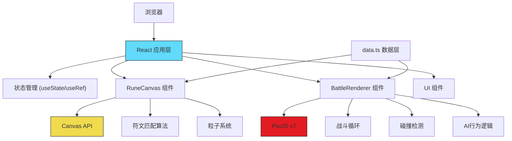

## 1. 架构设计



## 2. 技术描述

- **前端框架**: React@18 + ReactDOM@18
- **渲染引擎**: PixiJS@7（用于战斗场景精灵渲染和动画）
- **开发语言**: TypeScript（严格模式）
- **构建工具**: Vite@5 + @vitejs/plugin-react
- **包管理**: npm
- **其他依赖**: pixi.js@7.4.0

## 3. 项目结构

```
auto235/
├── index.html                 # 入口页面
├── package.json               # 项目依赖和脚本
├── tsconfig.json              # TypeScript配置（严格模式）
├── vite.config.js             # Vite构建配置
├── src/
│   ├── main.tsx               # React入口
│   ├── App.tsx                # 主组件（布局、状态管理）
│   ├── components/
│   │   ├── RuneCanvas.tsx     # 召唤阵画布组件
│   │   └── BattleRenderer.tsx # 战斗渲染组件
│   └── data/
│       └── data.ts            # 符文模板、生物属性、AI逻辑
└── .trae/
    └── documents/
        ├── PRD.md
        └── TechnicalArchitecture.md
```

## 4. 核心模块说明

### 4.1 App.tsx
- 主布局：左右分栏（召唤阵 + 战场）
- 状态管理：绘制路径、匹配结果、召唤状态、战斗状态
- 协调 RuneCanvas 和 BattleRenderer 的通信
- UI 控制：召唤按钮、重置按钮、状态提示

### 4.2 RuneCanvas.tsx
- **绘制系统**：使用 Canvas 2D API
  - 鼠标/触屏事件监听（mousedown/mousemove/mouseup）
  - 连续线条绘制，金色发光效果（#ffd700，线宽4px，阴影2px）
  - 粒子拖尾效果（requestAnimationFrame 驱动，0.5秒渐隐）
  - 旋转星轨装饰（0.05rad/s，requestAnimationFrame 驱动）
  
- **模板匹配算法**：
  - 路径归一化（缩放、平移到标准坐标系）
  - 点采样（固定点数，如64点）
  - 与模板的点距离计算
  - 匹配度 = 1 - (平均距离 / 最大阈值)
  - 阈值80%以上判定匹配成功

- **召唤动画**：
  - 对应颜色闪烁（使用 Canvas 全局合成模式）
  - 粒子爆发动画（0.8秒）
  - 全屏闪光过渡（0.3秒淡出）

### 4.3 BattleRenderer.tsx
- **PixiJS 场景管理**：
  - Application 实例，600x400 尺寸
  - 背景层（网格线）、战斗层（精灵）、UI层（血条）、特效层（闪光）
  
- **精灵系统**：
  - 64x64 像素生物（使用 Graphics 绘制像素风格）
  - 弹跳登场动画（TweenJS 或自定义时间轴）
    - 上抛0.3s（easeOut）
    - 落地压缩0.1s
    - 再弹起0.2s
  
- **战斗循环**：
  - 固定时间步长（30fps+，使用 PIXI.Ticker）
  - 状态机：IDLE → MOVING → ATTACKING → HIT → DEAD
  - AI行为逻辑（追击、攻击间隔、闪避）
  
- **碰撞检测**：
  - 圆形碰撞体（半径32px）
  - 攻击距离检测（触发攻击动画）
  
- **特效系统**：
  - 攻击闪光（白色圆形，快速缩放淡出）
  - 屏幕震动（容器偏移4px，0.1秒）
  - 血条更新（红到绿渐变，数值精确到1）

### 4.4 data.ts
- **符文模板定义**：
  - 6种符文的坐标数组（归一化到[-1,1]坐标系）
  - 每种符文对应颜色和名称

- **生物属性配置**：
  - 生命值、攻击力、移动速度、攻击速度
  - 像素风格绘制数据（颜色矩阵）
  - 克制关系（火克风，风克地，地克雷，雷克水，水克火，暗影互克）

- **AI行为逻辑函数**：
  - `aiMoveDecision()` - 移动决策
  - `aiAttackDecision()` - 攻击决策
  - `chooseRandomRune()` - AI随机选择符文

## 5. 性能优化策略

### 5.1 绘制性能
- 粒子系统对象池，避免频繁创建销毁
- 离屏 Canvas 预渲染背景元素
- requestAnimationFrame 批量更新

### 5.2 战斗性能
- PixiJS 自动批处理渲染
- 减少每帧的属性更新
- 合理的精灵缓存策略

### 5.3 内存管理
- 战斗结束后清理 PixiJS 资源
- 粒子及时回收
- 事件监听器正确移除

## 6. 数据模型

### 6.1 类型定义

```typescript
// 符文类型
type RuneType = 'fire' | 'water' | 'earth' | 'wind' | 'thunder' | 'shadow';

interface RuneTemplate {
  type: RuneType;
  name: string;
  color: string;
  points: { x: number; y: number }[];
}

// 生物类型
interface CreatureStats {
  maxHp: number;
  attack: number;
  moveSpeed: number;
  attackSpeed: number;
}

interface Creature {
  id: string;
  type: RuneType;
  name: string;
  stats: CreatureStats;
  currentHp: number;
  x: number;
  y: number;
  state: 'idle' | 'moving' | 'attacking' | 'hit' | 'dead';
  sprite: PIXI.Sprite | null;
}

// 粒子类型
interface Particle {
  x: number;
  y: number;
  vx: number;
  vy: number;
  life: number;
  maxLife: number;
  color: string;
  size: number;
}

// 匹配结果
interface MatchResult {
  type: RuneType | null;
  confidence: number;
  name: string;
  color: string;
}
```
